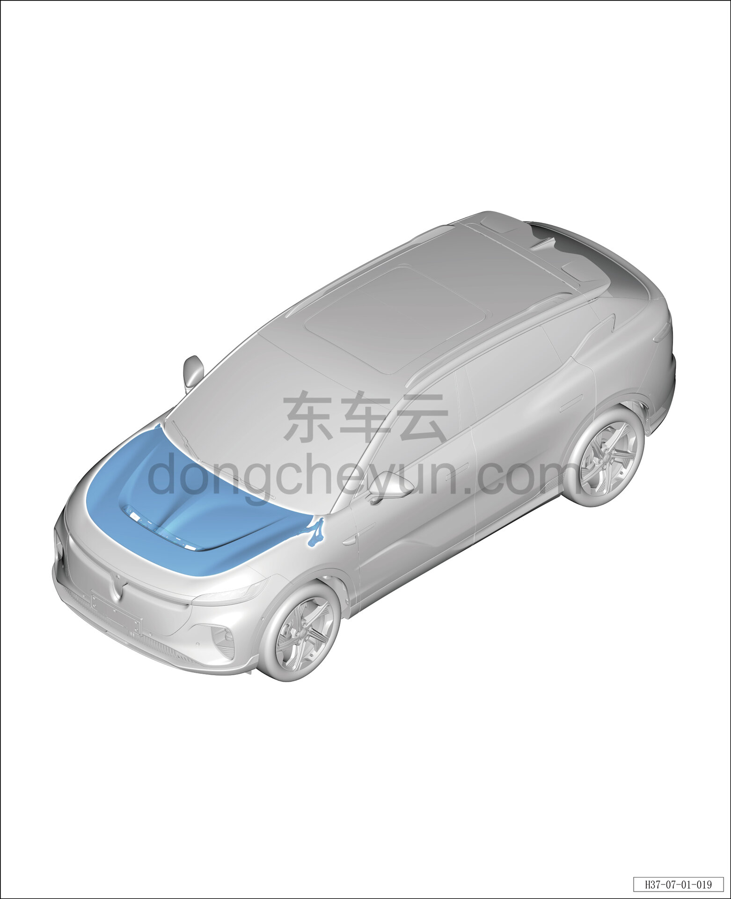

# Расположение компонентов

> Открывающиеся элементы кузова › Капот › Расположение компонентов  
> Оригинал: `零部件位置图` · [dongcheyun 56746](https://dongcheyun.com/p/56746), страница `54008c13592647ca9f3a2c998710c1ef` · [оглавление](../README.md)

