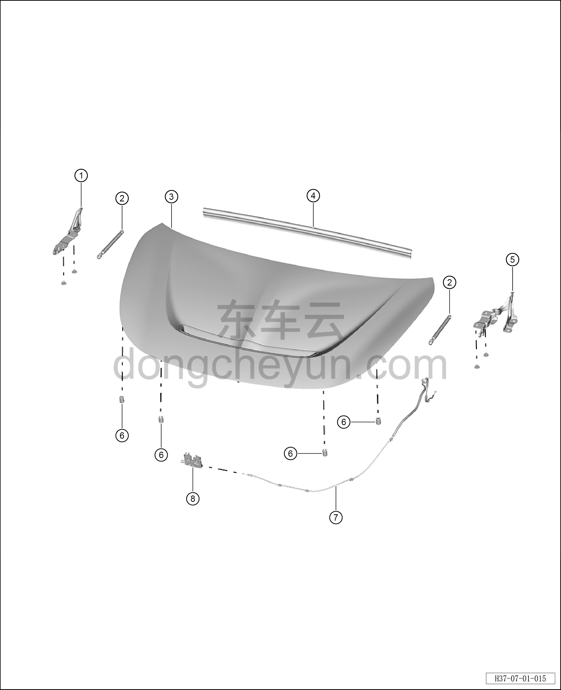

# Покомпонентный вид (деталировка)

> Открывающиеся элементы кузова › Капот › Покомпонентный вид (деталировка)  
> Оригинал: `结构分解图` · [dongcheyun 56746](https://dongcheyun.com/p/56746), страница `34602c34a9b14046b8528ac94ecd0569` · [оглавление](../README.md)

| № | Наименование детали | Кол-во на автомобиль | Примечание |
|---|---|---|---|
| 1 | Правая петля капота | 1 | - |
| 2 | Упор капота | 2 | - |
| 3 | Капот | 1 | - |
| 4 | Задний уплотнитель капота | 1 | - |
| 5 | Левая петля капота | 1 | - |
| 6 | Буфер капота | 4 | - |
| 7 | Трос замка капота | 1 | - |
| 8 | Замок капота в сборе | 1 | - |
