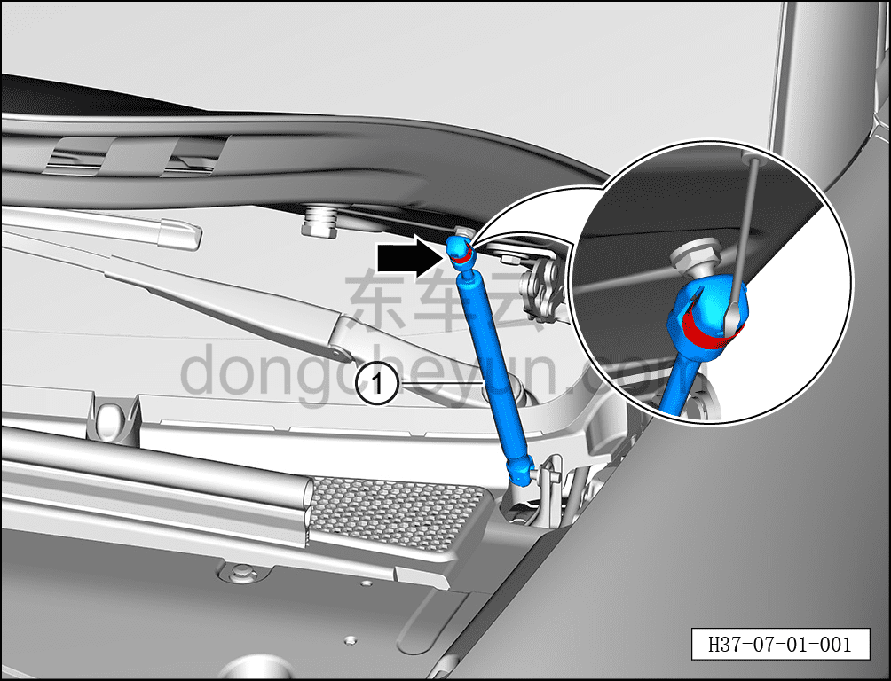
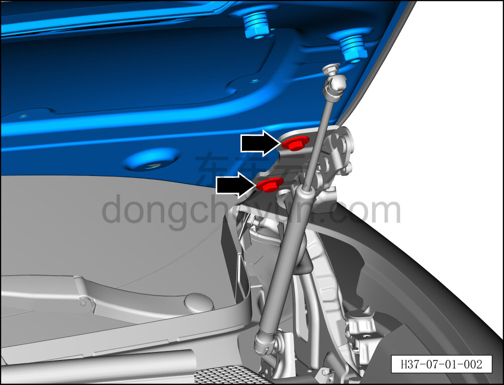
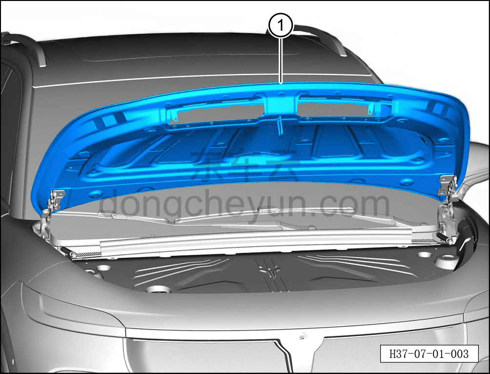
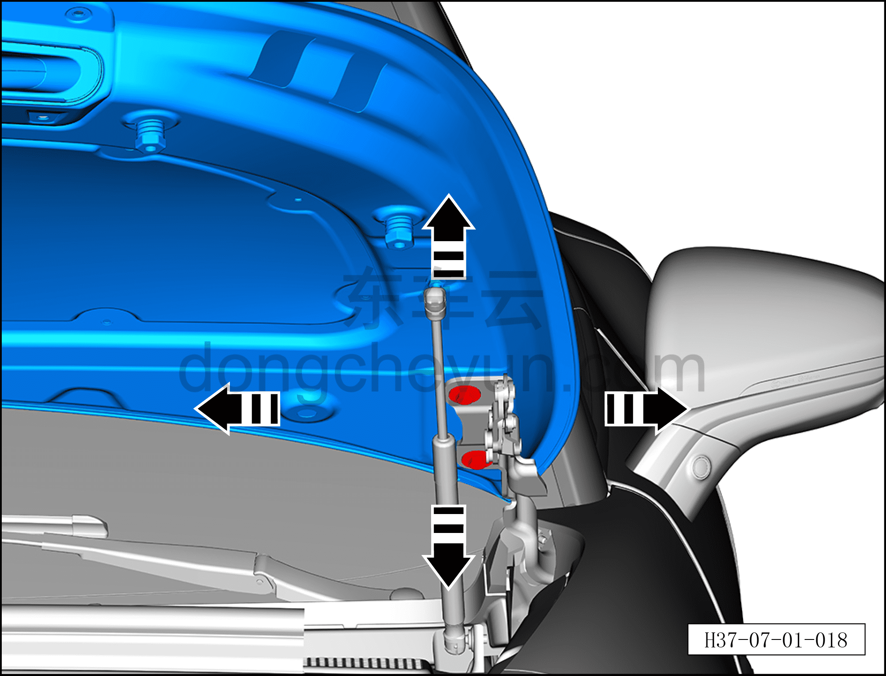

# Снятие и установка капота

> Открывающиеся элементы кузова › Капот › Кузовная панель капота  
> Оригинал: `拆卸与安装发动机罩` · [dongcheyun 56746](https://dongcheyun.com/p/56746), страница `5e5e73dffd604d2988aeb013ad3c53a1` · [оглавление](../README.md)

**Порядок снятия**

**Примечание:**

- **Снятие и установку необходимо выполнять с помощью второго технического специалиста, чтобы не повредить лобовое стекло и лакокрасочное покрытие кузова.**

**- После замены капота в сборе необходимо повторно нанести герметик, см. [12.1.6.3 Зоны герметизации кузова](../12-кузовные-жестяные-работы-окраска/016-зона-герметизации-кузова.md). **

1. Выключите все электроприборы, отключите питание.

2. Откройте капот.

3. Снимите шумоизоляцию капота. См. [8.5.10.1 Снятие и установка шумоизоляции капота](../08-внутренняя-и-внешняя-отделка/154-снятие-и-установка-шумоизоляционной-накладки-капота.md)

4. Снимите передний воздуховод капота. См. [8.6.6.14 Снятие и установка переднего воздуховода капота](../08-внутренняя-и-внешняя-отделка/227-снятие-и-установка-переднего-воздуховода-капота.md)

5. Снимите левую и правую задние декоративные накладки моторного отсека. См. [8.6.6.9 Снятие и установка левой задней декоративной накладки моторного отсека](../08-внутренняя-и-внешняя-отделка/222-снятие-и-установка-левой-задней-декоративной-накладки.md)

6. Снимите капот.

a. Вставьте плоскую отвёртку в паз пружинной пластины, отсоедините пружинную пластину от упора капота.

b. Отсоедините упор капота ① от шарового шарнирного болта капота, тем же способом отсоедините упор капота с другой стороны.

c. Двое человек должны поддерживать капот с обеих сторон.

d. С помощью торцевой головки 13 мм выверните по 4 крепёжных болта с каждой стороны капота.

Момент затяжки болта: 21±3 Н·м

**Внимание:**

**- Поскольку капот тяжёлый, при выворачивании болтов не допускайте его внезапного падения.**

e. Совместными усилиями двух человек извлеките капот ①.

**Внимание:**

**- При снятии капота избегайте повреждения лакокрасочного покрытия кузова, после снятия положите капот горизонтально на мягкую подкладку.**

**Порядок установки**

Установка выполняется в обратном порядке.

1. После установки капота в сборе сначала проверьте, соответствуют ли зазор и высота между капотом и окружающими панелями нормативным значениям. См. [12.1.4.3 Зазоры поверхности кузова](../12-кузовные-жестяные-работы-окраска/007-зазоры-поверхности-кузова.md)

2. Если результат проверки не соответствует нормативному значению, с помощью второго специалиста ослабьте 4 крепёжных болта капота настолько, чтобы капот получил достаточный люфт, затем отрегулируйте капот в направлении стрелки согласно рисунку, пока измеренное значение не будет соответствовать нормативному диапазону, после чего затяните 4 крепёжных болта.
