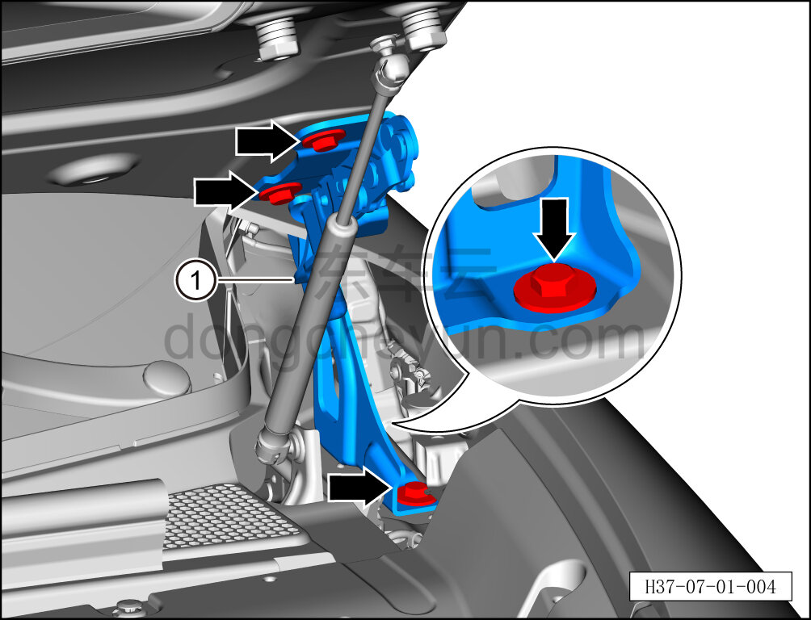
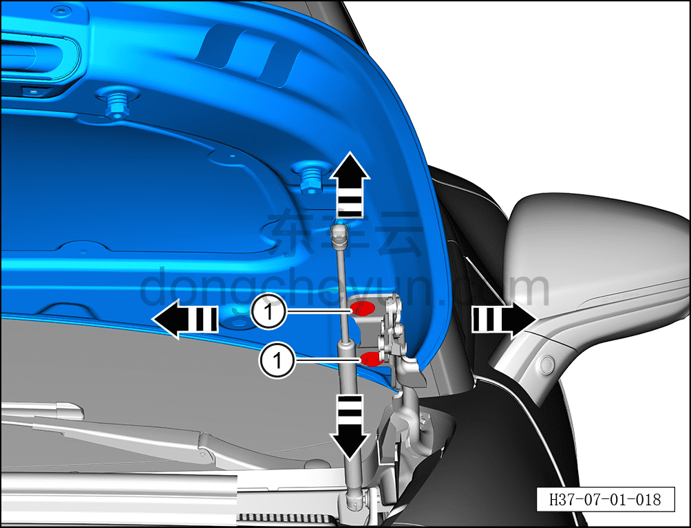

# Снятие и установка левой петли капота

> Открывающиеся элементы кузова › Капот › Кузовная панель капота  
> Оригинал: `拆卸与安装发动机罩左铰链` · [dongcheyun 56746](https://dongcheyun.com/p/56746), страница `be9c59074243425bb2fa47ea35d857b8` · [оглавление](../README.md)

**Порядок снятия**

**Примечание:**

-**Далее описано снятие и установка левой петли капота, правая сторона выполняется по аналогии с левой.**

-**При выворачивании крепёжных болтов капота необходимо действовать совместно со вторым техническим специалистом, поддерживающим капот во избежание его падения.**

1. Выключите все электроприборы, отключите питание.

2. Откройте капот.

3. Снимите левую и правую задние декоративные накладки моторного отсека. См. [8.6.6.9 Снятие и установка левой задней декоративной накладки моторного отсека](../08-внутренняя-и-внешняя-отделка/222-снятие-и-установка-левой-задней-декоративной-накладки.md)

4. Снимите левую петлю капота.

a. С помощью торцевой головки 13 мм выверните 4 крепёжных болта левой петли капота.

Момент затяжки болта: 21±3 Н·м

b. Извлеките левую петлю капота ①.

**Порядок установки**

Установка выполняется в обратном порядке.

1. После установки левой петли капота сначала проверьте, соответствуют ли зазор и высота между капотом и окружающими панелями нормативным значениям. См. [12.1.4.3 Зазоры поверхности кузова](../12-кузовные-жестяные-работы-окраска/007-зазоры-поверхности-кузова.md)

2. Если результат проверки не соответствует нормативному значению, с помощью второго специалиста ослабьте 2 крепёжных болта ① левой стороны капота настолько, чтобы левая сторона капота получила достаточный люфт, затем отрегулируйте левую сторону капота в направлении стрелки согласно рисунку, пока измеренное значение не будет соответствовать нормативному диапазону, после чего затяните 2 крепёжных болта ①.
