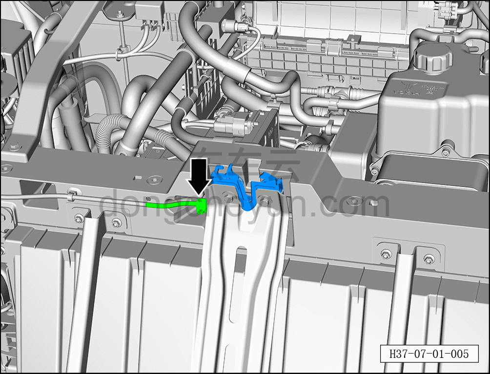
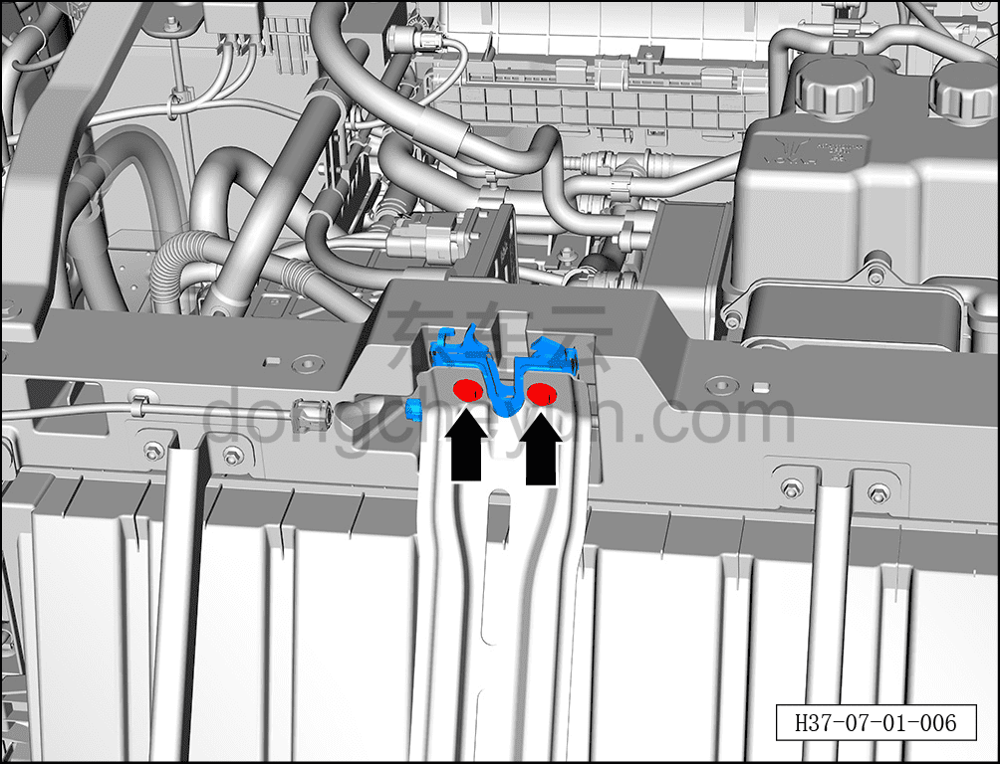
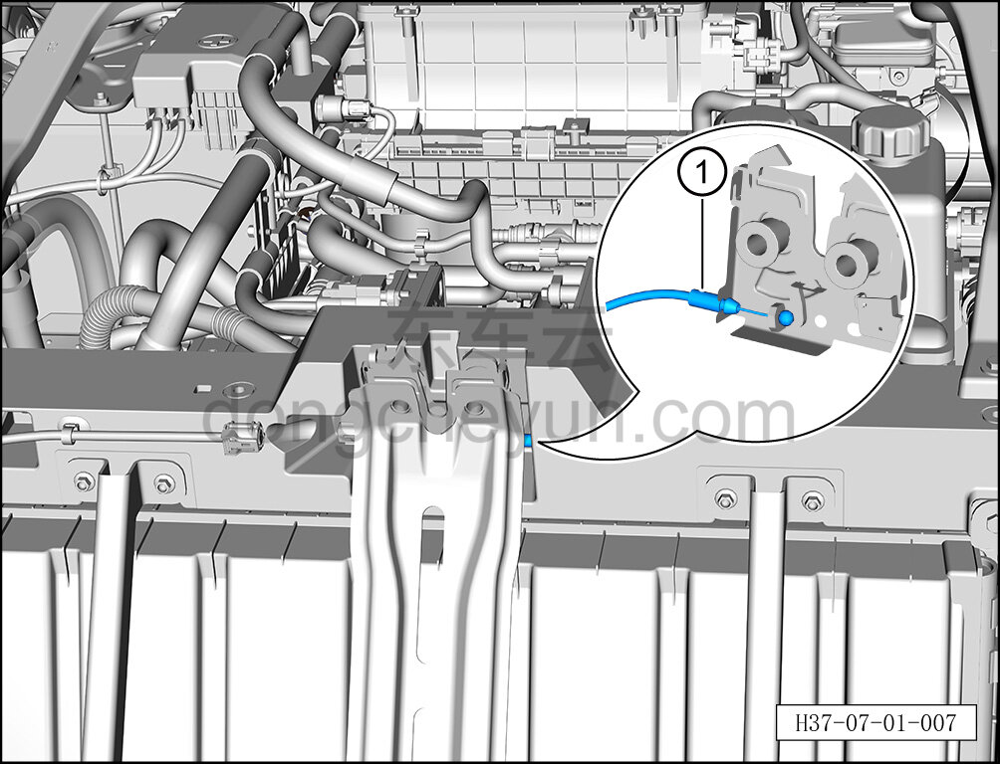

# Снятие и установка замка капота в сборе

> Открывающиеся элементы кузова › Капот › Навесные элементы капота  
> Оригинал: `拆卸与安装发动机罩锁总成` · [dongcheyun 56746](https://dongcheyun.com/p/56746), страница `cc94aa7cc38c4becab4bef06bccc5fbc` · [оглавление](../README.md)

**Порядок снятия**

1. Выключите все электроприборы, отключите питание.

2. Выполните операцию обесточивания автомобиля для ремонта. См. [3.1.4.1 Обесточивание автомобиля](../03-техническое-обслуживание/005-обесточивание-автомобиля.md)

3. Снимите передний бампер в сборе. См. [8.6.3.3 Снятие и установка переднего бампера в сборе](../08-внутренняя-и-внешняя-отделка/163-снятие-и-установка-переднего-бампера-в-сборе.md)

4. Снимите замок капота в сборе.

a. Отсоедините разъём жгута переднего отсека.

b. С помощью торцевой головки 10 мм выверните 2 крепёжных болта замка капота в сборе.

Момент затяжки болтов: 10±1 Н·м

c. Отсоедините трос замка капота ① от замка капота в сборе, извлеките замок капота в сборе.

**Порядок установки**

Установка выполняется в обратном порядке.

**Внимание:**

**- После установки замка капота в сборе необходимо проверить нормальность функции открытия и закрытия защёлки.**
