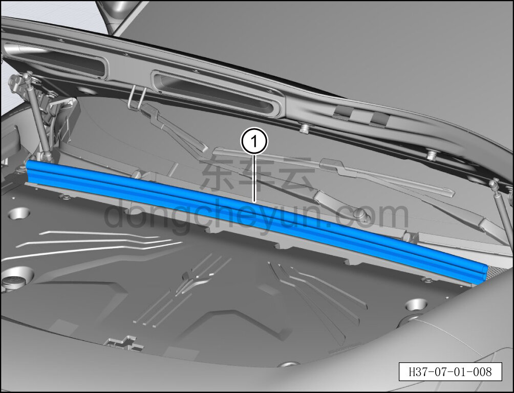

# Снятие и установка заднего уплотнителя капота

> Открывающиеся элементы кузова › Капот › Навесные элементы капота  
> Оригинал: `拆卸与安装发动机罩后密封条` · [dongcheyun 56746](https://dongcheyun.com/p/56746), страница `1634455510f347ce972ef7d7acb1ddd5` · [оглавление](../README.md)

**Порядок снятия**

1. Выключите все электроприборы, отключите питание.

2. Откройте капот.

3. Снимите задний уплотнитель капота.

a. Отсоедините задний уплотнитель капота ①.

**Порядок установки**

Установка выполняется в обратном порядке.

**Внимание:**

**- После установки уплотнителя капота необходимо проверить, чтобы уплотнитель был ровным, без выступов.**
