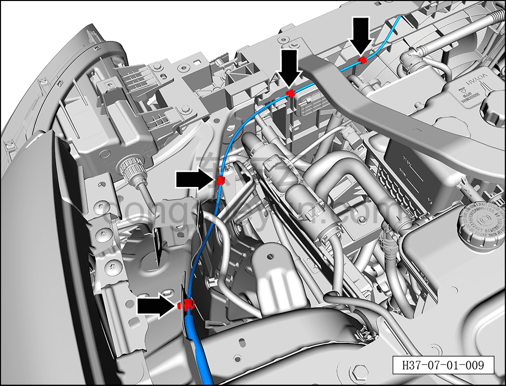
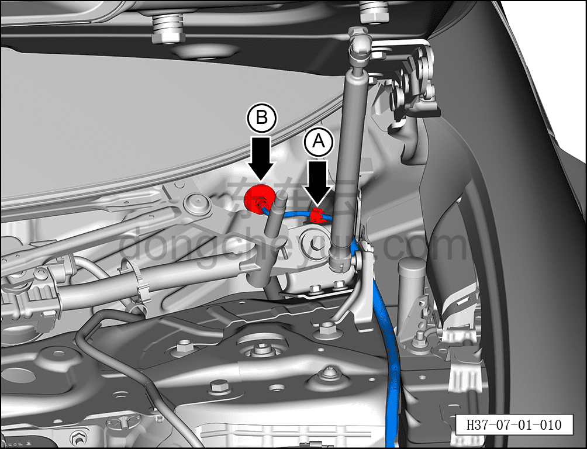
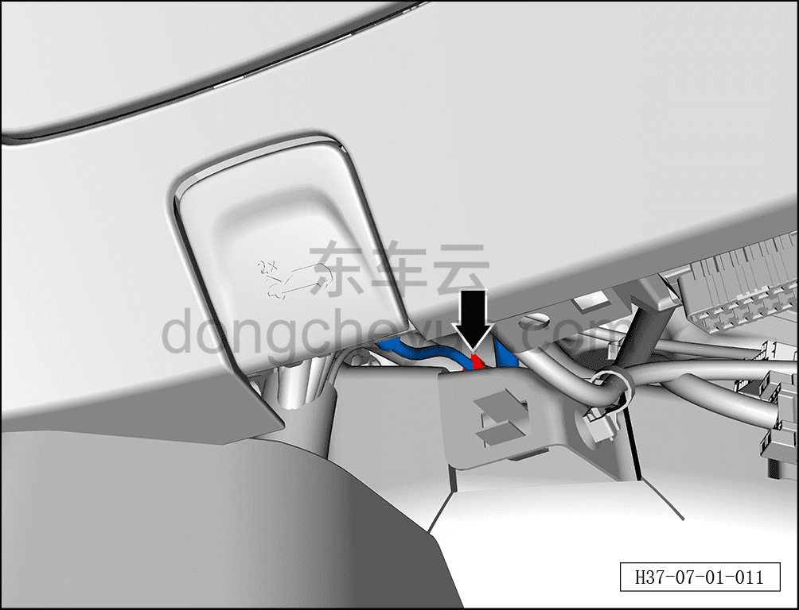
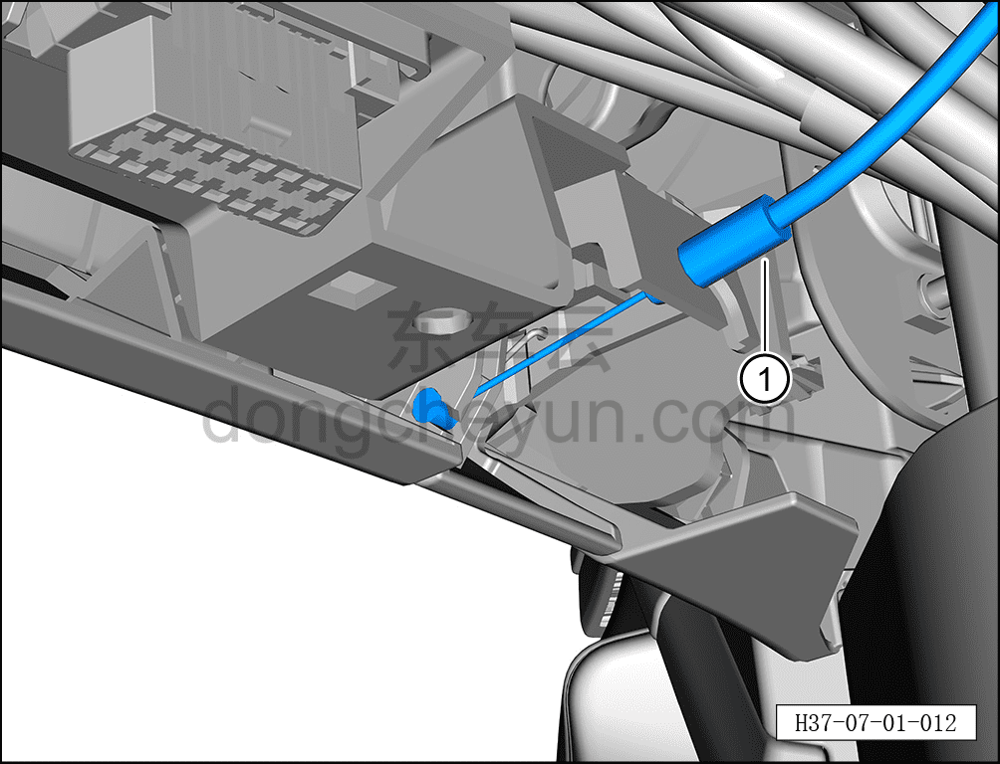

# Снятие и установка троса замка капота

> Открывающиеся элементы кузова › Капот › Навесные элементы капота  
> Оригинал: `拆卸与安装发动机罩锁拉丝` · [dongcheyun 56746](https://dongcheyun.com/p/56746), страница `31fb5e5357be43339fadc07111fbb30d` · [оглавление](../README.md)

**Порядок снятия**

1. Выключите все электроприборы, отключите питание.

2. Выполните операцию обесточивания автомобиля перед ремонтом. См. [3.1.4.1 Обесточивание автомобиля](##)

3. Снимите замок капота в сборе. См. [7.1.4.1 Снятие и установка замка капота в сборе](005-снятие-и-установка-замка-капота-в-сборе.md)

4. Снимите левую нижнюю декоративную накладку лобового стекла. См. [8.6.7.7 Снятие и установка левой нижней декоративной накладки лобового стекла](../08-внутренняя-и-внешняя-отделка/244-снятие-и-установка-крышки-стеклоочистителя-в-сборе.md)

5. Снимите левую нижнюю панель панели приборов. См. [8.2.4.3 Снятие и установка левой нижней панели панели приборов](../08-внутренняя-и-внешняя-отделка/056-снятие-и-установка-левой-нижней-панели-панели-приборов.md)

6. Снимите трос замка капота.

a. С помощью инструмента для снятия внутренней облицовки отсоедините 4 крепёжные клипсы троса замка капота.

b. Отсоедините крепёжную клипсу A троса замка капота.

c. Отсоедините водонепроницаемую заглушку B, соединяющую трос замка капота с кузовом.

d. С помощью инструмента для снятия внутренней облицовки отсоедините крепёжную клипсу троса замка капота.

e. Отделите трос замка капота ① от ручки капота в сборе, извлеките трос замка капота ①.

**Порядок установки**

Установка выполняется в обратном порядке.

**Внимание:**

**- Перед установкой троса замка капота проверьте крепёжные клипсы на тросе замка капота на отсутствие потерь и повреждений.**

**- После установки троса замка капота необходимо проверить нормальность открытия и закрытия капота.**
