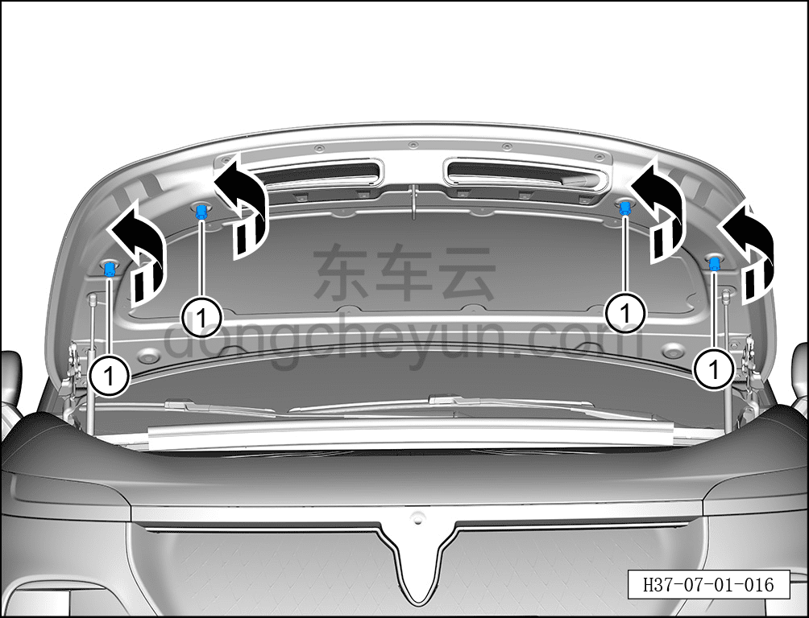

# Снятие и установка буфера капота

> Открывающиеся элементы кузова › Капот › Навесные элементы капота  
> Оригинал: `拆卸与安装发动机罩缓冲块` · [dongcheyun 56746](https://dongcheyun.com/p/56746), страница `df15dbdc5db74f96a48a61b3602a05be` · [оглавление](../README.md)

**Порядок снятия**

1. Выключите все электроприборы, отключите питание.

2. Откройте капот.

3. Снимите буфер капота.

a. Выверните 4 буфера капота ① против часовой стрелки в направлении стрелки.

**Порядок установки**

Установка выполняется в обратном порядке.

**Внимание:**

**- Если после закрытия капот неровный или перекошен, можно соответствующим образом отрегулировать буферы.**
