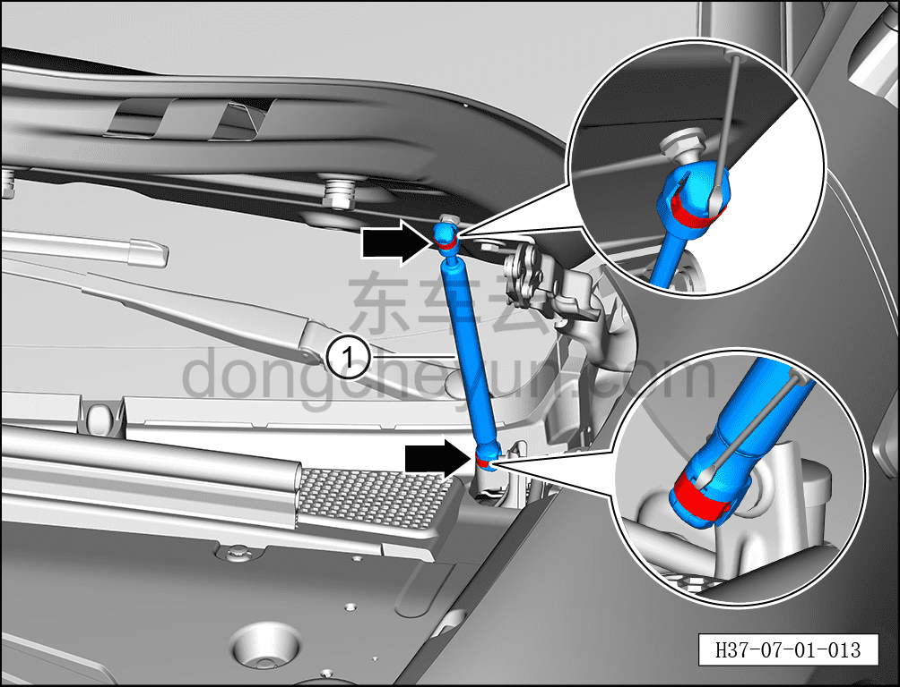

# Снятие и установка упора капота

> Открывающиеся элементы кузова › Капот › Навесные элементы капота  
> Оригинал: `拆卸与安装发动机罩撑杆` · [dongcheyun 56746](https://dongcheyun.com/p/56746), страница `f719a4f996c64ed0a77a362d8f190564` · [оглавление](../README.md)

**Порядок снятия**

**Примечание:**

**- Далее описано снятие и установка левого упора капота, правая сторона выполняется по аналогии с левой.**

**- Снятие и установку необходимо выполнять с помощью второго технического специалиста, поддерживающего капот во избежание его падения.**

1. Выключите все электроприборы, отключите питание.

2. Откройте капот.

3. Снимите упор капота.

a. Вставьте плоскую отвёртку в паз пружинной пластины, отсоедините 2 пружинные пластины от упора капота.

b. Отсоедините упор капота ① от шарового шарнирного болта капота.

**Порядок установки**

Установка выполняется в обратном порядке.

**Внимание:**

**- После установки упора капота необходимо проверить нормальность его функционирования.**
