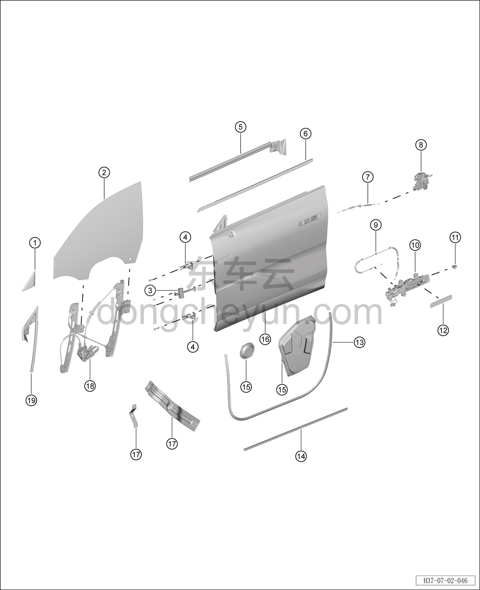

# Покомпонентный вид (деталировка)

> Открывающиеся элементы кузова › Передняя дверь › Покомпонентный вид (деталировка)  
> Оригинал: `结构分解图` · [dongcheyun 56746](https://dongcheyun.com/p/56746), страница `5801cc20c77f4b1f971570d2248c45da` · [оглавление](../README.md)

| № | Наименование детали | Кол-во на автомобиль | Примечание |
|---|---|---|---|
| 1 | Треугольная декоративная накладка левой передней двери | 1 | - |
| 2 | Стекло левой передней двери | 1 | - |
| 3 | Ограничитель передней двери | 1 | - |
| 4 | Верхняя петля левой передней двери | 2 | - |
| 5 | Внутренний уплотнитель подоконника левой передней двери | 1 | - |
| 6 | Наружный уплотнитель подоконника левой передней двери | 1 | - |
| 7 | Трос внутренней ручки открывания передней двери | 1 | - |
| 8 | Корпус замка левой передней двери | 1 | - |
| 9 | Трос наружной ручки открывания передней двери | 1 | - |
| 10 | Наружная ручка открывания левой передней двери в сборе | 1 | - |
| 11 | Узел замочного цилиндра двери | 1 | - |
| 12 | Корпус наружной ручки открывания левой передней двери | 1 | - |
| 13 | Уплотнитель левой передней двери | 1 | - |
| 14 | Грязезащитная лента левой передней двери | 1 | - |
| 15 | Гидроизоляционная плёнка левой передней двери | 2 | - |
| 16 | Левая передняя дверь | 1 | - |
| 17 | Кронштейн бокса подлокотника левой передней двери | 1 | - |
| 18 | Стеклоподъёмник левой передней двери | 1 | - |
| 19 | Направляющая стекла стойки A левой передней двери | 1 | - |
