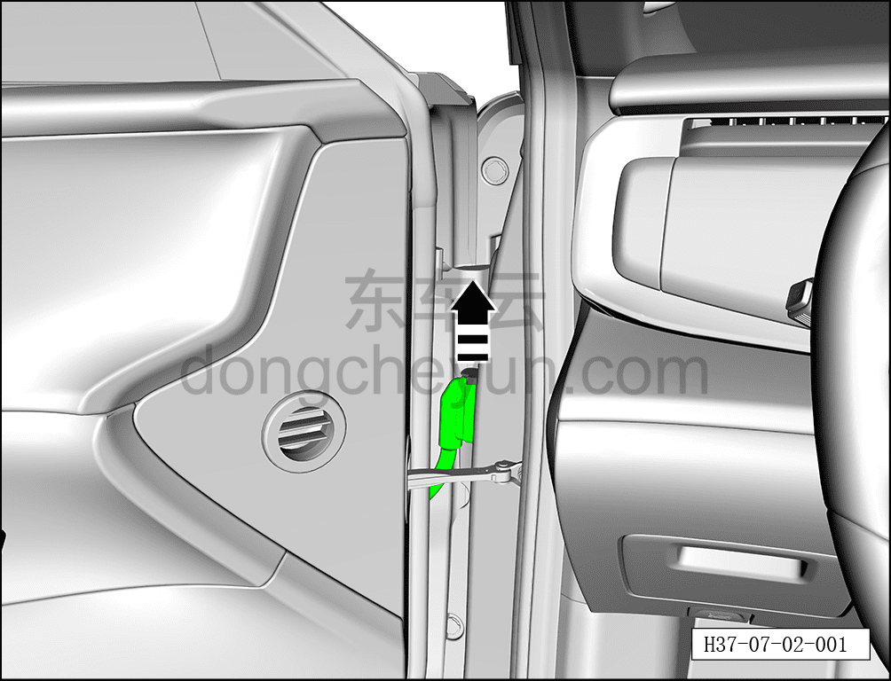
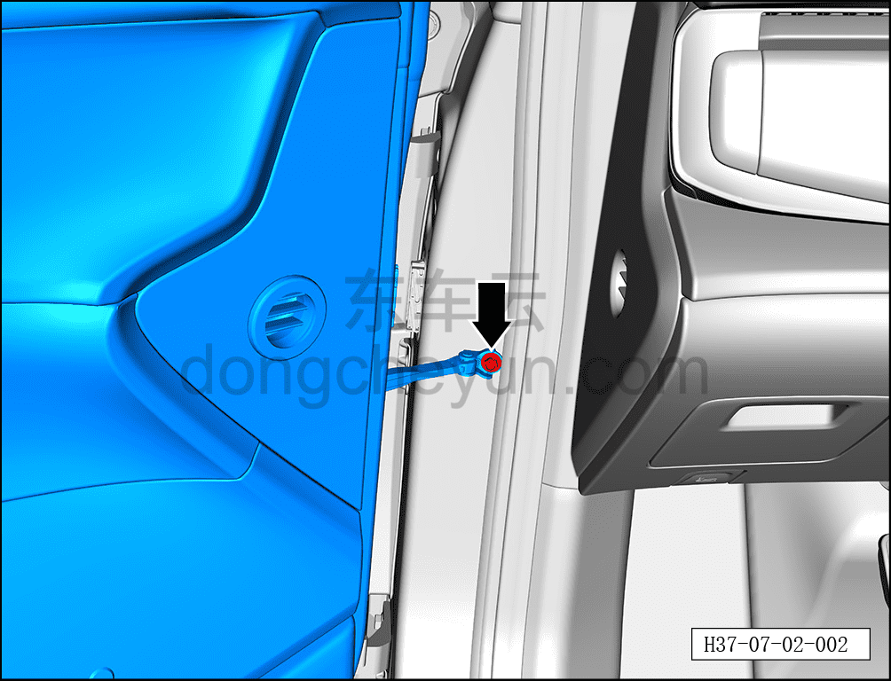
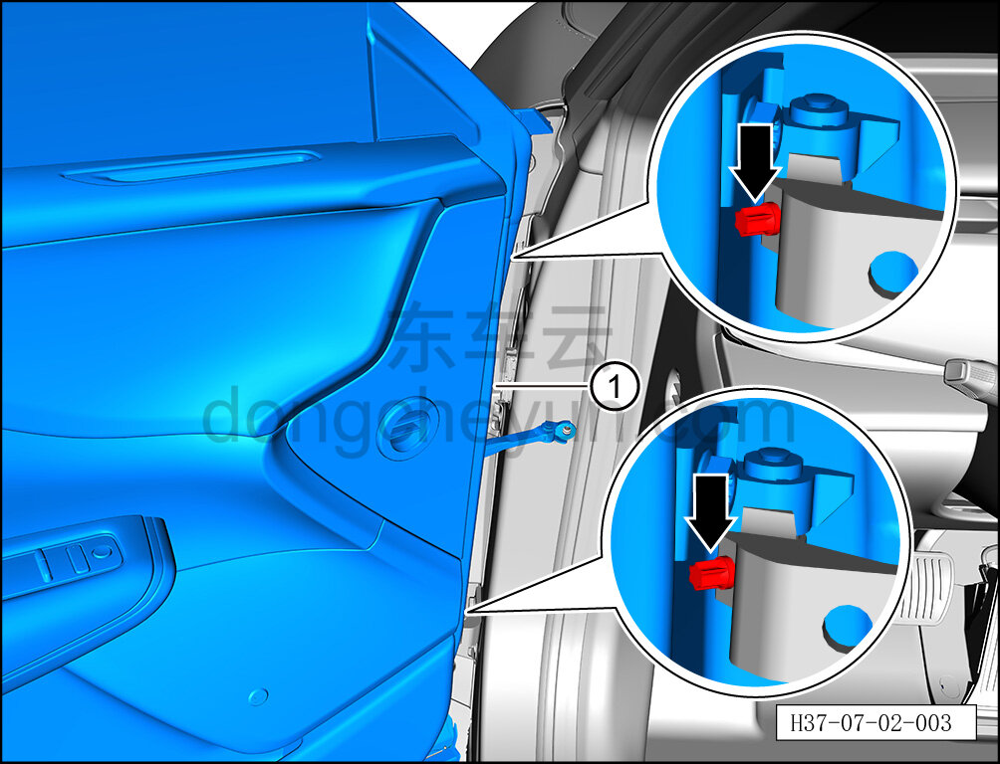

# Снятие и установка левой передней двери

> Открывающиеся элементы кузова › Передняя дверь › Кузовная панель передней двери  
> Оригинал: `拆卸与安装左前车门` · [dongcheyun 56746](https://dongcheyun.com/p/56746), страница `4ed6381f21fd44b3b583faf3d8541ec0` · [оглавление](../README.md)

**Порядок снятия**

**Примечание:**

**- Далее описано снятие и установка левой передней двери, правая сторона выполняется по аналогии с левой.**

**- При снятии левой передней двери необходимо выполнять снятие и установку с помощью второго специалиста.**

**- После замены передней двери в сборе необходимо повторно нанести герметик, см. [12.1.6.3 Зоны герметизации кузова](../12-кузовные-жестяные-работы-окраска/016-зона-герметизации-кузова.md). **

1. Выключите все электроприборы, отключите питание.

2. Выполните операцию обесточивания автомобиля для ремонта. См. [3.1.4.1 Обесточивание автомобиля](../03-техническое-обслуживание/005-обесточивание-автомобиля.md)

3. Откройте левую переднюю дверь, подложите деревянный брусок или резиновую подкладку под левую переднюю дверь, чтобы дверь не упала после снятия болтов.

4. Снимите левую переднюю дверь.

a. Сдвиньте фиксирующую защёлку разъёма вверх в направлении стрелки согласно рисунку, отсоедините разъём жгута левой передней двери, двигая назад.

b. С помощью торцевой головки 10 мм выверните крепёжный болт ограничителя передней двери.

Момент затяжки болта: 25±3 Н·м

c. С помощью торцевой головки M25 выверните 2 фиксирующих штифта-стопора верхней петли левой передней двери.

Момент затяжки болта: 23±3 Н·м

d. Совместно со вторым специалистом снимите левую переднюю дверь, поднимая её вверх ①.

**Внимание:**

**- При снятии левой передней двери избегайте повреждения лакокрасочного покрытия кузова, после снятия положите дверь горизонтально на мягкую подкладку. **

**Порядок установки**

Установка выполняется в обратном порядке.

**Внимание:**

**- После завершения установки проверьте нормальность работы всех функций двери.**
