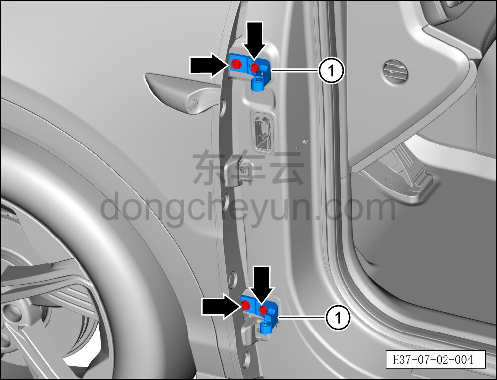
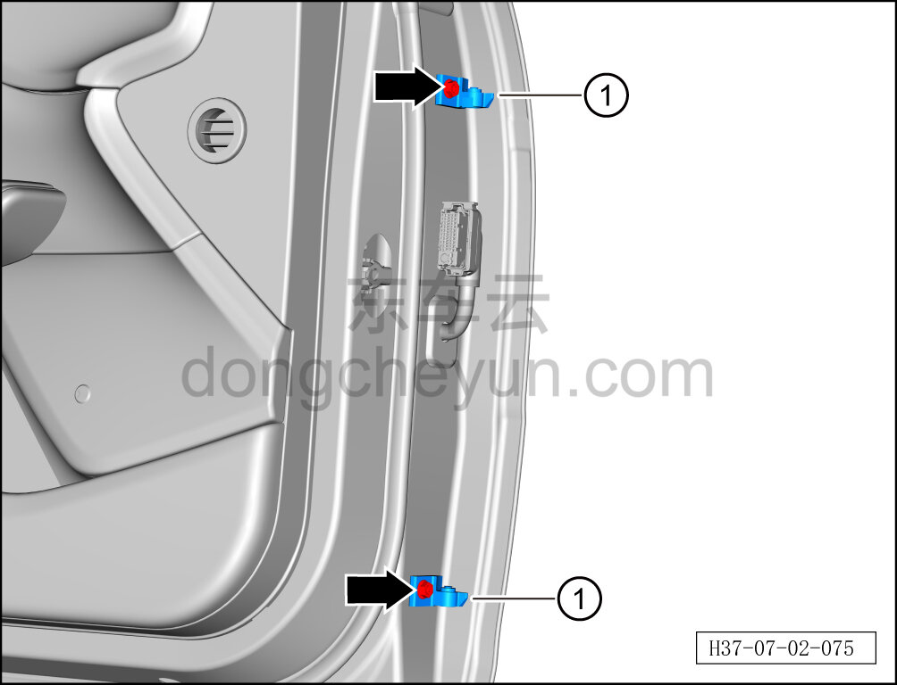
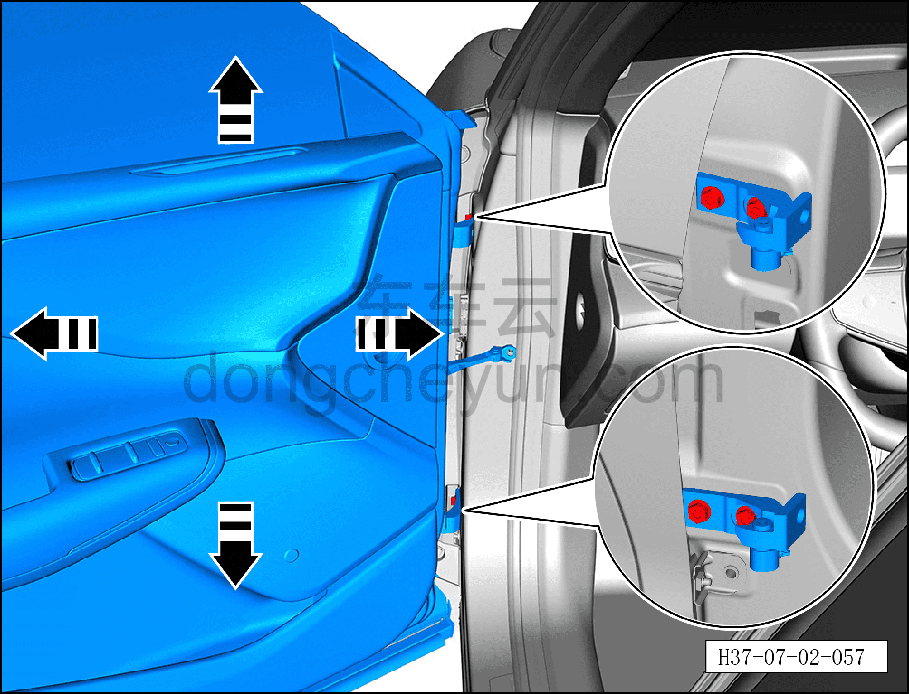

# Снятие и установка левой петли двери (передней)

> Открывающиеся элементы кузова › Передняя дверь › Кузовная панель передней двери  
> Оригинал: `拆卸与安装左门铰链（前）` · [dongcheyun 56746](https://dongcheyun.com/p/56746), страница `11e92a0ad96445b6a0dce0c3e7e990c4` · [оглавление](../README.md)

**Порядок снятия**

Примечание:

- Далее описано снятие и установка левой петли двери (передней), правая сторона выполняется по аналогии с левой.

1. Выключите все электроприборы, отключите питание.

2. Выполните операцию обесточивания автомобиля для ремонта. См. [3.1.4.1 Обесточивание автомобиля](../03-техническое-обслуживание/005-обесточивание-автомобиля.md)

3. Снимите левую переднюю дверь. См. [7.2.3.1 Снятие и установка левой передней двери](012-снятие-и-установка-левой-передней-двери.md)

4. Снимите левую петлю двери (переднюю).

a. С помощью торцевой головки 13 мм выверните 4 крепёжных болта петли на кузове.

Момент затяжки болта: 30±5 Н·м

b. Извлеките 2 петли на кузове ①.

c. С помощью торцевой головки 13 мм выверните 2 крепёжных болта петли левой передней двери.

Момент затяжки болта: 30±5 Н·м

d. Извлеките 2 петли левой передней двери ①.

**Порядок установки**

Установка выполняется в обратном порядке.

1. После установки левой петли двери (передней) и левой передней двери проверьте, соответствуют ли зазор и высота между левой передней дверью и окружающими панелями нормативным значениям. См. [12.1.4.3 Зазоры поверхности кузова](../12-кузовные-жестяные-работы-окраска/007-зазоры-поверхности-кузова.md)

2. Если результат проверки не соответствует нормативному значению, с помощью второго специалиста ослабьте 4 крепёжных болта верхней и нижней петель левой передней двери настолько, чтобы левая передняя дверь получила достаточный люфт, затем отрегулируйте левую переднюю дверь в направлении стрелки согласно рисунку, пока измеренное значение не будет соответствовать нормативному диапазону, после чего затяните 4 крепёжных болта.
