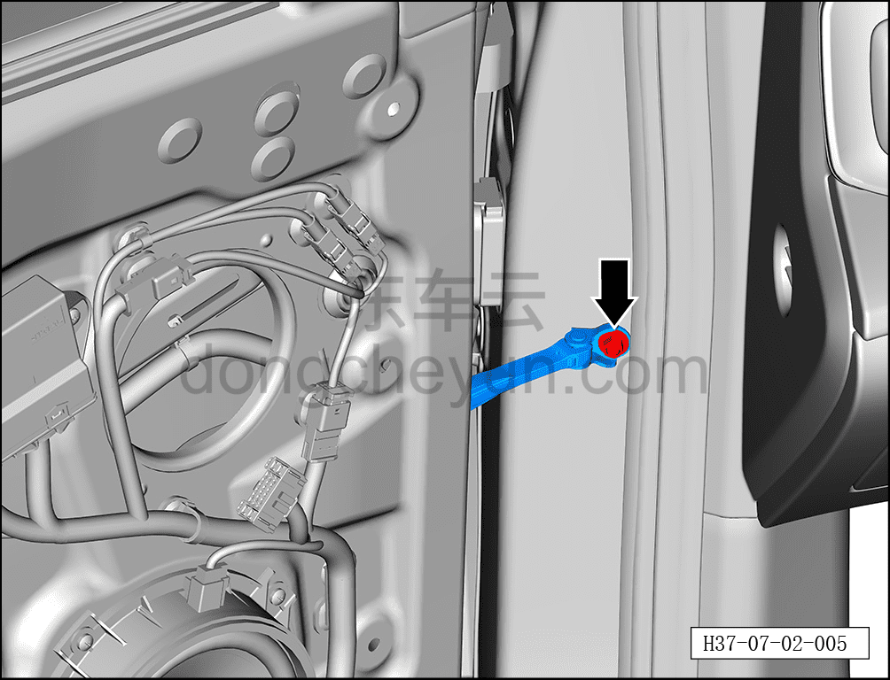
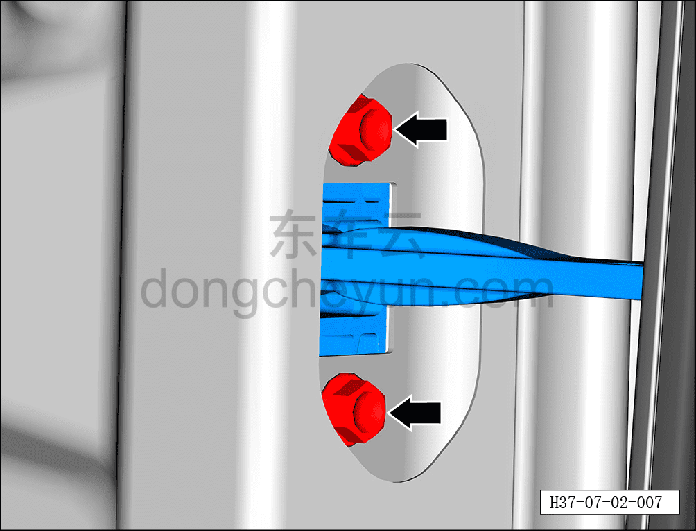
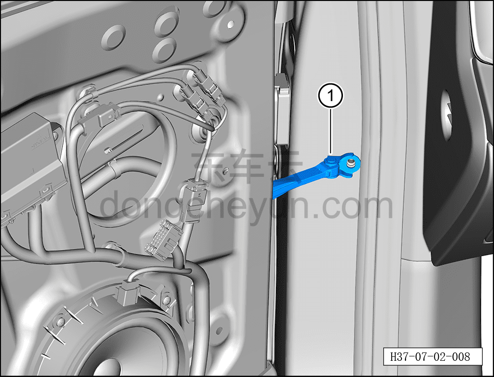

# Снятие и установка ограничителя передней двери

> Открывающиеся элементы кузова › Передняя дверь › Навесные элементы передней двери  
> Оригинал: `拆卸与安装前门限位器` · [dongcheyun 56746](https://dongcheyun.com/p/56746), страница `449410a8250f4284b04a44c1e47e4830` · [оглавление](../README.md)

**Порядок снятия**

**Примечание:**

**- Далее описано снятие и установка ограничителя левой передней двери, правая сторона выполняется по аналогии с левой.**

1. Выключите все электроприборы, отключите питание.

2. Выполните операцию обесточивания автомобиля для ремонта. См. [3.1.4.1 Обесточивание автомобиля](../03-техническое-обслуживание/005-обесточивание-автомобиля.md)

3. Снимите гидроизоляционную плёнку левой передней двери. См. [7.2.4.2 Снятие и установка гидроизоляционной плёнки левой передней двери](015-снятие-и-установка-гидроизоляционной-плёнки-левой.md)

4. Снимите ограничитель передней двери.

a. С помощью торцевой головки 10 мм выверните крепёжный болт ограничителя передней двери.

Момент затяжки болта: 25±3 Н·м

b. С помощью торцевой головки 10 мм выверните 2 крепёжных болта ограничителя передней двери.

Момент затяжки болта: 10±1.5 Н·м

c. Извлеките ограничитель передней двери ①.

**Порядок установки**

Установка выполняется в обратном порядке.

**Внимание:**

**- После установки ограничителя передней двери необходимо проверить нормальность его функционирования.**

**- После завершения установки проверьте нормальность работы всех функций двери.**
