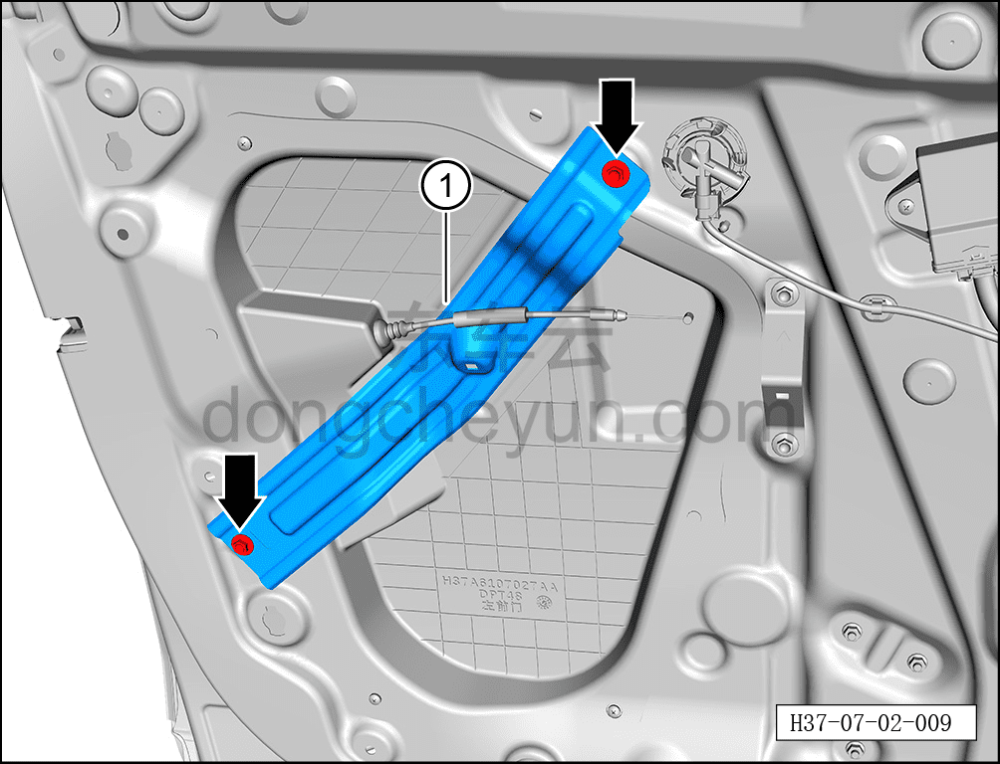
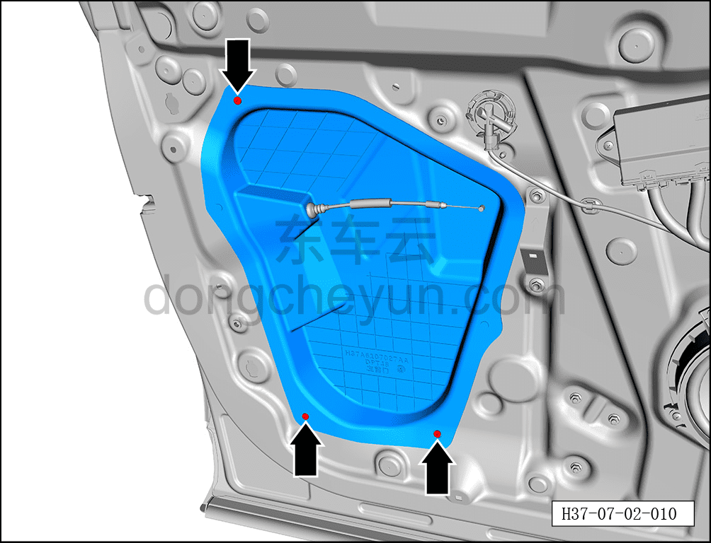
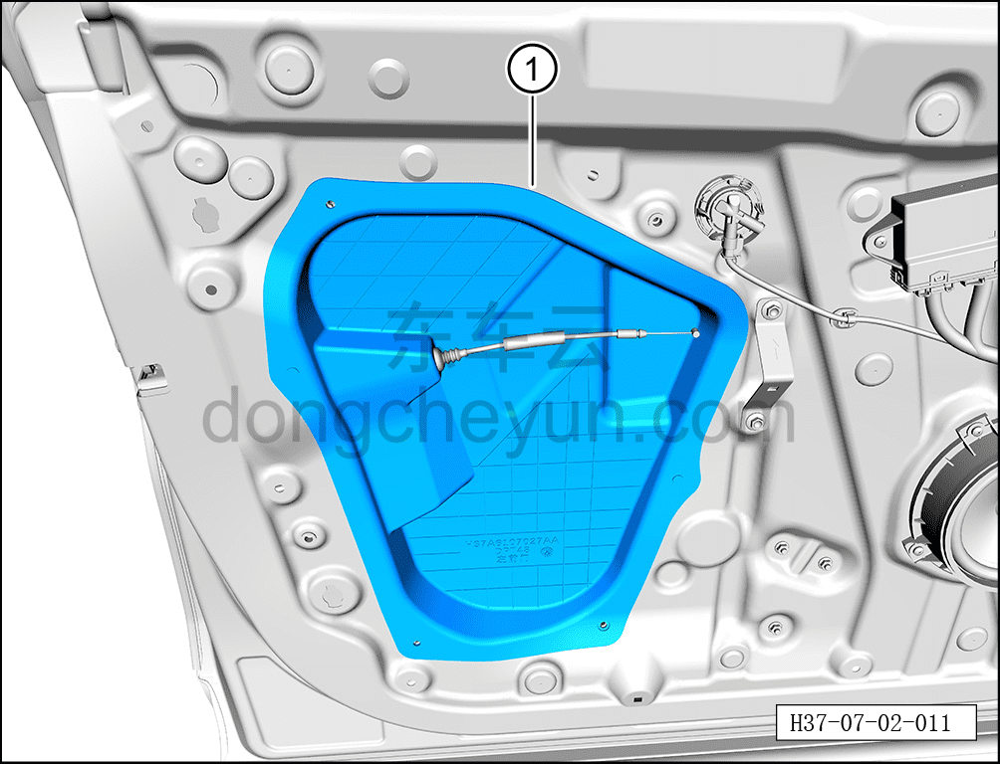
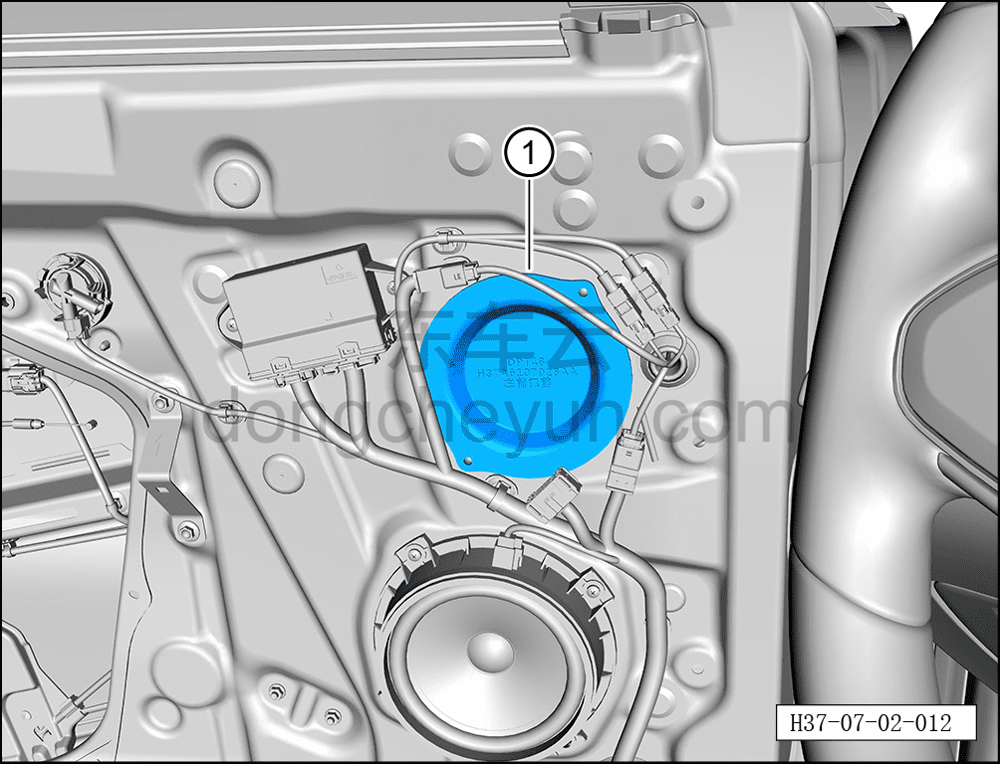

# Снятие и установка гидроизоляционной плёнки левой передней двери

> Открывающиеся элементы кузова › Передняя дверь › Навесные элементы передней двери  
> Оригинал: `拆卸与安装左前门防水膜` · [dongcheyun 56746](https://dongcheyun.com/p/56746), страница `3ab2c5fd11d84de582fd1164bcf2641e` · [оглавление](../README.md)

**Порядок снятия**

**Примечание:**

**- Далее описано снятие и установка гидроизоляционной плёнки левой передней двери, правая сторона выполняется по аналогии с левой.**

1. Выключите все электроприборы, отключите питание.

2. Выполните операцию обесточивания автомобиля для ремонта. См. [3.1.4.1 Обесточивание автомобиля](../03-техническое-обслуживание/005-обесточивание-автомобиля.md)

3. Снимите внутреннюю обивку левой передней двери. См. [8.4.2.1 Снятие и установка внутренней обивки левой передней двери](../08-внутренняя-и-внешняя-отделка/117-снятие-и-установка-обивки-левой-передней-двери.md)

4. Снимите гидроизоляционную плёнку левой передней двери.

a. С помощью торцевой головки 10 мм выверните 2 крепёжных болта кронштейна бокса подлокотника левой передней двери.

Момент затяжки болтов: 10±1 Н·м

b. Извлеките кронштейн бокса подлокотника левой передней двери ①.

c. С помощью крестовой отвёртки выверните 3 крепёжных винта гидроизоляционной плёнки левой передней двери.

Момент затяжки винта: 2±0.5 Н·м

d. Извлеките гидроизоляционную плёнку левой передней двери ①.

e. Извлеките гидроизоляционную плёнку левой передней двери ①.

**Порядок установки**

Установка выполняется в обратном порядке.

**Внимание:**

**- Перед установкой гидроизоляционной плёнки левой передней двери необходимо очистить герметик на плёнке и передней двери, и нанести новый герметик.**

**- После установки гидроизоляционной плёнки левой передней двери необходимо проверить герметичность плёнки, чтобы избежать протечек воды.**

**- После завершения установки проверьте нормальность работы всех функций двери.**
