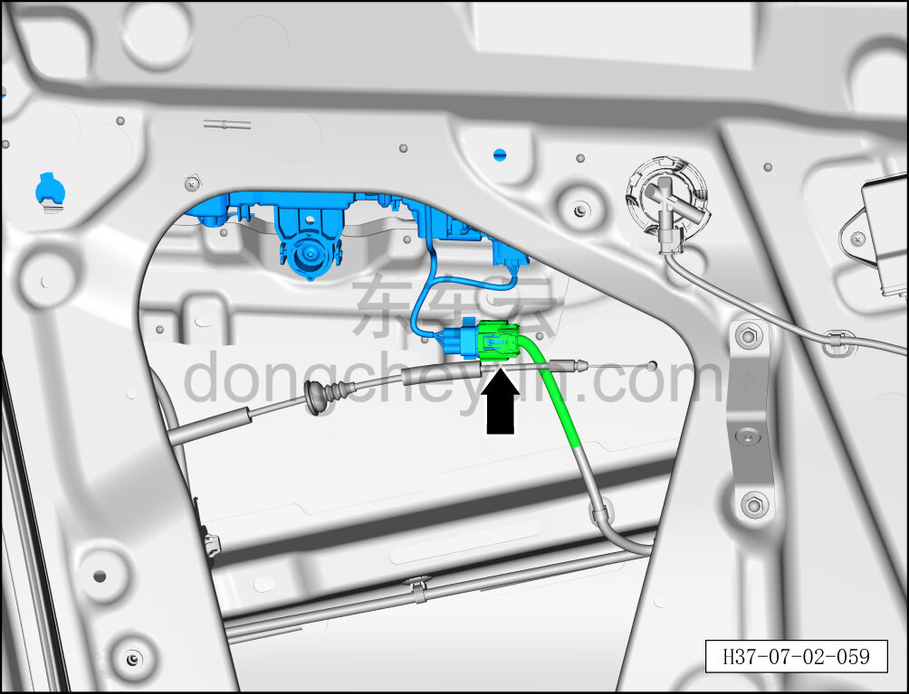
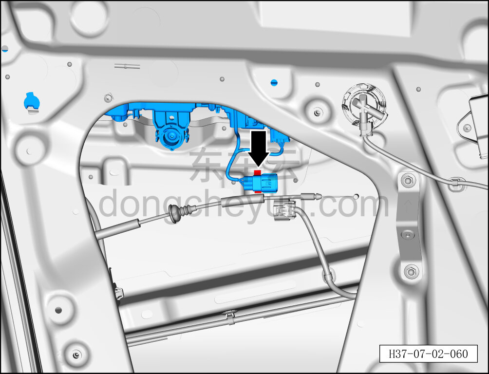
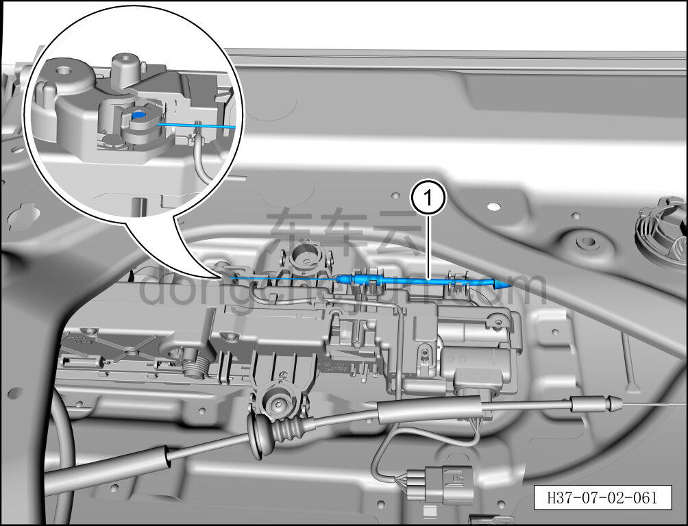
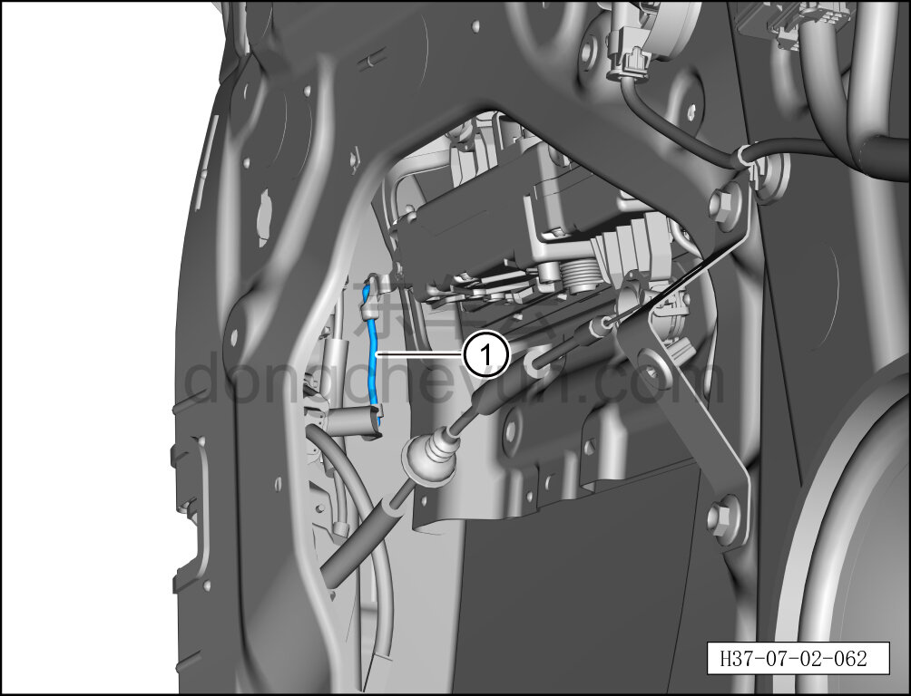
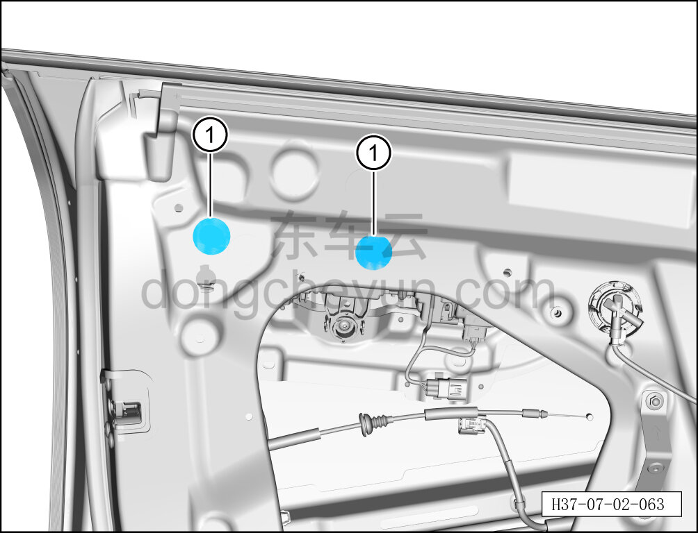
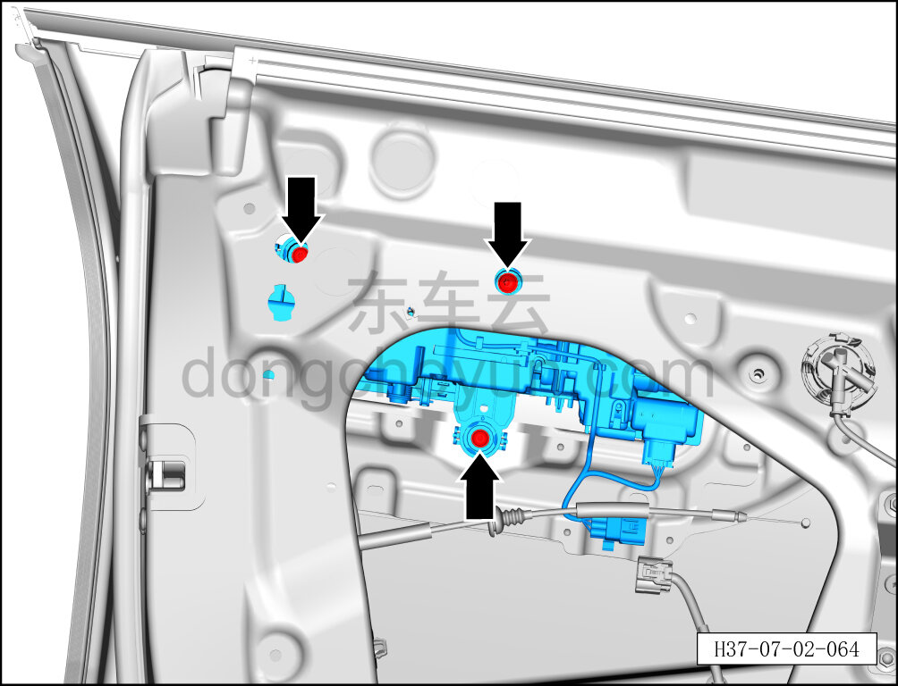
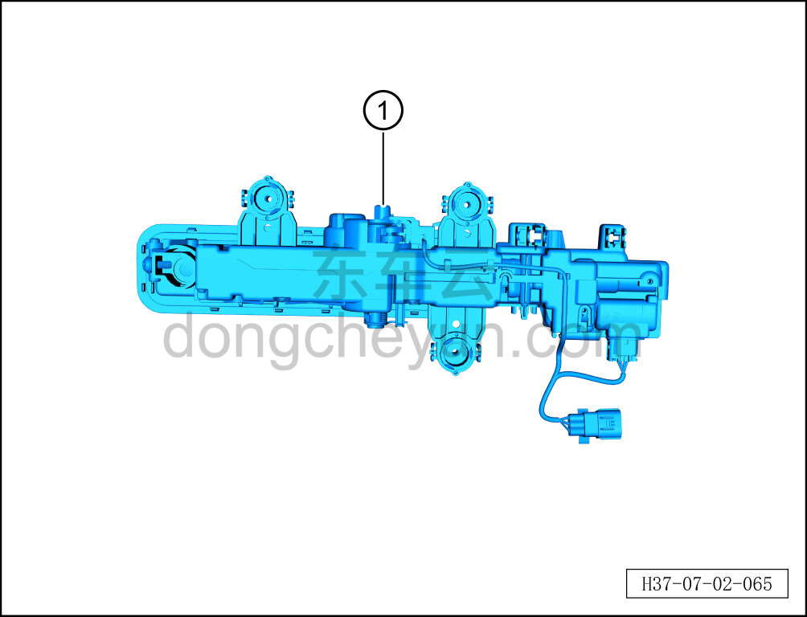

# Снятие и установка наружной ручки открывания левой передней двери в сборе

> Открывающиеся элементы кузова › Передняя дверь › Навесные элементы передней двери  
> Оригинал: `拆卸与安装左前门外开手柄总成` · [dongcheyun 56746](https://dongcheyun.com/p/56746), страница `5dec852a8fc04e1f8f554a3c2de49d15` · [оглавление](../README.md)

**Порядок снятия**

**Примечание:**

**- Далее описано снятие и установка наружной ручки открывания левой передней двери в сборе, правая сторона выполняется по аналогии с левой.**

1. Приведите наружную ручку открывания левой передней двери в сборе в закрытое положение.

2. Выключите все электрические потребители, отключите питание.

3. Выполните обесточивание автомобиля для ремонта. См. [3.1.4.1 Обесточивание автомобиля](../03-техническое-обслуживание/005-обесточивание-автомобиля.md)

4. Снимите стеклоподъёмник левой передней двери. См. [7.2.4.14 Снятие и установка стеклоподъёмника левой передней двери](027-снятие-и-установка-стеклоподъёмника-левой-передней.md)

5. Снимите наружную ручку открывания левой передней двери в сборе.

a. Удерживая фиксатор разъёма, отсоедините разъём жгута левой передней двери.

b. С помощью инструмента для снятия внутренней облицовки отсоедините крепёжную клипсу, соединяющую наружную ручку открывания левой передней двери в сборе с левой передней дверью.

c. Отделите трос наружной ручки открывания передней двери ① от наружной ручки открывания левой передней двери в сборе.

d. Отсоедините тягу замочного цилиндра ①.

e. С помощью плоской отвёртки снимите 2 заглушки внутренней панели передней двери ①.

f. С помощью бита T25 выверните 3 крепёжных винта наружной ручки открывания передней двери в сборе.

Момент затяжки винта: 4.5±0.5 Н·м

g. Снимите наружную ручку открывания передней двери в сборе ①.

**Примечание:**

**- При извлечении необходимо избегать повреждения фиксирующего паза ручки.**

**Порядок установки**

Установка выполняется в обратном порядке.

**Внимание:**

**- После установки наружной ручки открывания левой передней двери необходимо проверить нормальность функций открытия и закрытия ручки.**

**- После завершения установки проверьте нормальность работы всех функций двери.**
