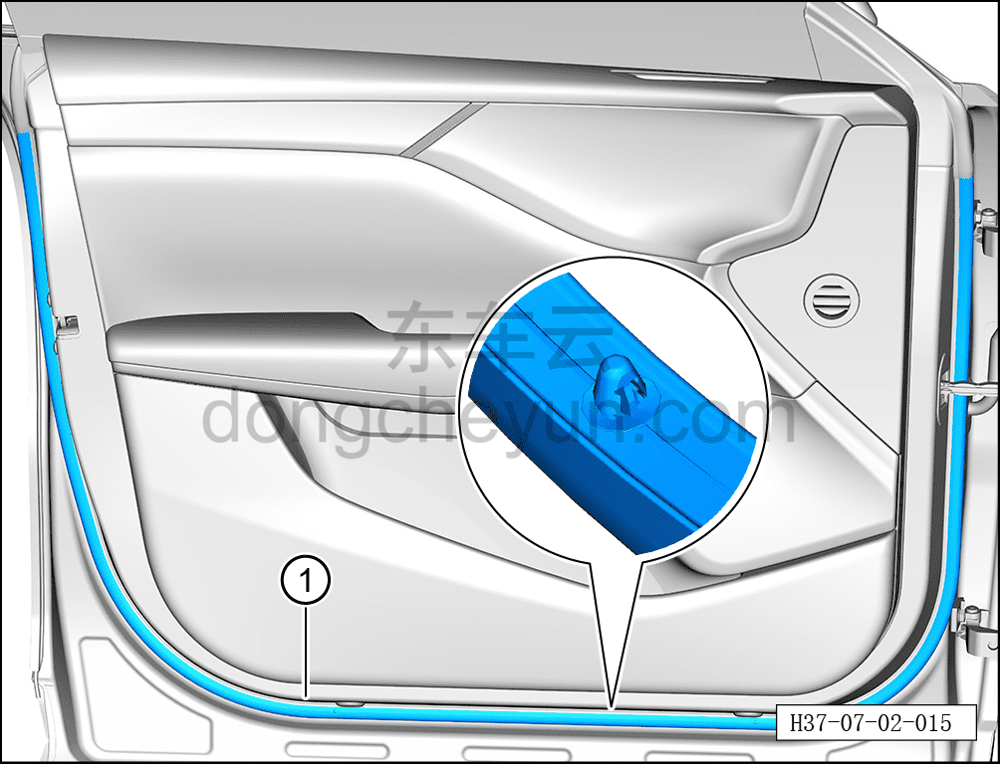

# Снятие и установка уплотнителя левой передней двери

> Открывающиеся элементы кузова › Передняя дверь › Навесные элементы передней двери  
> Оригинал: `拆卸与安装左前门密封条` · [dongcheyun 56746](https://dongcheyun.com/p/56746), страница `9e24d8f12d8643e78ba48a69dd60707e` · [оглавление](../README.md)

**Порядок снятия**

**Примечание:**

**- Далее описано снятие и установка уплотнителя левой передней двери, правая сторона выполняется по аналогии с левой.**

1. Выключите все электроприборы, отключите питание.

2. Откройте левую переднюю дверь.

3. Снимите уплотнитель левой передней двери.

a. С помощью инструмента для снятия внутренней облицовки отсоедините крепёжные клипсы уплотнителя левой передней двери, снимите уплотнитель левой передней двери ①.

**Примечание:**

**- При снятии не повредите пластиковые клипсы на задней стороне уплотнителя левой передней двери.**

**Порядок установки**

Установка выполняется в обратном порядке.

**Внимание:**

**- Перед установкой проверьте места соединения уплотнителя левой передней двери с клипсами на отсутствие повреждений или отрыва, при их наличии необходимо заменить уплотнитель на новый.**
