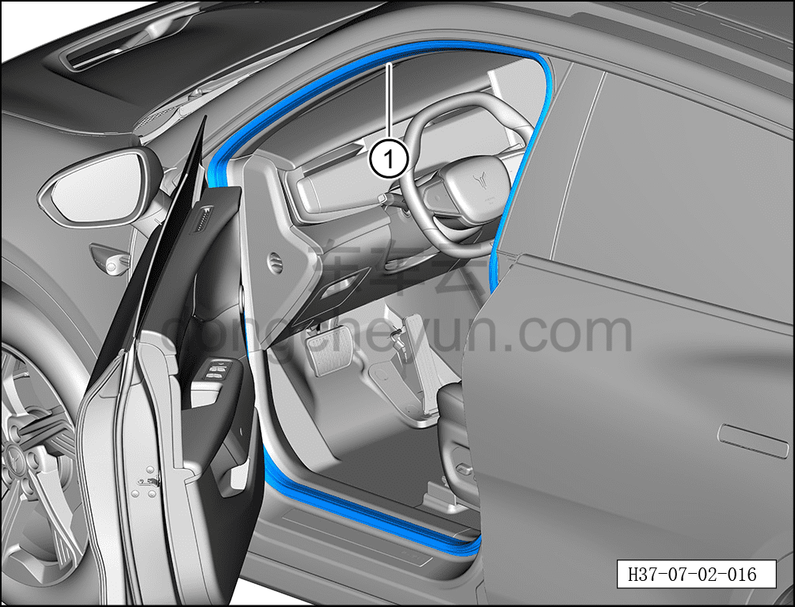

# Снятие и установка уплотнителя проёма левой передней двери

> Открывающиеся элементы кузова › Передняя дверь › Навесные элементы передней двери  
> Оригинал: `拆卸与安装左前门框密封条` · [dongcheyun 56746](https://dongcheyun.com/p/56746), страница `c185f18fade74f1bb43bd0e67fe5f229` · [оглавление](../README.md)

**Порядок снятия**

**Примечание:**

**- Далее описано снятие и установка уплотнителя проёма левой передней двери, правая сторона выполняется по аналогии с левой.**

1. Выключите все электроприборы, отключите питание.

2. Откройте левую переднюю дверь.

3. Снимите уплотнитель проёма левой передней двери.

a. Отсоедините уплотнитель проёма левой передней двери ①.

**Порядок установки**

Установка выполняется в обратном порядке.

**Внимание:**

**- После завершения установки проверьте, чтобы место соединения уплотнителя проёма левой передней двери с кузовом было ровным, без выступов, при необходимости используйте резиновый молоток для восстановления ровности.**
