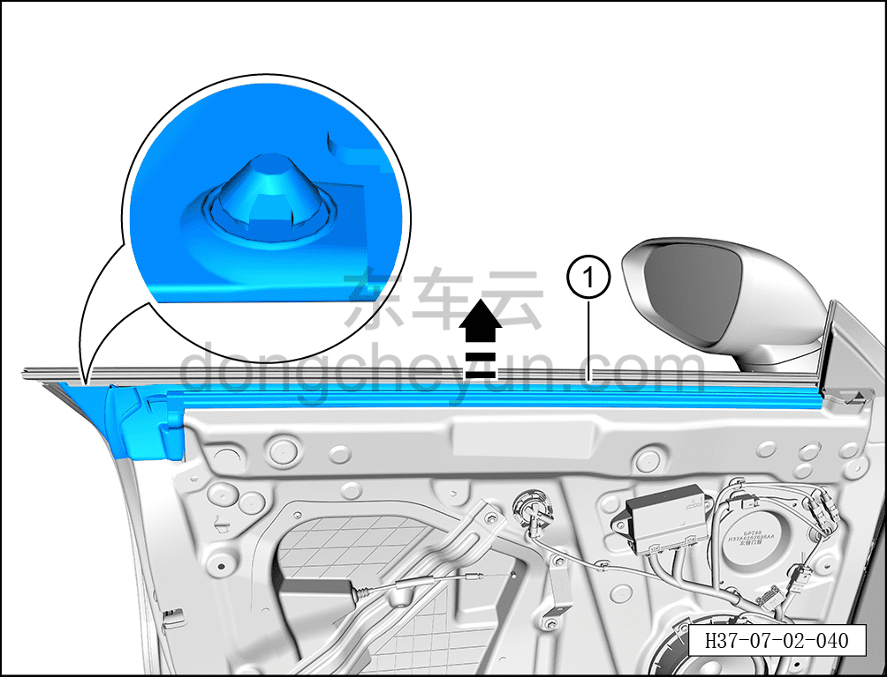

# Снятие и установка внутреннего уплотнителя подоконника левой передней двери

> Открывающиеся элементы кузова › Передняя дверь › Навесные элементы передней двери  
> Оригинал: `拆卸与安装左前门窗台内密封条` · [dongcheyun 56746](https://dongcheyun.com/p/56746), страница `acdced42038b448baa8cdd0f70fac3a6` · [оглавление](../README.md)

**Порядок снятия**

**Примечание:**

**- Далее описано снятие и установка внутреннего уплотнителя подоконника левой передней двери, правая сторона выполняется по аналогии с левой.**

1. Опустите стекло левой передней двери в самое нижнее положение.

2. Выключите все электрические потребители, отключите питание.

3. Выполните обесточивание автомобиля для ремонта. См. [3.1.4.1 Обесточивание автомобиля](../03-техническое-обслуживание/005-обесточивание-автомобиля.md)

4. Снимите внутреннюю обивку левой передней двери. См. [8.4.2.1 Снятие и установка внутренней обивки левой передней двери](../08-внутренняя-и-внешняя-отделка/117-снятие-и-установка-обивки-левой-передней-двери.md)

5. Снимите внутренний уплотнитель подоконника левой передней двери.

a. С помощью инструмента для снятия внутренней облицовки отсоедините внутренний уплотнитель подоконника левой передней двери ① в направлении стрелки согласно рисунку.

**Внимание:**

**- Внутренний уплотнитель подоконника левой передней двери изготовлен из легко деформируемого материала, при снятии не сгибайте его.**

**- При снятии не повредите клипсы на задней стороне внутреннего уплотнителя подоконника левой передней двери.**

**Порядок установки**

Установка выполняется в обратном порядке.

**Внимание:**

**- Перед установкой проверьте клипсы внутреннего уплотнителя подоконника левой передней двери на отсутствие повреждений, при их наличии необходимо заменить уплотнитель на новый.**
