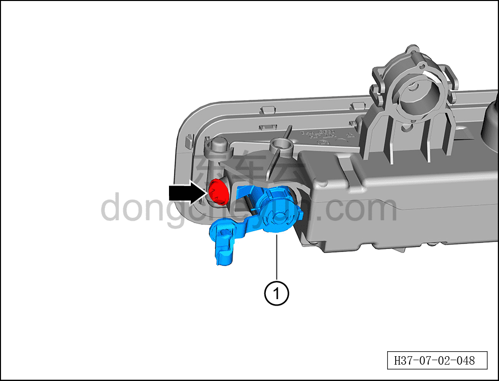

# Снятие и установка узла замочного цилиндра двери

> Открывающиеся элементы кузова › Передняя дверь › Навесные элементы передней двери  
> Оригинал: `拆卸与安装车门锁芯组件` · [dongcheyun 56746](https://dongcheyun.com/p/56746), страница `b092ef6724d54615b4d40ac971f14d1c` · [оглавление](../README.md)

**Порядок снятия**

1. Выключите все электроприборы, отключите питание.

2. Выполните операцию обесточивания автомобиля для ремонта. См. [3.1.4.1 Обесточивание автомобиля](../03-техническое-обслуживание/005-обесточивание-автомобиля.md)

3. Снимите наружную ручку открывания левой передней двери в сборе. См. [7.2.4.3 Снятие и установка наружной ручки открывания левой передней двери в сборе](016-снятие-и-установка-наружной-ручки-открывания-левой.md)

4. Снимите узел замочного цилиндра двери.

a. С помощью бита T30 выверните крепёжный винт узла замочного цилиндра двери.

Момент затяжки винта: 4±0.6 Н·м

b. Извлеките узел замочного цилиндра двери ①.

**Порядок установки**

Установка выполняется в обратном порядке.

**Внимание:**

**- После установки узла замочного цилиндра двери необходимо проверить нормальность его функционирования.**

**- После завершения установки проверьте нормальность работы всех функций двери.**
