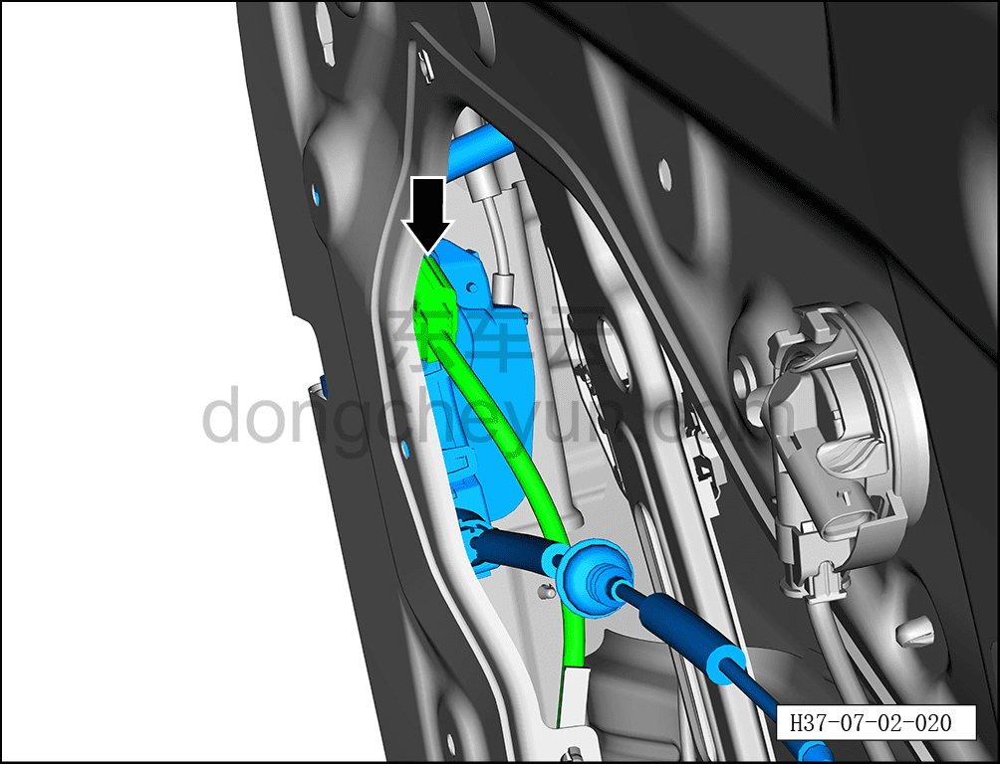
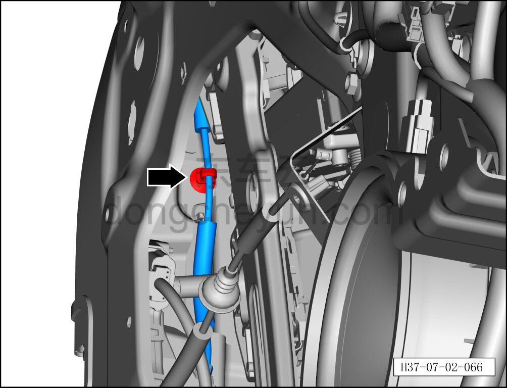
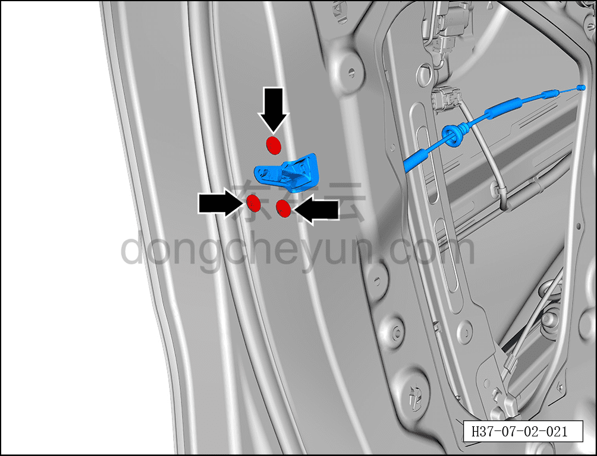
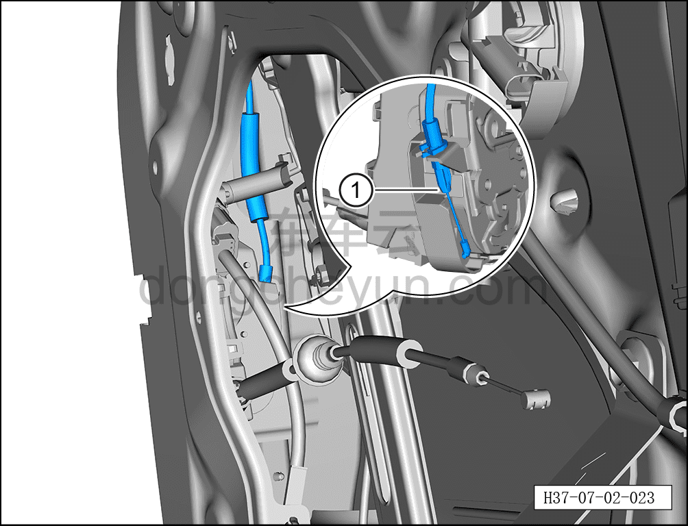

# Снятие и установка корпуса замка левой передней двери

> Открывающиеся элементы кузова › Передняя дверь › Навесные элементы передней двери  
> Оригинал: `拆卸与安装左前门锁体` · [dongcheyun 56746](https://dongcheyun.com/p/56746), страница `49c7f81b52254d6dab5f908916ea5261` · [оглавление](../README.md)

**Порядок снятия**

**Примечание:**

**- Далее описано снятие и установка корпуса замка левой передней двери, правая сторона выполняется по аналогии с левой.**

1. Поднимите стекло левой передней двери в верхнее положение.

2. Выключите все электрические потребители, отключите питание.

3. Выполните обесточивание автомобиля для ремонта. См. [3.1.4.1 Обесточивание автомобиля](../03-техническое-обслуживание/005-обесточивание-автомобиля.md)

4. Снимите гидроизоляционную плёнку левой передней двери. См. [7.2.4.2 Снятие и установка гидроизоляционной плёнки левой передней двери](015-снятие-и-установка-гидроизоляционной-плёнки-левой.md)

5. Снимите корпус замка левой передней двери.

a. Удерживая фиксатор разъёма, отсоедините разъём жгута левой передней двери.

b. Отсоедините тягу замочного цилиндра ①.

c. С помощью инструмента для снятия внутренней облицовки отсоедините крепёжную клипсу троса наружной ручки открывания передней двери.

d. С помощью T30 выверните 3 крепёжных винта корпуса замка левой передней двери.

Момент затяжки винта: 8±1 Н·м

e. Отсоедините трос наружной ручки открывания передней двери ①, извлеките корпус замка левой передней двери.

f. Отсоедините трос внутренней ручки открывания передней двери ①, отделите корпус замка левой передней двери от троса внутренней ручки открывания передней двери.

**Порядок установки**

Установка выполняется в обратном порядке.

**Внимание:**

**- После установки корпуса замка левой передней двери необходимо проверить нормальность открытия и закрытия передней двери.**

**- После завершения установки проверьте нормальность работы всех функций двери.**
