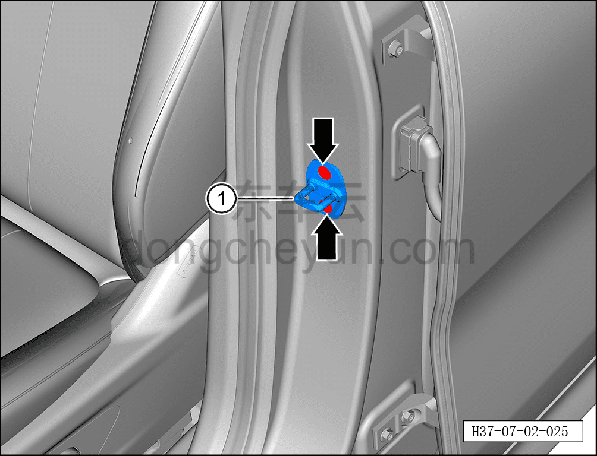

# Снятие и установка ответной части замка двери (передней двери)

> Открывающиеся элементы кузова › Передняя дверь › Навесные элементы передней двери  
> Оригинал: `拆卸与安装车门锁扣（前门）` · [dongcheyun 56746](https://dongcheyun.com/p/56746), страница `2d2c728fd9ee424e9d58e094b4e3deea` · [оглавление](../README.md)

**Порядок снятия**

**Примечание:**

**- Далее описано снятие и установка ответной части замка левой передней двери, правая сторона выполняется по аналогии с левой.**

1. Выключите все электроприборы, отключите питание.

2. Откройте левую переднюю дверь.

3. Снимите ответную часть замка двери.

a. С помощью бита T40 выверните 2 крепёжных винта ответной части замка двери.

Момент затяжки винта: 25±3 Н·м

b. Извлеките ответную часть замка двери ①.

**Порядок установки**

Установка выполняется в обратном порядке.

**Внимание:**

**- После установки ответной части замка двери необходимо проверить нормальность открытия и закрытия передней двери.**
