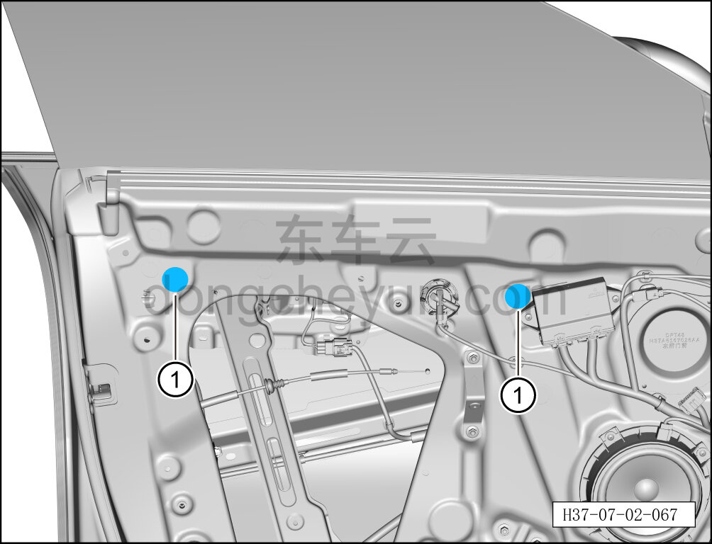
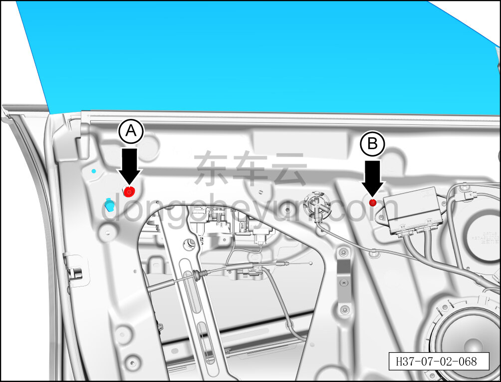
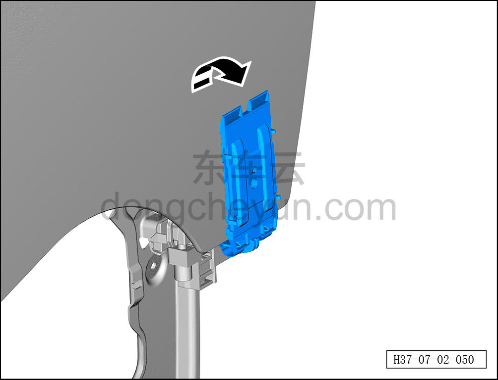
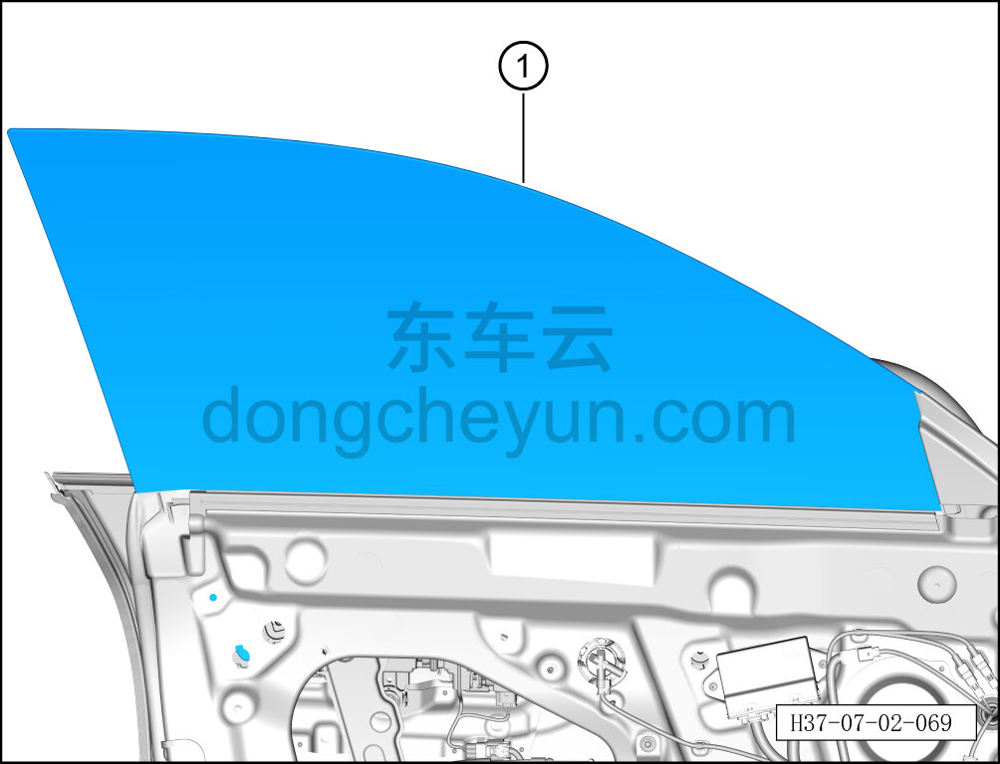

# Снятие и установка стекла левой передней двери

> Открывающиеся элементы кузова › Передняя дверь › Навесные элементы передней двери  
> Оригинал: `拆卸与安装左前门玻璃` · [dongcheyun 56746](https://dongcheyun.com/p/56746), страница `23e4f72091044d368fbb37b657c5a324` · [оглавление](../README.md)

**Порядок снятия**

**Примечание:**

**- Далее описано снятие и установка стекла левой передней двери, правая сторона выполняется по аналогии с левой.**

1. Выключите все электроприборы, отключите питание.

2. Выполните операцию обесточивания автомобиля для ремонта. См. [3.1.4.1 Обесточивание автомобиля](../03-техническое-обслуживание/005-обесточивание-автомобиля.md)

3. Снимите гидроизоляционную плёнку левой передней двери. См. [7.2.4.2 Снятие и установка гидроизоляционной плёнки левой передней двери](015-снятие-и-установка-гидроизоляционной-плёнки-левой.md)

4. Снимите стекло левой передней двери.

a. С помощью плоской отвёртки снимите 2 заглушки внутренней панели передней двери ①.

b. С помощью торцевой головки 10 мм выверните крепёжный болт A стекла левой передней двери.

Момент затяжки болта: 13±1.5 Н·м

c. С помощью бита T30 ослабьте крепёжный винт B стекла левой передней двери.

Момент затяжки винта: 13±1.5 Н·м

**Примечание:**

**- Крепёжный винт B стекла левой передней двери не требуется извлекать, достаточно ослабить настолько, чтобы стекло можно было извлечь.**

d. Раскройте зажим стеклоподъёмника левой передней двери в направлении стрелки.

**Внимание:**

**- При раскрытии зажима будьте осторожны, чтобы не повредить стекло левой передней двери.**

e. Извлеките стекло левой передней двери ①.

**Внимание:**

**- При извлечении стекла левой передней двери не допускайте его соприкосновения и столкновения с дверью, во избежание растрескивания стекла; стекло нельзя ставить краем на землю, даже незначительное повреждение может привести к растрескиванию стекла.**

**Порядок установки**

Установка выполняется в обратном порядке.

**Внимание:**

**- После установки стекла левой передней двери необходимо проверить нормальность функции подъёма и опускания стекла.**

**- После завершения установки проверьте нормальность работы всех функций двери.**
