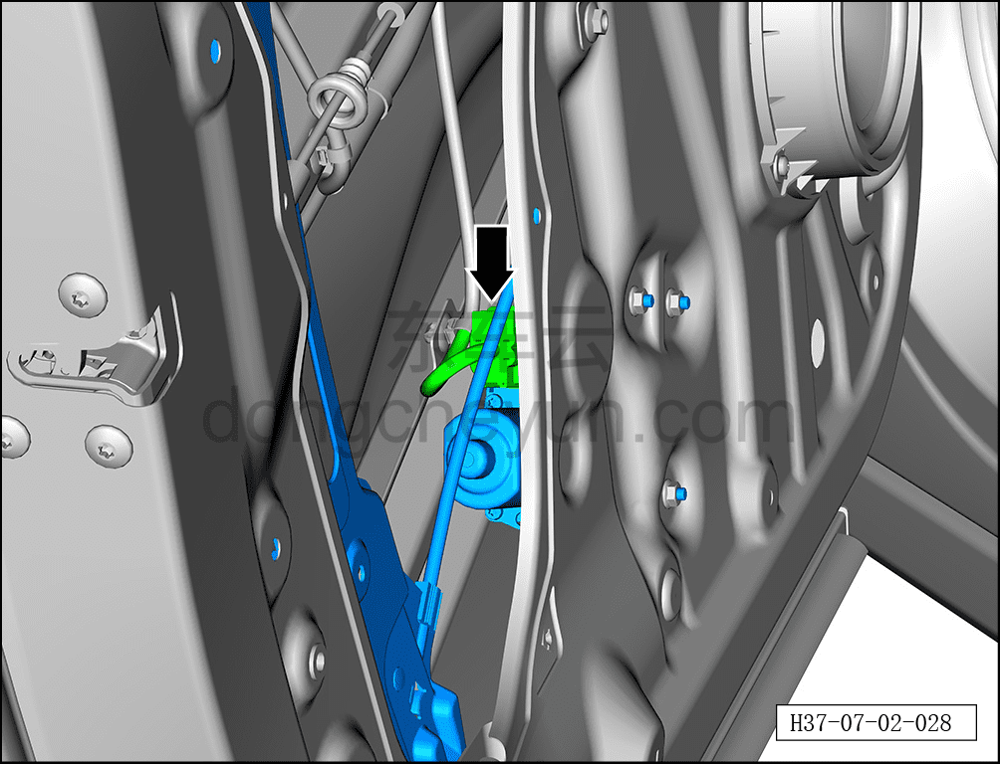
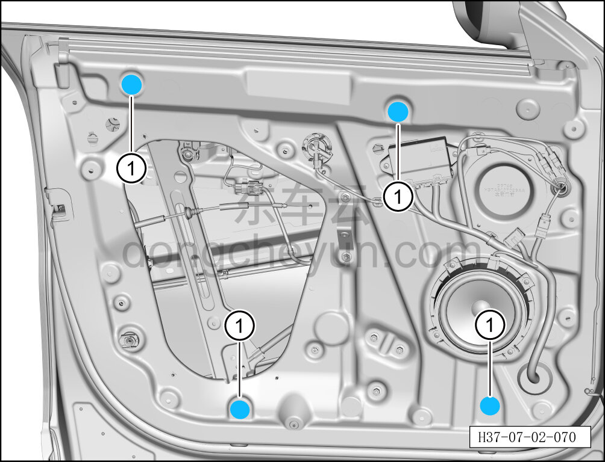
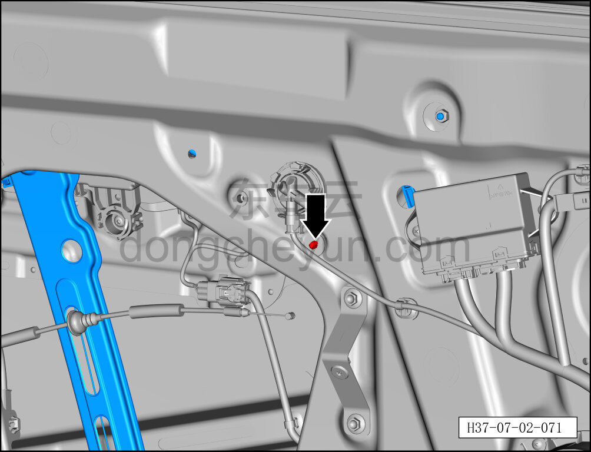
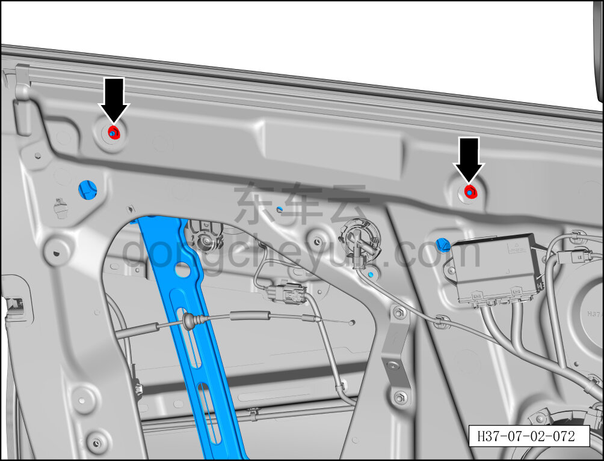
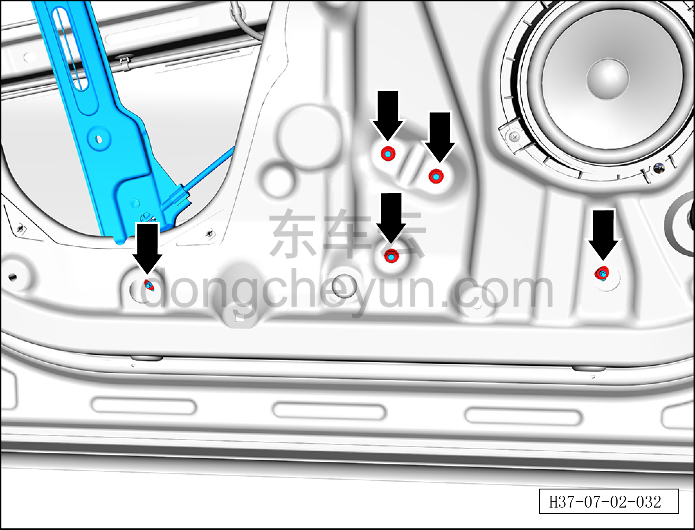
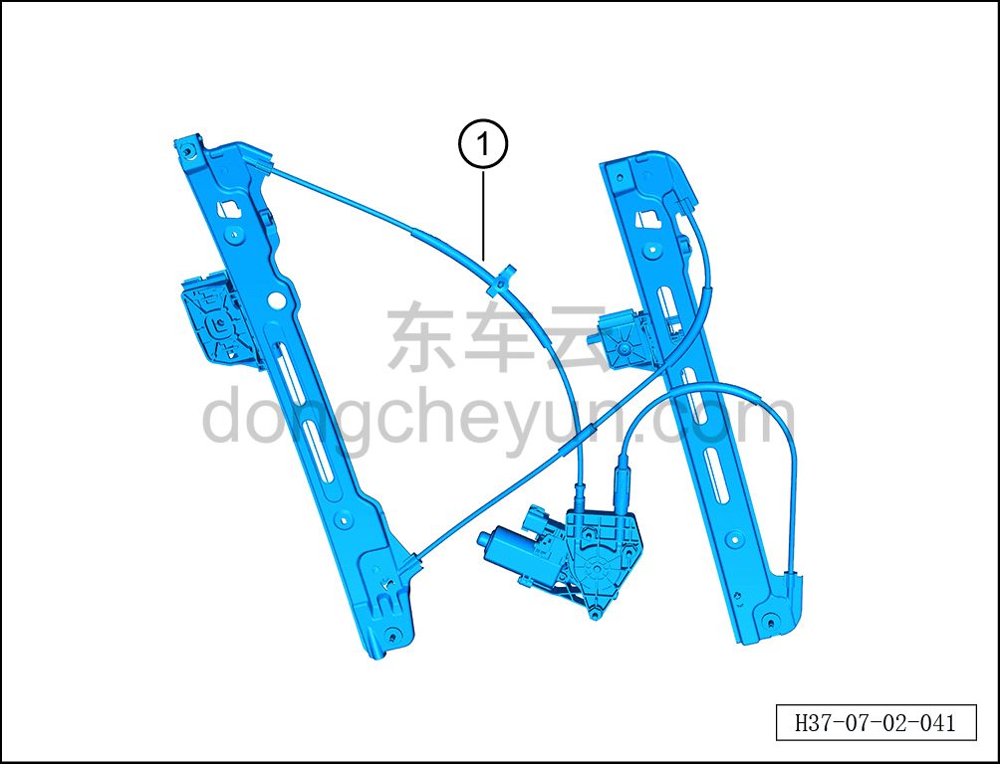

# Снятие и установка стеклоподъёмника левой передней двери

> Открывающиеся элементы кузова › Передняя дверь › Навесные элементы передней двери  
> Оригинал: `拆卸与安装左前门玻璃升降器` · [dongcheyun 56746](https://dongcheyun.com/p/56746), страница `6a25f4b68f9342a0b2aa8583104371f7` · [оглавление](../README.md)

**Порядок снятия**

**Примечание:**

**- Далее описано снятие и установка стеклоподъёмника левой передней двери, правая сторона выполняется по аналогии с левой.**

1. Выключите все электроприборы, отключите питание.

2. Выполните операцию обесточивания автомобиля для ремонта. См. [3.1.4.1 Обесточивание автомобиля](../03-техническое-обслуживание/005-обесточивание-автомобиля.md)

3. Снимите стекло левой передней двери. См. [7.2.4.13 Снятие и установка стекла левой передней двери](026-снятие-и-установка-стекла-левой-передней-двери.md)

4. Снимите стеклоподъёмник левой передней двери.

a. Нажмите на фиксатор разъёма, отсоедините разъём жгута левой передней двери.

b. С помощью плоской отвёртки снимите 4 заглушки внутренней панели передней двери ①.

c. С помощью инструмента для снятия внутренней облицовки отсоедините крепёжную клипсу, соединяющую стеклоподъёмник левой передней двери с левой передней дверью.

d. С помощью торцевой головки 10 мм выверните 2 крепёжные гайки стеклоподъёмника левой передней двери.

Момент затяжки гайки: 10±1 Н·м

e. С помощью торцевой головки 10 мм выверните 5 крепёжных гаек стеклоподъёмника левой передней двери.

Момент затяжки гайки: 10±1 Н·м

f. Снимите стеклоподъёмник левой передней двери ①.

**Порядок установки**

Установка выполняется в обратном порядке.

**Внимание:**

**- После установки стеклоподъёмника левой передней двери необходимо проверить нормальность функции подъёма и опускания стекла.**

**- После завершения установки проверьте нормальность работы всех функций двери.**
