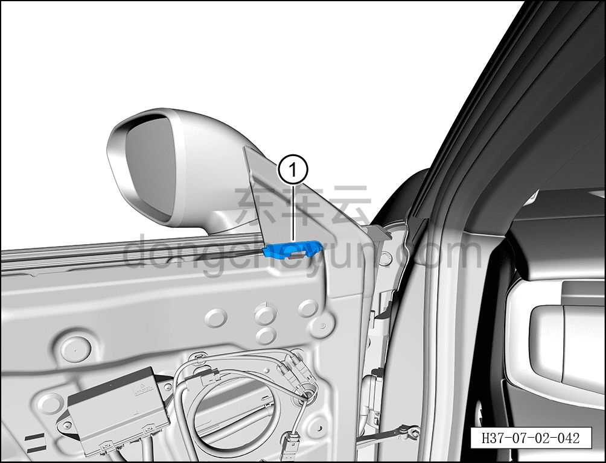
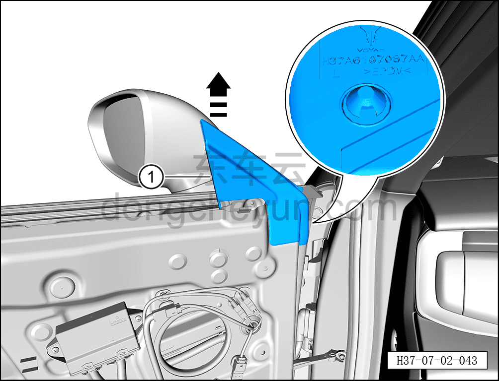

# Снятие и установка направляющей стекла стойки A левой передней двери

> Открывающиеся элементы кузова › Передняя дверь › Навесные элементы передней двери  
> Оригинал: `拆卸与安装左前门A柱玻璃导槽` · [dongcheyun 56746](https://dongcheyun.com/p/56746), страница `e2b3e600894e4bab9d70057221caf394` · [оглавление](../README.md)

**Порядок снятия**

**Примечание:**

**- Далее описано снятие и установка направляющей стекла стойки A левой передней двери, правая сторона выполняется по аналогии с левой.**

1. Выключите все электроприборы, отключите питание.

2. Выполните операцию обесточивания автомобиля для ремонта. См. [3.1.4.1 Обесточивание автомобиля](../03-техническое-обслуживание/005-обесточивание-автомобиля.md)

3. Снимите стекло левой передней двери. См. [7.2.4.13 Снятие и установка стекла левой передней двери](026-снятие-и-установка-стекла-левой-передней-двери.md)

4. Снимите внутренний уплотнитель подоконника левой передней двери. См. [7.2.4.8 Снятие и установка внутреннего уплотнителя подоконника левой передней двери](021-снятие-и-установка-внутреннего-уплотнителя-подоконника.md)

5. Снимите треугольную декоративную накладку левой передней двери. См. [8.6.2.1 Снятие и установка треугольной декоративной накладки левой передней двери](../08-внутренняя-и-внешняя-отделка/158-снятие-и-установка-левой-треугольной-накладки-передней.md)

6. Снимите направляющую стекла стойки A левой передней двери.

a. Извлеките звукоизоляционную заглушку левой передней двери ①.

b. С помощью инструмента для снятия внутренней облицовки отсоедините направляющую стекла стойки A левой передней двери от левой передней двери, извлеките направляющую стекла стойки A левой передней двери ① в направлении стрелки согласно рисунку.

**Внимание:**

**- При снятии не повредите клипсы на задней стороне направляющей стойки A левой передней двери.**

**Порядок установки**

Установка выполняется в обратном порядке.

**Внимание:**

**- После установки направляющей стойки A левой передней двери необходимо проверить, чтобы место соединения направляющей с направляющим рельсом плотно прилегало.**

**- Перед установкой проверьте клипсы направляющей стойки A левой передней двери на отсутствие повреждений, при их наличии необходимо заменить уплотнитель на новый.**

**- После завершения установки проверьте нормальность работы всех функций двери.**
