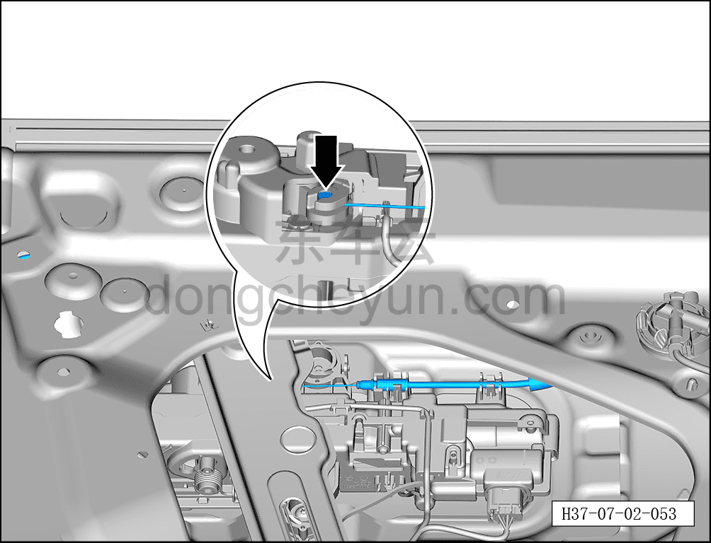
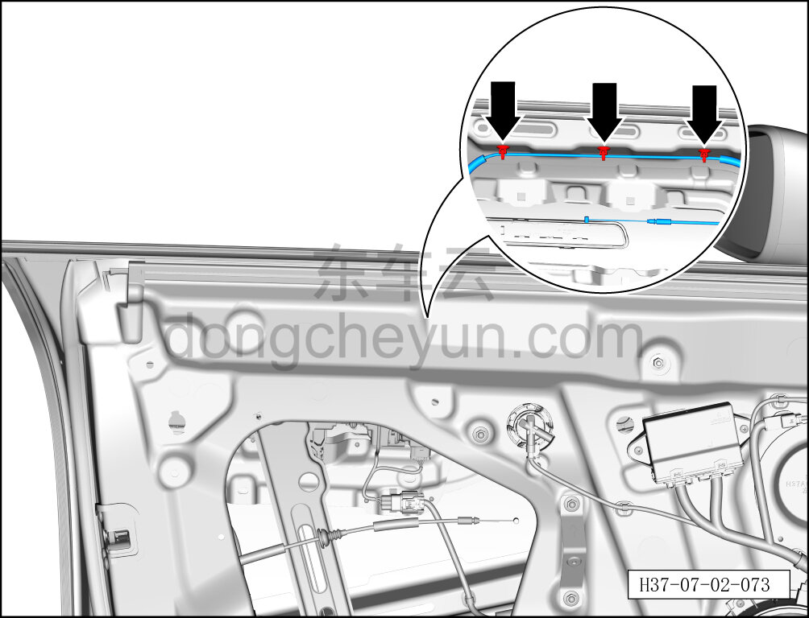
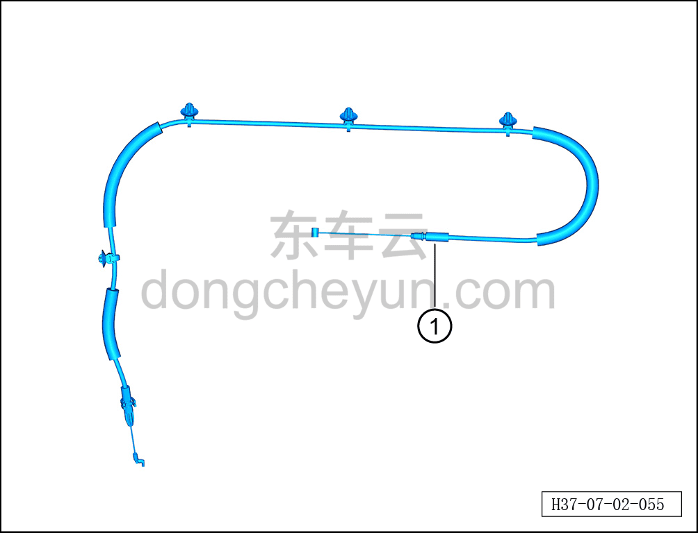

# Снятие и установка троса наружной ручки открывания передней двери

> Открывающиеся элементы кузова › Передняя дверь › Навесные элементы передней двери  
> Оригинал: `拆卸与安装前门外开拉丝` · [dongcheyun 56746](https://dongcheyun.com/p/56746), страница `3661c1fbe6ea48ca835854ffe314a376` · [оглавление](../README.md)

**Порядок снятия**

**Примечание:**

**- Далее описано снятие и установка троса наружной ручки открывания левой передней двери, правая сторона выполняется по аналогии с левой.**

1. Выключите все электроприборы, отключите питание.

2. Выполните операцию обесточивания автомобиля для ремонта. См. [3.1.4.1 Обесточивание автомобиля](../03-техническое-обслуживание/005-обесточивание-автомобиля.md)

3. Снимите стекло левой передней двери. См. [7.2.4.13 Снятие и установка стекла левой передней двери](026-снятие-и-установка-стекла-левой-передней-двери.md)

4. Снимите корпус замка левой передней двери. См. [7.2.4.11 Снятие и установка корпуса замка левой передней двери](024-снятие-и-установка-корпуса-замка-левой-передней-двери.md)

5. Снимите трос наружной ручки открывания передней двери.

a. Отсоедините трос наружной ручки открывания передней двери от места соединения с наружной ручкой открывания левой передней двери в сборе.

b. Отсоедините 3 крепёжные клипсы троса наружной ручки открывания передней двери.

c. Извлеките трос наружной ручки открывания передней двери ①.

**Порядок установки**

Установка выполняется в обратном порядке.

**Внимание:**

**- После установки троса наружной ручки открывания передней двери необходимо проверить нормальность открывания передней двери снаружи.**

**- После завершения установки проверьте нормальность работы всех функций двери.**
