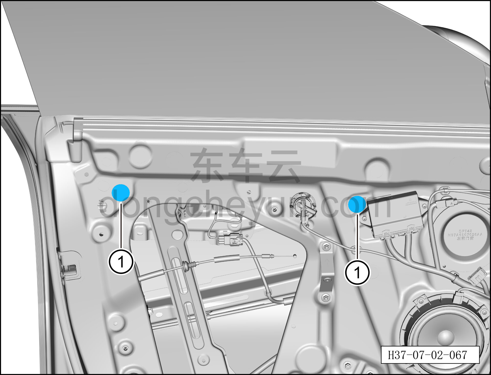
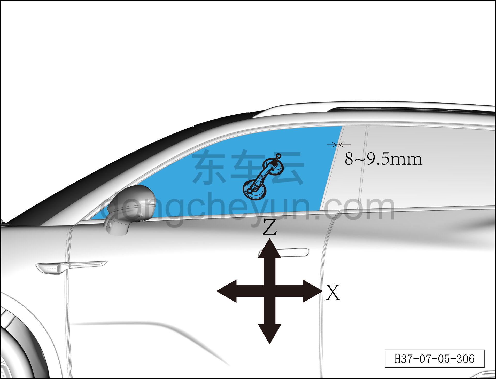
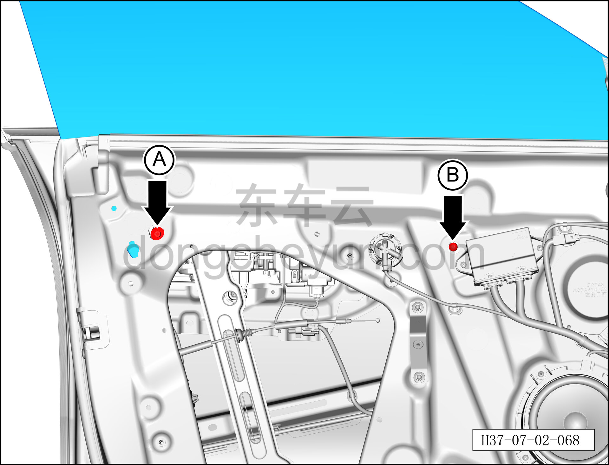

# Регулировка смещения положения стекла передней двери

> Открывающиеся элементы кузова › Передняя дверь › Навесные элементы передней двери  
> Оригинал: `前门玻璃位置偏移调整` · [dongcheyun 56746](https://dongcheyun.com/p/56746), страница `4a50d4cd3dc8471cb726754adf2cd471` · [оглавление](../README.md)

**Порядок регулировки**

**Примечание:**

**- Далее способ регулировки описан на примере стекла левой передней двери, правая сторона выполняется по аналогии с левой.**

1. Выключите все электроприборы, отключите питание.

2. Выполните операцию обесточивания автомобиля для ремонта. См. [3.1.4.1 Обесточивание автомобиля](../03-техническое-обслуживание/005-обесточивание-автомобиля.md)

3. Снимите внутреннюю обивку левой передней двери. См. [8.4.2.1 Снятие и установка внутренней обивки левой передней двери](../08-внутренняя-и-внешняя-отделка/117-снятие-и-установка-обивки-левой-передней-двери.md)

4. Отрегулируйте стекло левой передней двери.

a. С помощью плоской отвёртки снимите 2 заглушки внутренней панели передней двери ①.

**Внимание:**

**- Регулировку стекла необходимо выполнять совместно двумя людьми: один снаружи автомобиля регулирует стекло, другой внутри автомобиля ослабляет или затягивает болты.**

**Действия внутри автомобиля:**

b. С помощью торцевой головки 10 мм ослабьте крепёжный болт A стекла левой передней двери.

c. С помощью бита T30 ослабьте крепёжный винт B стекла левой передней двери.

**Примечание:**

**- Крепёжные болт и винт стекла левой передней двери извлекать не требуется, достаточно ослабить.**

**Действия снаружи автомобиля:**

d. Закройте дверь, человек снаружи автомобиля присасывает присоской стекло, регулирует стекло по осям X и Z.

e. По оси X зазор между стеклом и накладкой стойки B должен составлять от 8 до 9.5 мм; по оси Z разница верхнего и нижнего зазора между стеклом и накладкой стойки B должна быть < 1.5 мм.

**Действия внутри автомобиля:**

f. С помощью торцевой головки 10 мм затяните крепёжный болт A стекла левой передней двери.

Момент затяжки болта: 12 Н·м

g. С помощью бита T30 затяните крепёжный винт B стекла левой передней двери.

Момент затяжки болта: 12 Н·м

h. Установите 2 заглушки внутренней панели передней двери ①.

5. Установите внутреннюю обивку левой передней двери. См. [8.4.2.1 Снятие и установка внутренней обивки левой передней двери](../08-внутренняя-и-внешняя-отделка/117-снятие-и-установка-обивки-левой-передней-двери.md)

6. Включите питание автомобиля.

**Внимание:**

**- После завершения регулировки приведите в действие стеклоподъёмник, проверьте отсутствие задевания края стекла с накладкой стойки B, при наличии — необходимо повторить регулировку.**
