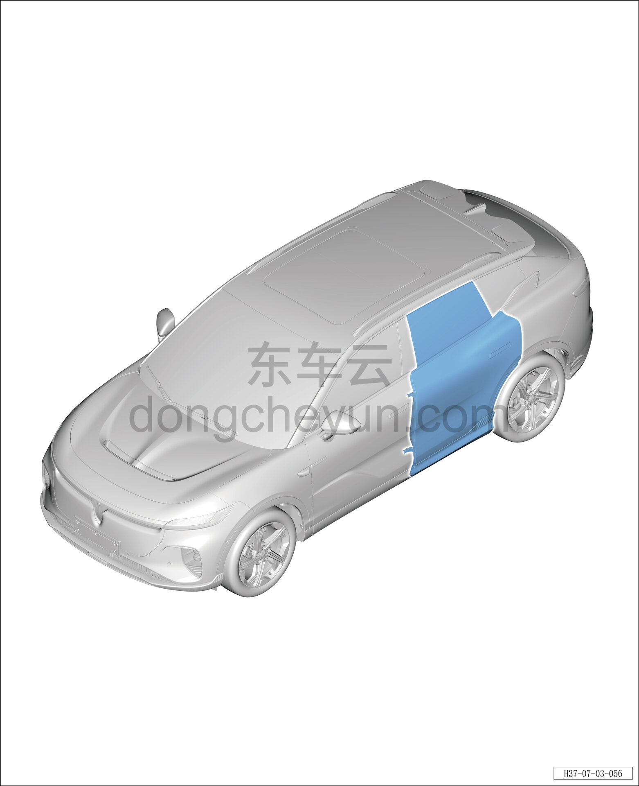

# Покомпонентный вид (деталировка)

> Открывающиеся элементы кузова › Задняя дверь › Расположение компонентов  
> Оригинал: `零部件分解图` · [dongcheyun 56746](https://dongcheyun.com/p/56746), страница `bc55e5cd5a044469ae62f57f6d887d18` · [оглавление](../README.md)

