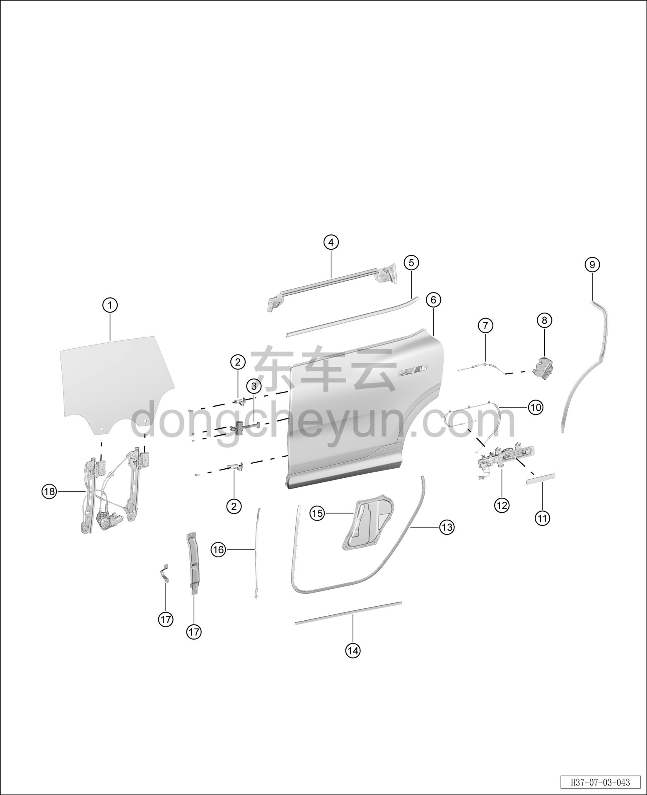

# Покомпонентный вид (деталировка)

> Открывающиеся элементы кузова › Задняя дверь › Покомпонентный вид (деталировка)  
> Оригинал: `结构分解图` · [dongcheyun 56746](https://dongcheyun.com/p/56746), страница `ee00c24faae3426f925769050a34736d` · [оглавление](../README.md)

| № | Наименование детали | Кол-во на автомобиль | Примечание |
|---|---|---|---|
| 1 | Стекло левой задней двери | 1 | - |
| 2 | Нижняя петля левой передней двери (петля левой задней двери) | 2 | - |
| 3 | Ограничитель задней двери | 1 | - |
| 4 | Внутренний уплотнитель подоконника левой задней двери | 1 | - |
| 5 | Наружный уплотнитель подоконника левой задней двери | 1 | - |
| 6 | Левая задняя дверь | 1 | - |
| 7 | Трос внутренней ручки открывания задней двери | 1 | - |
| 8 | Корпус замка левой задней двери | 1 | - |
| 9 | Уплотнитель стойки C левой двери | 1 | - |
| 10 | Трос наружной ручки открывания задней двери | 1 | - |
| 11 | Корпус наружной ручки открывания левой задней двери | 1 | - |
| 12 | Наружная ручка открывания левой задней двери в сборе | 1 | - |
| 13 | Уплотнитель левой задней двери | 1 | - |
| 14 | Грязезащитная лента левой задней двери | 1 | - |
| 15 | Гидроизоляционная плёнка левой задней двери | 1 | - |
| 16 | Передний уплотнитель левой задней двери | 1 | - |
| 17 | Кронштейн бокса подлокотника левой задней двери | 1 | - |
| 18 | Стеклоподъёмник левой задней двери | 1 | - |
