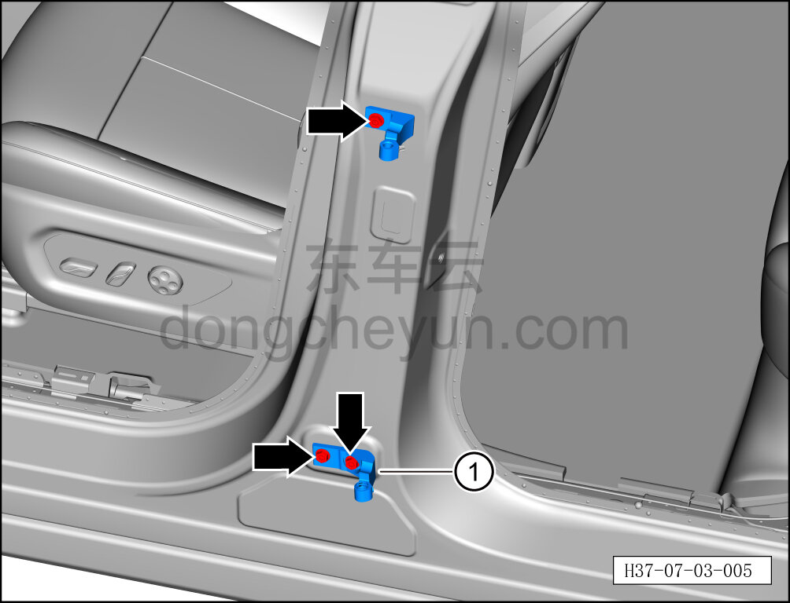
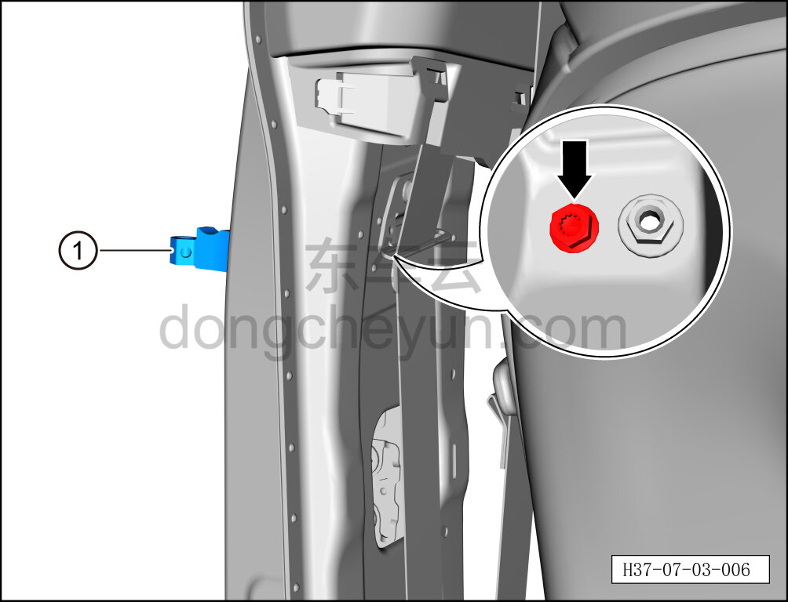
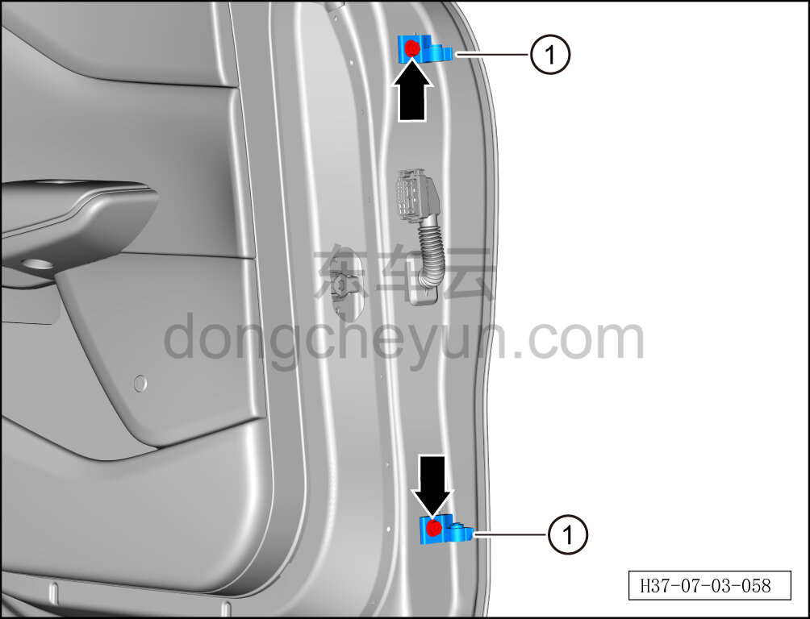
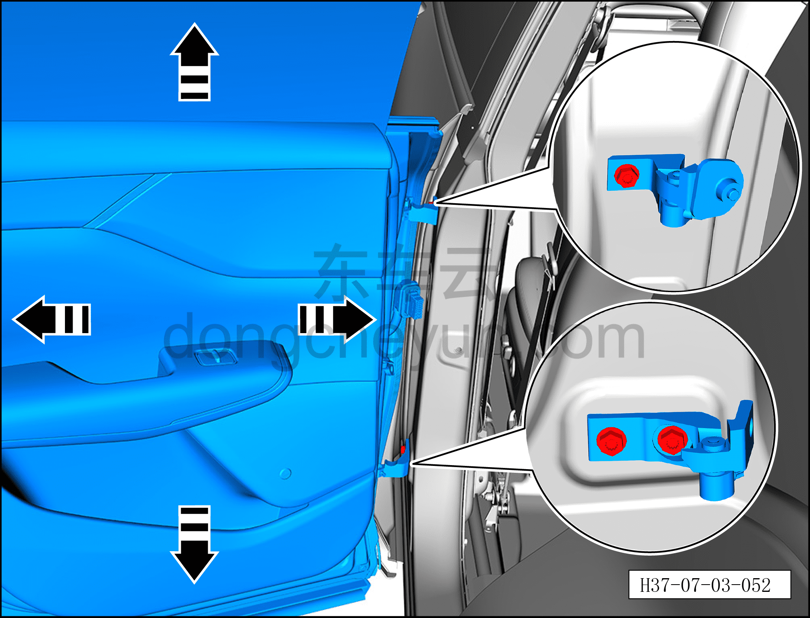

# Снятие и установка левой петли двери (задней)

> Открывающиеся элементы кузова › Задняя дверь › Кузовная панель задней двери  
> Оригинал: `拆卸与安装左门铰链（后）` · [dongcheyun 56746](https://dongcheyun.com/p/56746), страница `25352502174c4504bf36759e8cbabcff` · [оглавление](../README.md)

**Порядок снятия**

**Примечание:**

**- Далее описано снятие и установка левой петли двери (задней), правая сторона выполняется по аналогии с левой.**

1. Выключите все электроприборы, отключите питание.

2. Выполните операцию обесточивания автомобиля для ремонта. См. [3.1.4.1 Обесточивание автомобиля](../03-техническое-обслуживание/005-обесточивание-автомобиля.md)

3. Снимите левую заднюю дверь. См. [7.3.3.1 Снятие и установка левой задней двери](034-снятие-и-установка-левой-задней-двери.md)

4. Снимите нижнюю защитную накладку левой стойки B. См. [8.5.5.2 Снятие и установка нижней защитной накладки левой стойки B](../08-внутренняя-и-внешняя-отделка/132-снятие-и-установка-левой-нижней-накладки-стойки-b.md)

5. Снимите левую петлю двери (заднюю).

a. С помощью торцевой головки 13 мм выверните 3 крепёжных болта петли на кузове.

Момент затяжки болта: 30±5 Н·м

b. Извлеките петлю на кузове ①.

c. С помощью торцевой головки 13 мм выверните крепёжный болт петли на кузове.

Момент затяжки болта: 30±5 Н·м

d. Извлеките петлю на кузове ①.

e. С помощью торцевой головки 13 мм выверните крепёжный болт петли левой задней двери.

Момент затяжки болта: 30±5 Н·м

f. Извлеките петлю левой задней двери ①.

**Порядок установки**

Установка выполняется в обратном порядке.

1. После установки левой петли двери (задней) и левой задней двери сначала проверьте, соответствуют ли зазор и высота между левой задней дверью и окружающими панелями нормативным значениям. См. [12.1.4.3 Зазоры поверхности кузова](../12-кузовные-жестяные-работы-окраска/007-зазоры-поверхности-кузова.md)

2. Если результат проверки не соответствует нормативному значению, с помощью второго специалиста ослабьте 3 крепёжных болта верхней и нижней петель левой задней двери настолько, чтобы левая задняя дверь получила достаточный люфт, затем сместите левую заднюю дверь в направлении стрелки согласно рисунку, пока измеренное значение не будет соответствовать нормативному диапазону, после чего затяните 3 крепёжных болта.

**Внимание:**

**- После завершения установки проверьте нормальность работы всех функций двери.**
