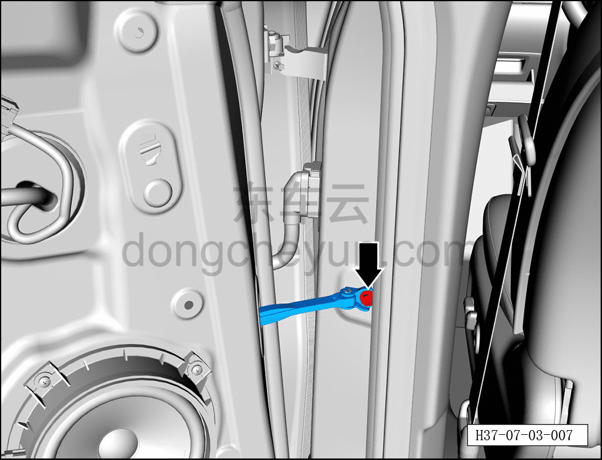
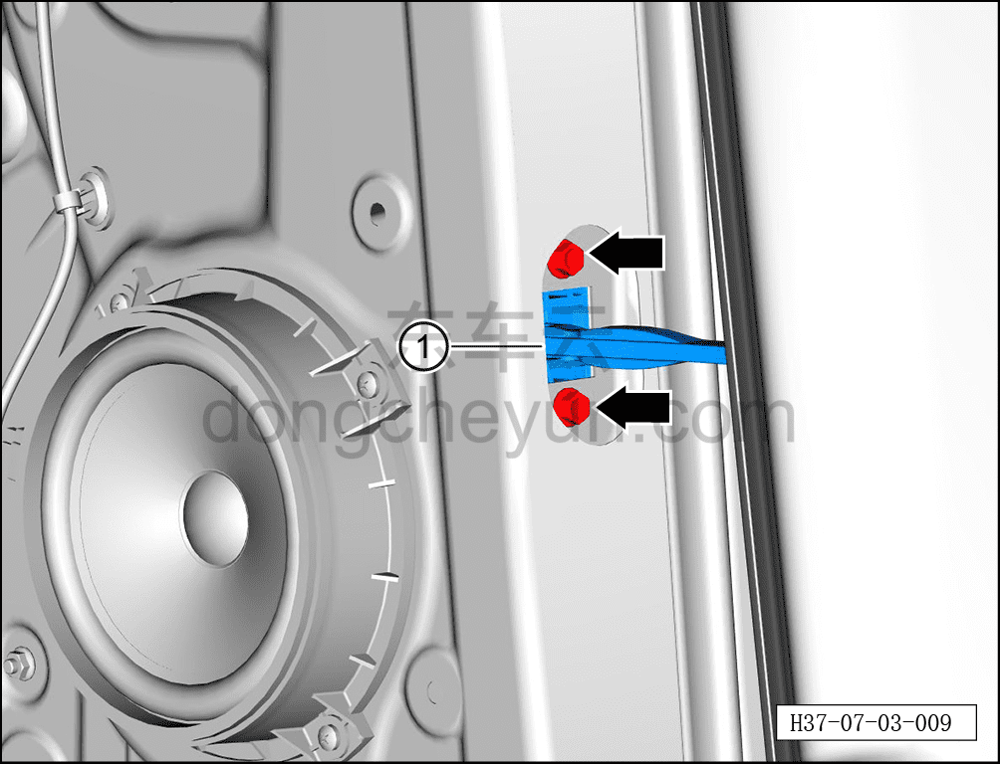

# Снятие и установка ограничителя задней двери

> Открывающиеся элементы кузова › Задняя дверь › Навесные элементы задней двери  
> Оригинал: `拆卸与安装后门限位器` · [dongcheyun 56746](https://dongcheyun.com/p/56746), страница `708a8cf90a184f4088efd2501c47a4a9` · [оглавление](../README.md)

**Порядок снятия**

**Примечание:**

**- Далее описано снятие и установка ограничителя левой задней двери, правая сторона выполняется по аналогии с левой.**

1. Выключите все электроприборы, отключите питание.

2. Выполните операцию обесточивания автомобиля для ремонта. См. [3.1.4.1 Обесточивание автомобиля](../03-техническое-обслуживание/005-обесточивание-автомобиля.md)

3. Снимите гидроизоляционную плёнку левой задней двери. См. [7.3.4.2 Снятие и установка гидроизоляционной плёнки левой задней двери](037-снятие-и-установка-гидроизоляционной-плёнки-левой.md)

4. Снимите ограничитель задней двери.

a. С помощью торцевой головки 10 мм выверните крепёжный болт ограничителя задней двери.

Момент затяжки болта: 25±3 Н·м

b. С помощью торцевой головки 10 мм выверните 2 крепёжных болта ограничителя задней двери.

Момент затяжки болта: 10±1.5 Н·м

c. Извлеките ограничитель задней двери ①.

**Порядок установки**

Установка выполняется в обратном порядке.

**Внимание:**

**- После установки ограничителя задней двери необходимо проверить нормальность его функционирования.**

**- После завершения установки проверьте нормальность работы всех функций двери.**
