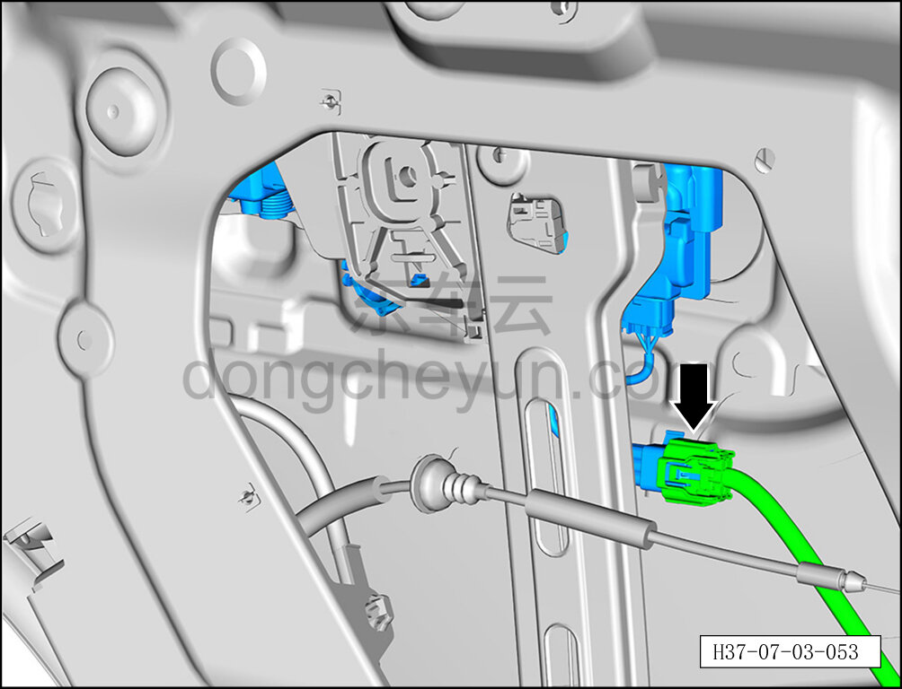
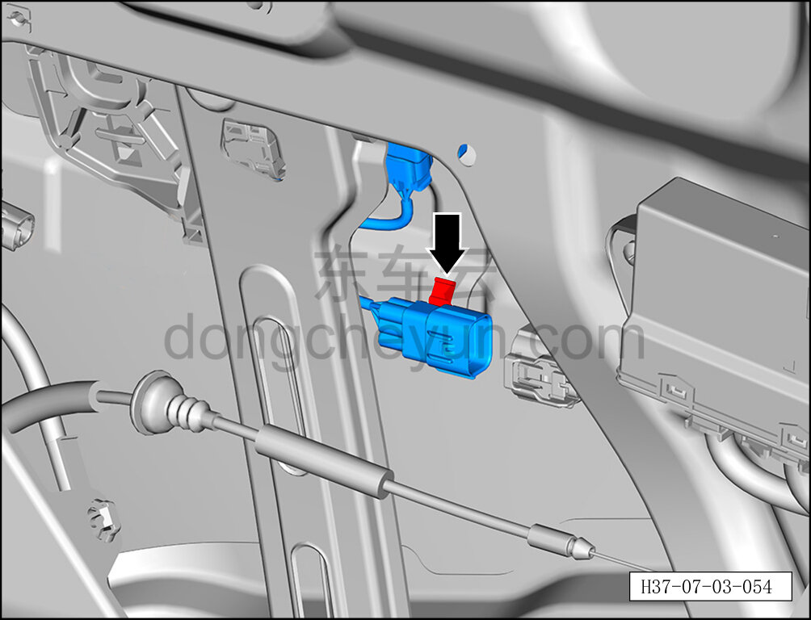
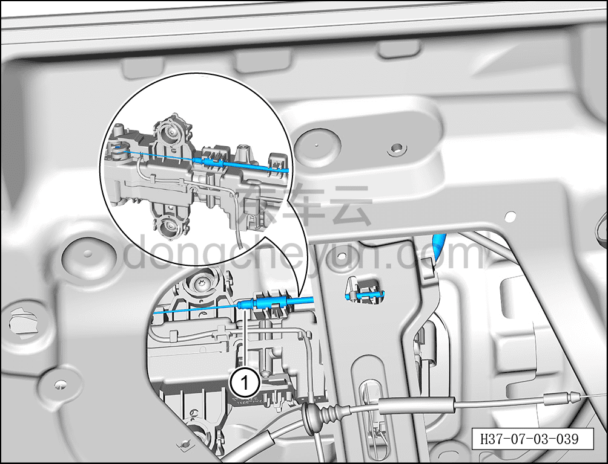
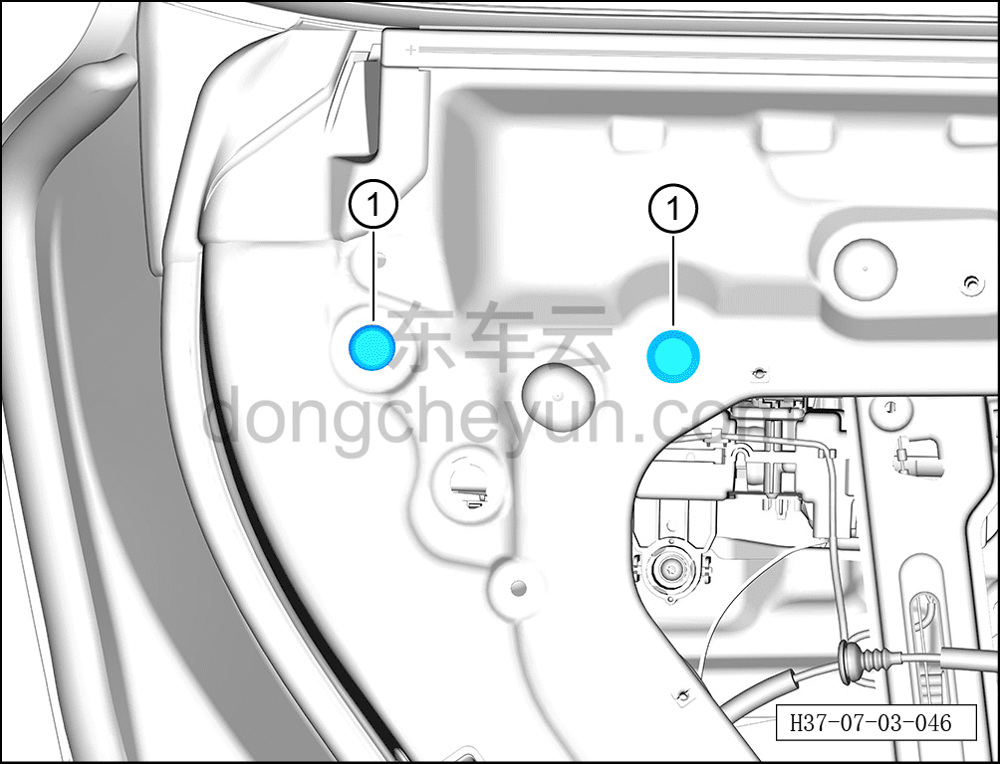
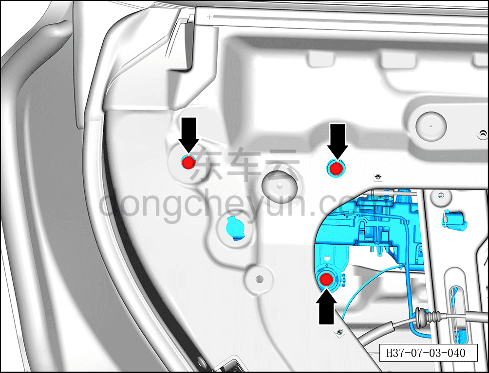
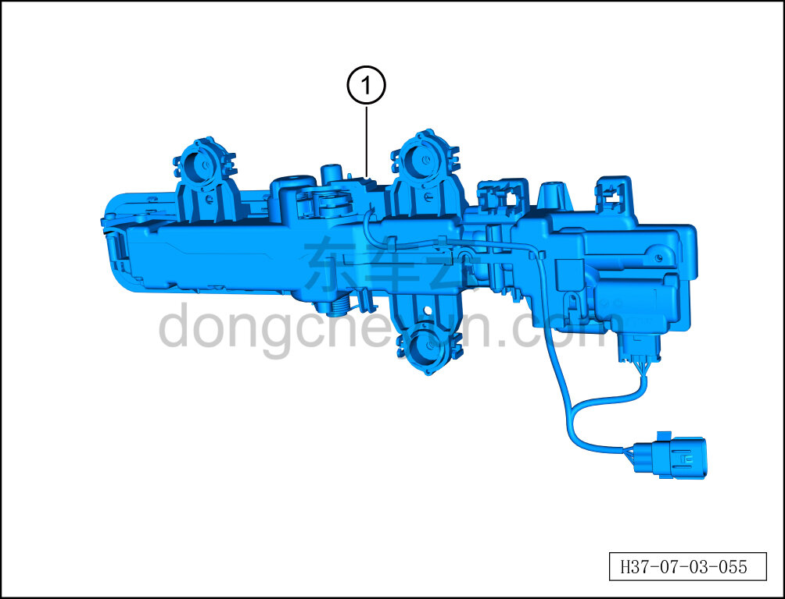

# Снятие и установка наружной ручки открывания левой задней двери в сборе

> Открывающиеся элементы кузова › Задняя дверь › Навесные элементы задней двери  
> Оригинал: `拆卸与安装左后门外开手柄总成` · [dongcheyun 56746](https://dongcheyun.com/p/56746), страница `b40e465089f54af285ac9efc4cbdfaff` · [оглавление](../README.md)

**Порядок снятия**

**Примечание:**

**- Далее описано снятие и установка наружной ручки открывания левой задней двери в сборе, правая сторона выполняется по аналогии с левой.**

1. Приведите наружную ручку открывания левой задней двери в сборе в закрытое положение.

2. Выключите все электрические потребители, отключите питание.

3. Выполните обесточивание автомобиля для ремонта. См. [3.1.4.1 Обесточивание автомобиля](../03-техническое-обслуживание/005-обесточивание-автомобиля.md)

4. Снимите стекло левой задней двери. См. [7.3.4.13 Снятие и установка стекла левой задней двери](048-снятие-и-установка-стекла-левой-задней-двери.md)

5. Снимите наружную ручку открывания левой задней двери в сборе.

a. Удерживая фиксатор разъёма, отсоедините разъём A жгута задней двери.

b. Удерживая фиксатор разъёма, отсоедините разъём B жгута подсветки салона (ambient) левой задней двери.

c. С помощью инструмента для снятия внутренней облицовки отсоедините крепёжную клипсу, соединяющую наружную ручку открывания левой задней двери в сборе с левой задней дверью.

d. Отделите трос наружной ручки открывания задней двери ① от наружной ручки открывания левой задней двери в сборе.

e. С помощью плоской отвёртки снимите 2 заглушки внутренней панели задней двери ①.

f. С помощью бита T25 выверните 3 крепёжных винта наружной ручки открывания левой задней двери в сборе.

Момент затяжки винта: 4.5±0.5 Н·м

g. Извлеките наружную ручку открывания левой задней двери в сборе ①.

**Порядок установки**

Установка выполняется в обратном порядке.

**Внимание:**

**- После установки наружной ручки открывания левой задней двери необходимо проверить нормальность функций открытия и закрытия ручки.**

**- После завершения установки проверьте нормальность работы всех функций двери.**
