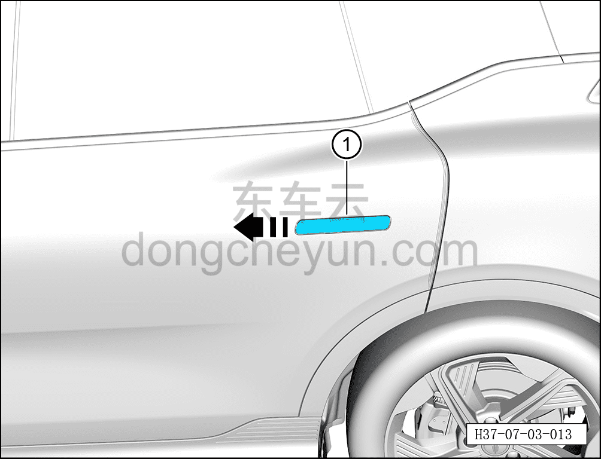
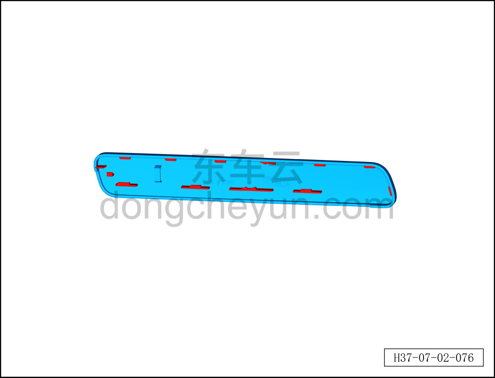
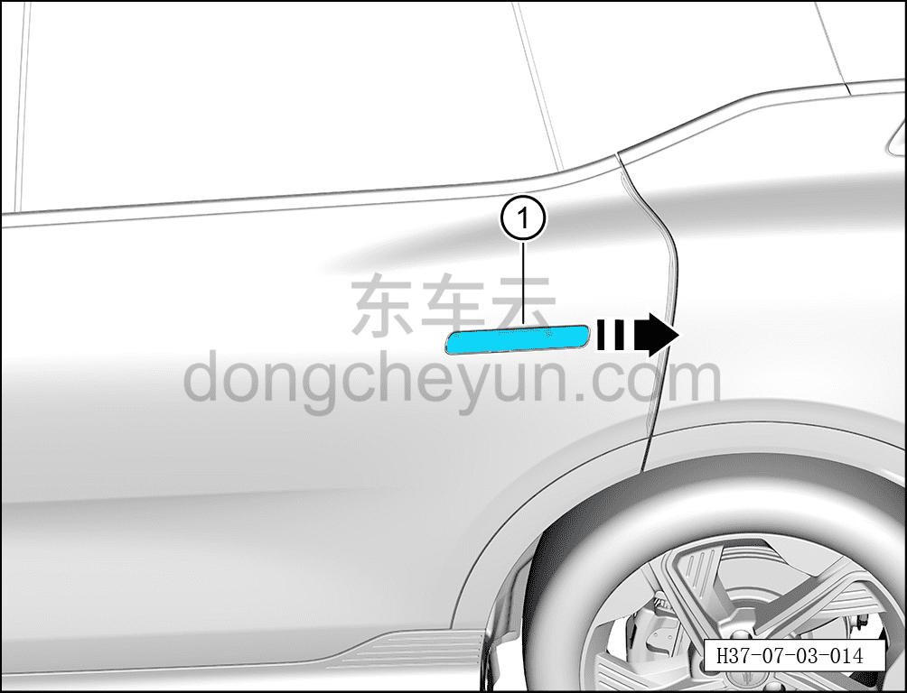

# Снятие и установка корпуса наружной ручки открывания левой задней двери

> Открывающиеся элементы кузова › Задняя дверь › Навесные элементы задней двери  
> Оригинал: `拆卸与安装左后门外开手柄壳体` · [dongcheyun 56746](https://dongcheyun.com/p/56746), страница `8b6a1745ee4543948c85c76192a7f45a` · [оглавление](../README.md)

**Порядок снятия**

**Примечание:**

**- Далее описано снятие и установка корпуса наружной ручки открывания левой задней двери, правая сторона выполняется по аналогии с левой.**

1. Выдвиньте наружную ручку открывания левой задней двери в сборе.

2. Снимите корпус наружной ручки открывания левой задней двери.

a. Сдвиньте корпус наружной ручки открывания левой задней двери ① в направлении стрелки.

Внимание:

- При снятии обратите внимание, чтобы не повредить пластиковый паз на задней стороне корпуса наружной ручки открывания.

**Порядок установки**

1. Установите корпус наружной ручки открывания левой задней двери.

a. Сдвиньте корпус наружной ручки открывания левой задней двери ① в направлении стрелки в наружную ручку открывания левой задней двери в сборе.

b. Верните наружную ручку открывания левой задней двери в сборе в исходное положение.

**Внимание:**

**- После установки необходимо проверить корпус наружной ручки открывания левой задней двери на отсутствие люфта, если корпус ручки шатается, это может означать поломку паза, необходимо заменить деталь на новую.**

c. После установки корпуса выдвиньте ручку, надавите на корпус ручки в направлении, указанном на рисунке, — корпус ручки не должен слетать; если он слетает, это означает, что защёлка корпуса ручки повреждена, требуется заменить корпус ручки.
