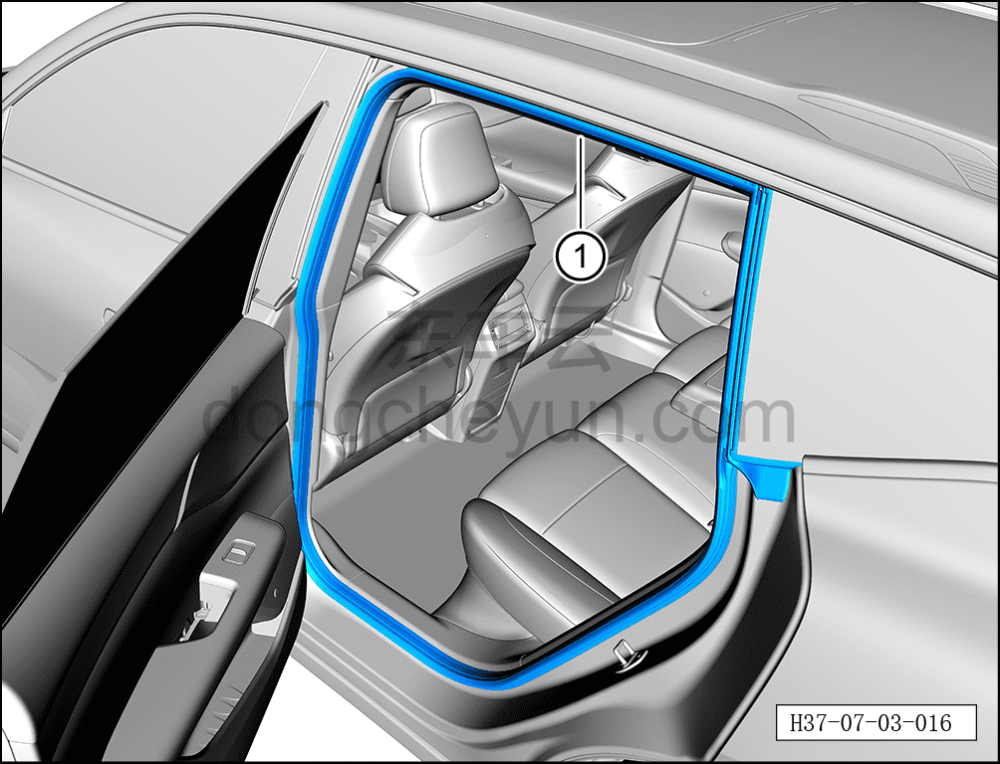

# Снятие и установка уплотнителя проёма левой задней двери

> Открывающиеся элементы кузова › Задняя дверь › Навесные элементы задней двери  
> Оригинал: `拆卸与安装左后门框密封条` · [dongcheyun 56746](https://dongcheyun.com/p/56746), страница `b15f411b102443b0a42a71f5aba556f4` · [оглавление](../README.md)

**Порядок снятия**

**Примечание:**

**- Далее описано снятие и установка уплотнителя проёма левой задней двери, правая сторона выполняется по аналогии с левой.**

1. Выключите все электроприборы, отключите питание.

2. Откройте левую заднюю дверь.

3. Снимите уплотнитель проёма левой задней двери.

a. Отсоедините уплотнитель проёма левой задней двери ①.

**Порядок установки**

Установка выполняется в обратном порядке.

**Внимание:**

**- Проверьте, чтобы место соединения уплотнителя проёма левой задней двери с кузовом было ровным, без выступов, при необходимости используйте резиновый молоток для восстановления ровности.**
