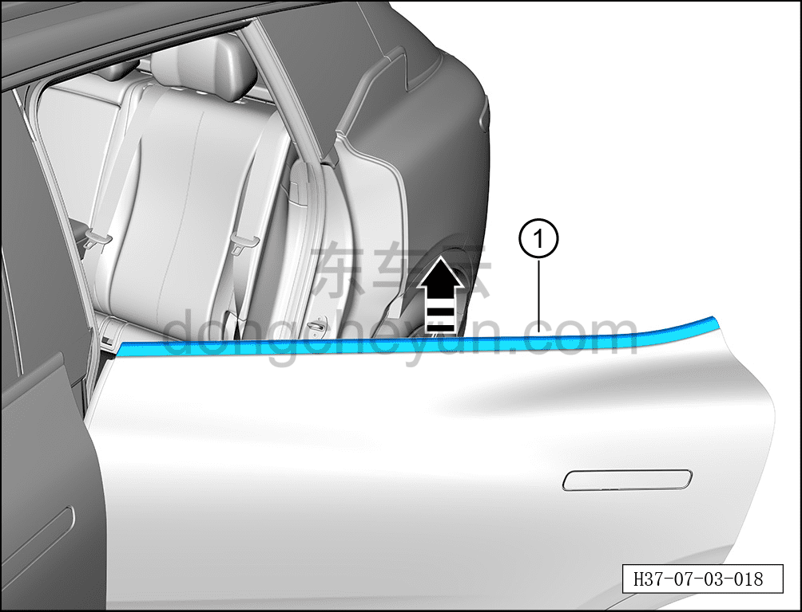

# Снятие и установка наружного уплотнителя подоконника левой задней двери

> Открывающиеся элементы кузова › Задняя дверь › Навесные элементы задней двери  
> Оригинал: `拆卸与安装左后门窗台外密封条` · [dongcheyun 56746](https://dongcheyun.com/p/56746), страница `549937caffb64350a41be1e4fde51645` · [оглавление](../README.md)

**Порядок снятия**

**Примечание:**

**- Далее описано снятие и установка наружного уплотнителя подоконника левой задней двери, правая сторона выполняется по аналогии с левой.**

1. Опустите стекло левой задней двери в самое нижнее положение.

2. Выключите все электрические потребители, отключите питание.

3. Снимите наружный уплотнитель подоконника левой задней двери.

a. С помощью инструмента для снятия внутренней облицовки отсоедините наружный уплотнитель подоконника левой задней двери ① в направлении стрелки согласно рисунку.

**Внимание:**

**- Наружный уплотнитель подоконника левой задней двери изготовлен из легко деформируемого материала, при снятии не сгибайте его.**

**Порядок установки**

Установка выполняется в обратном порядке.

**Внимание:**

**- После завершения установки проверьте нормальность работы всех функций двери.**
