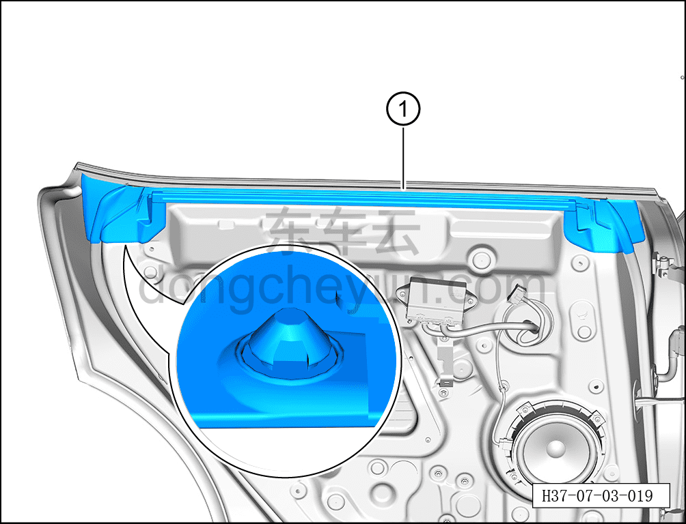

# Снятие и установка внутреннего уплотнителя подоконника левой задней двери

> Открывающиеся элементы кузова › Задняя дверь › Навесные элементы задней двери  
> Оригинал: `拆卸与安装左后门窗台内密封条` · [dongcheyun 56746](https://dongcheyun.com/p/56746), страница `99d2e8007398466197be337f63307256` · [оглавление](../README.md)

**Порядок снятия**

**Примечание:**

**- Далее описано снятие и установка внутреннего уплотнителя подоконника левой задней двери, правая сторона выполняется по аналогии с левой.**

1. Опустите стекло левой задней двери в самое нижнее положение.

2. Выключите все электрические потребители, отключите питание.

3. Выполните обесточивание автомобиля для ремонта. См. [3.1.4.1 Обесточивание автомобиля](../03-техническое-обслуживание/005-обесточивание-автомобиля.md)

4. Снимите внутреннюю обивку левой задней двери. См. [8.4.3.1 Снятие и установка внутренней обивки левой задней двери](../08-внутренняя-и-внешняя-отделка/119-снятие-и-установка-обивки-левой-задней-двери.md)

5. Снимите внутренний уплотнитель подоконника левой задней двери.

a. С помощью инструмента для снятия внутренней облицовки отсоедините внутренний уплотнитель подоконника левой задней двери ① в направлении стрелки согласно рисунку.

**Внимание:**

**- Внутренний уплотнитель подоконника левой задней двери изготовлен из легко деформируемого материала, при снятии не сгибайте его.**

**- При снятии не повредите клипсы на задней стороне внутреннего уплотнителя подоконника левой задней двери.**

**Порядок установки**

Установка выполняется в обратном порядке.

**Внимание:**

**- Перед установкой проверьте клипсы внутреннего уплотнителя подоконника левой задней двери на отсутствие повреждений, при их наличии необходимо заменить уплотнитель на новый.**
