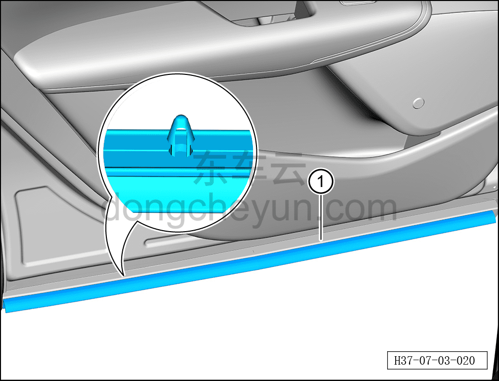

# Снятие и установка грязезащитной ленты левой задней двери

> Открывающиеся элементы кузова › Задняя дверь › Навесные элементы задней двери  
> Оригинал: `拆卸与安装左后车门防污条` · [dongcheyun 56746](https://dongcheyun.com/p/56746), страница `42a79dad009245509c9c8e2885575f27` · [оглавление](../README.md)

**Порядок снятия**

**Примечание:**

**- Далее описано снятие и установка грязезащитной ленты левой задней двери, правая сторона выполняется по аналогии с левой.**

1. Выключите все электроприборы, отключите питание.

2. Откройте левую заднюю дверь.

3. Снимите грязезащитную ленту левой задней двери.

a. С помощью инструмента для снятия внутренней облицовки отсоедините крепёжные клипсы грязезащитной ленты левой задней двери, снимите грязезащитную ленту левой задней двери ①.

**Внимание:**

**- При снятии не повредите пластиковые клипсы на задней стороне грязезащитной ленты левой задней двери.**

**Порядок установки**

Установка выполняется в обратном порядке.

**Внимание:**

**- Перед установкой проверьте места соединения грязезащитной ленты левой задней двери с клипсами на отсутствие повреждений или отрыва, при их наличии необходимо заменить ленту на новую.**
