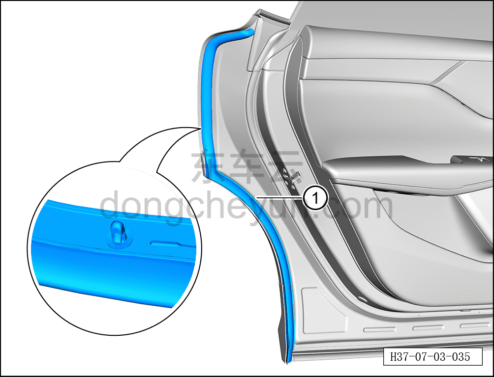

# Снятие и установка уплотнителя стойки C левой двери

> Открывающиеся элементы кузова › Задняя дверь › Навесные элементы задней двери  
> Оригинал: `拆卸与安装左车门C柱密封条` · [dongcheyun 56746](https://dongcheyun.com/p/56746), страница `0273a8d2fedf4d61941f72bdb5eb7fac` · [оглавление](../README.md)

**Порядок снятия**

**Примечание:**

**- Далее описано снятие и установка уплотнителя стойки C левой задней двери, правая сторона выполняется по аналогии с левой.**

1. Выключите все электроприборы, отключите питание.

2. Откройте левую заднюю дверь.

3. Снимите уплотнитель стойки C левой задней двери.

a. С помощью инструмента для снятия внутренней облицовки отсоедините крепёжные клипсы уплотнителя стойки C левой задней двери, снимите уплотнитель стойки C левой задней двери ①.

**Внимание:**

**- При снятии не повредите пластиковые клипсы на задней стороне уплотнителя стойки C двери.**

**Порядок установки**

Установка выполняется в обратном порядке.

**Внимание:**

**- Перед установкой проверьте места соединения уплотнителя стойки C левой двери с клипсами на отсутствие повреждений или отрыва, при их наличии необходимо заменить уплотнитель на новый.**
