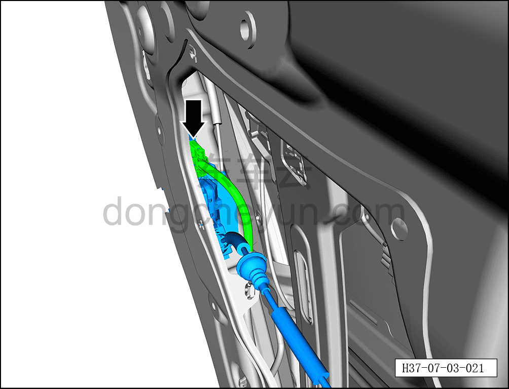
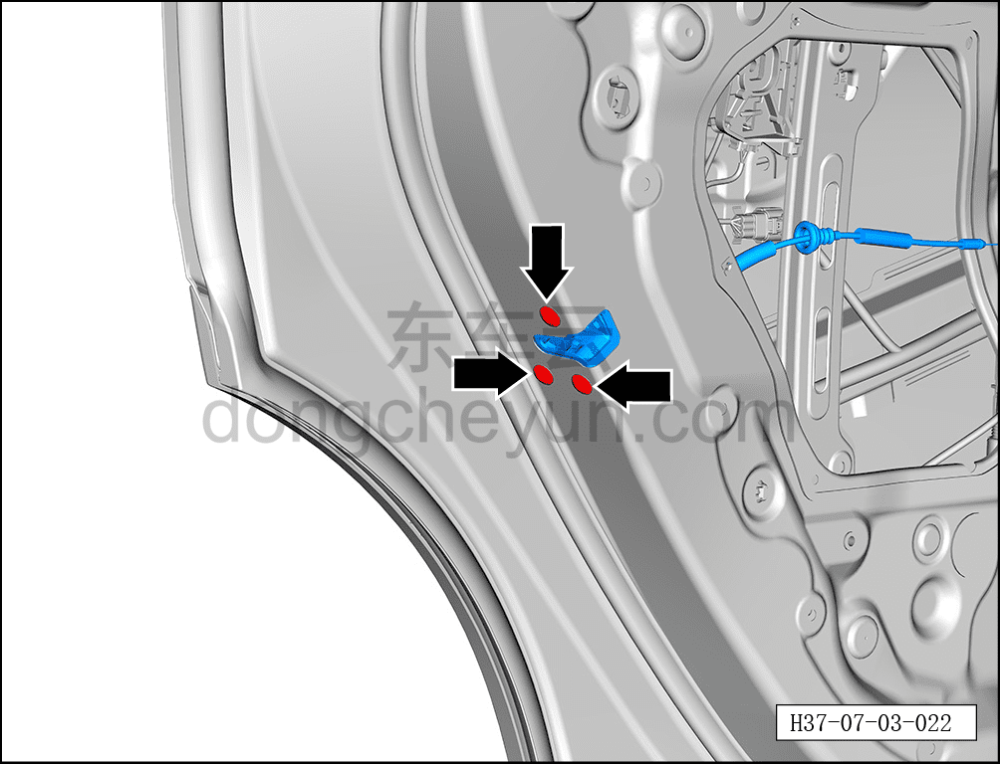
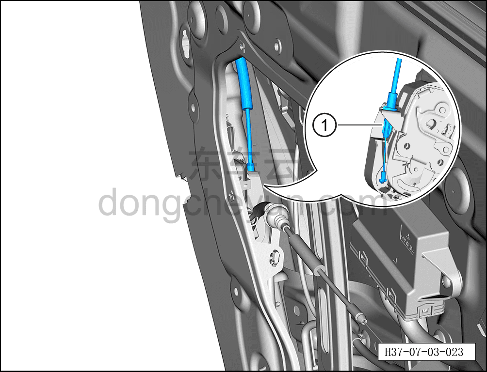
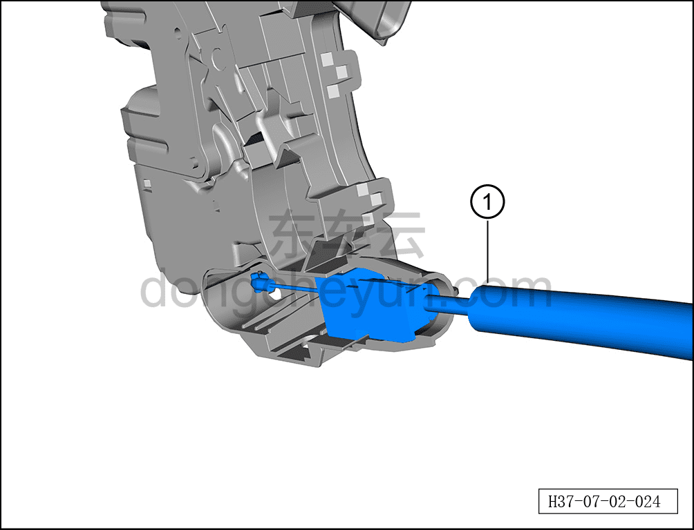

# Снятие и установка корпуса замка левой задней двери

> Открывающиеся элементы кузова › Задняя дверь › Навесные элементы задней двери  
> Оригинал: `拆卸与安装左后门锁体` · [dongcheyun 56746](https://dongcheyun.com/p/56746), страница `93e8e47c8784445eb2d22dd907975c84` · [оглавление](../README.md)

**Порядок снятия**

**Примечание:**

**- Далее описано снятие и установка корпуса замка левой задней двери, правая сторона выполняется по аналогии с левой.**

1. Выключите все электроприборы, отключите питание.

2. Выполните операцию обесточивания автомобиля для ремонта. См. [3.1.4.1 Обесточивание автомобиля](../03-техническое-обслуживание/005-обесточивание-автомобиля.md)

3. Снимите гидроизоляционную плёнку левой задней двери. См. [7.3.4.2 Снятие и установка гидроизоляционной плёнки левой задней двери](037-снятие-и-установка-гидроизоляционной-плёнки-левой.md)

4. Снимите корпус замка левой задней двери.

a. Удерживая фиксатор разъёма, отсоедините разъём корпуса замка левой задней двери.

b. С помощью бита T30 выверните 3 крепёжных винта корпуса замка левой задней двери.

Момент затяжки винта: 8±1 Н·м

c. Отсоедините трос наружной ручки открывания задней двери ① от места соединения с корпусом замка левой задней двери.

d. Отсоедините трос внутренней ручки открывания задней двери ① от места соединения с корпусом замка левой задней двери.

**Порядок установки**

Установка выполняется в обратном порядке.

**Внимание:**

**- После установки корпуса замка левой задней двери необходимо проверить нормальность открытия и закрытия задней двери.**

**- После завершения установки проверьте нормальность работы всех функций двери.**
