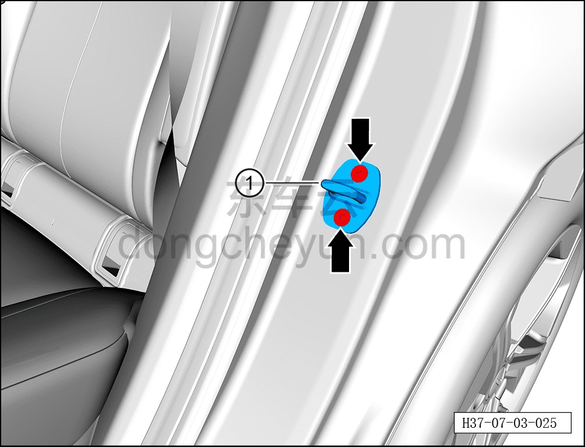

# Снятие и установка ответной части замка двери (задней двери)

> Открывающиеся элементы кузова › Задняя дверь › Навесные элементы задней двери  
> Оригинал: `拆卸与安装车门锁扣（后门）` · [dongcheyun 56746](https://dongcheyun.com/p/56746), страница `97cb16bdaea64638af6c3785b29b6100` · [оглавление](../README.md)

**Порядок снятия**

**Примечание:**

**- Далее описано снятие и установка ответной части замка левой задней двери, правая сторона выполняется по аналогии с левой.**

1. Выключите все электроприборы, отключите питание.

2. Откройте левую заднюю дверь.

3. Снимите ответную часть замка двери.

a. С помощью бита T40 выверните 2 крепёжных винта ответной части замка двери.

Момент затяжки винта: 25±3 Н·м

b. Извлеките ответную часть замка двери ①.

**Порядок установки**

Установка выполняется в обратном порядке.

**Внимание:**

**- После установки ответной части замка задней двери необходимо проверить нормальность открытия и закрытия задней двери.**
