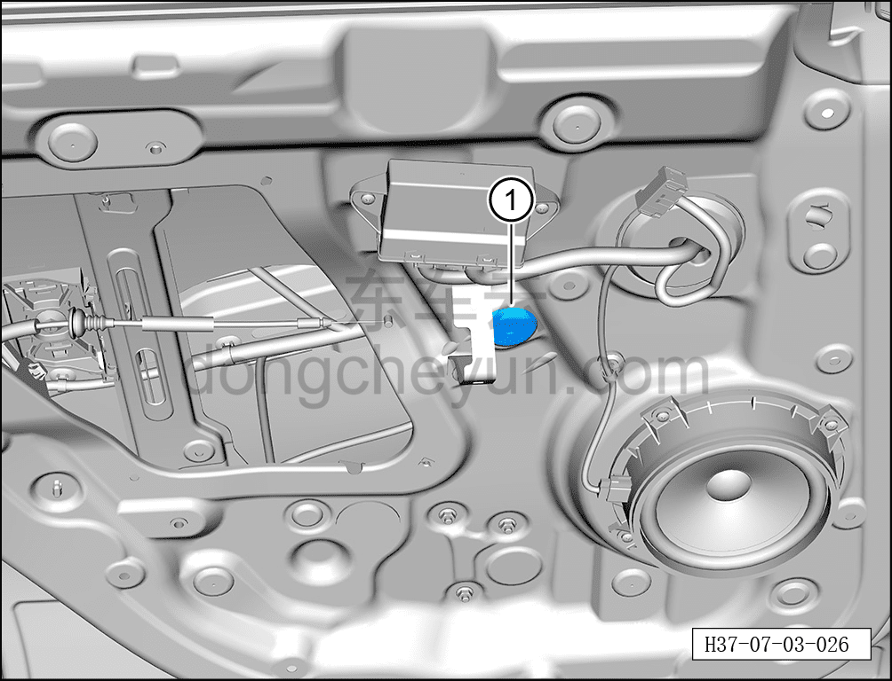
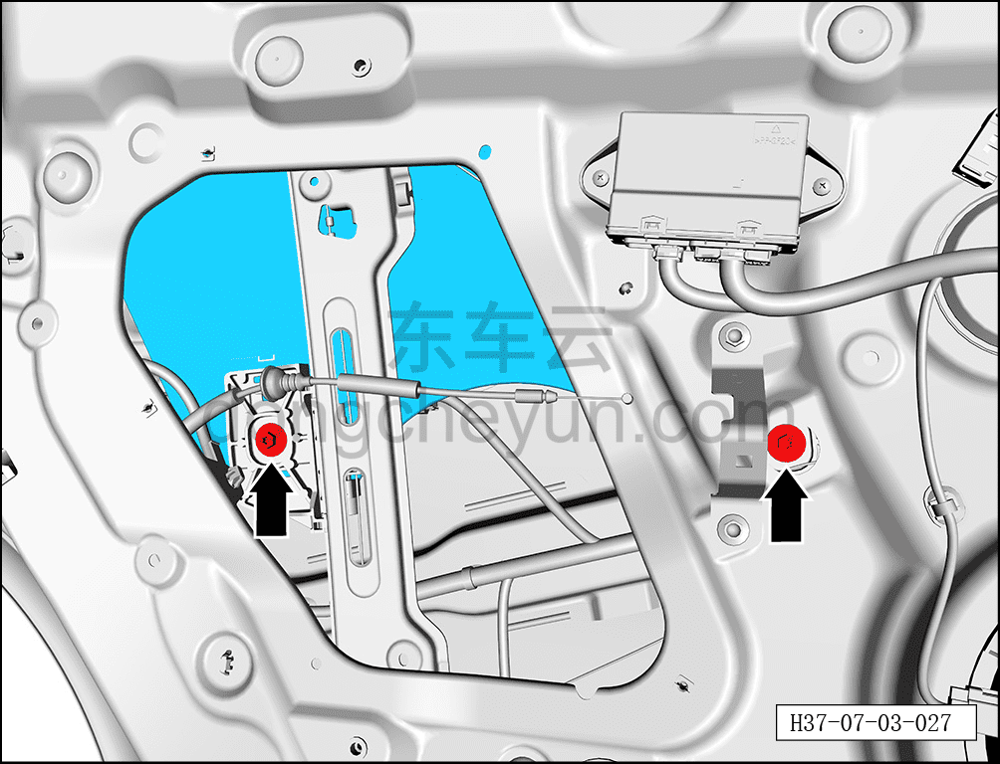
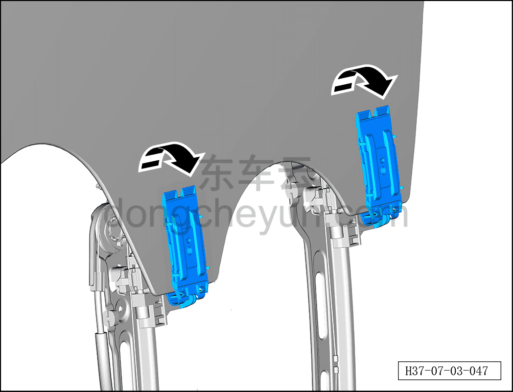
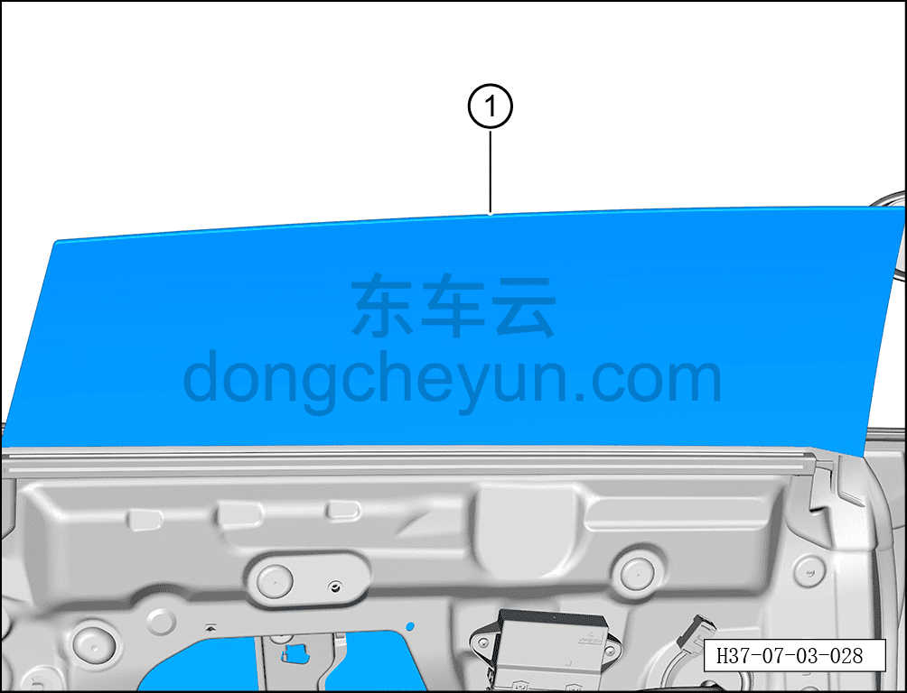

# Снятие и установка стекла левой задней двери

> Открывающиеся элементы кузова › Задняя дверь › Навесные элементы задней двери  
> Оригинал: `拆卸与安装左后门玻璃` · [dongcheyun 56746](https://dongcheyun.com/p/56746), страница `69dff5bbbf1e4f66a6e567b72544f87a` · [оглавление](../README.md)

**Порядок снятия**

**Примечание:**

**- Далее описано снятие и установка стекла левой задней двери, правая сторона выполняется по аналогии с левой.**

1. Выключите все электроприборы, отключите питание.

2. Выполните операцию обесточивания автомобиля для ремонта. См. [3.1.4.1 Обесточивание автомобиля](../03-техническое-обслуживание/005-обесточивание-автомобиля.md)

3. Снимите гидроизоляционную плёнку левой задней двери. См. [7.3.4.2 Снятие и установка гидроизоляционной плёнки левой задней двери](037-снятие-и-установка-гидроизоляционной-плёнки-левой.md)

4. Снимите стекло левой задней двери.

a. С помощью плоской отвёртки снимите заглушку внутренней панели задней двери ①.

b. С помощью торцевой головки 10 мм выверните 2 крепёжных болта стекла левой задней двери.

Момент затяжки болтов: 10±1 Н·м

**Примечание:**

**- Перед выворачиванием болтов стекла левой задней двери необходимо включить питание автомобиля и переместить стекло задней двери в подходящее положение.**

c. Раскройте зажим стеклоподъёмника левой задней двери в направлении стрелки.

**Внимание:**

**- При раскрытии зажима будьте осторожны, чтобы не повредить стекло левой задней двери.**

d. Извлеките стекло левой задней двери ①.

**Внимание:**

**- При извлечении стекла левой задней двери не допускайте его соприкосновения и столкновения с дверью, во избежание растрескивания стекла; стекло нельзя ставить краем на землю, даже незначительное повреждение может привести к растрескиванию стекла.**

**Порядок установки**

Установка выполняется в обратном порядке.

**Внимание:**

**- После установки стекла левой задней двери необходимо проверить нормальность функции подъёма и опускания стекла.**

**- После завершения установки проверьте нормальность работы всех функций двери.**
