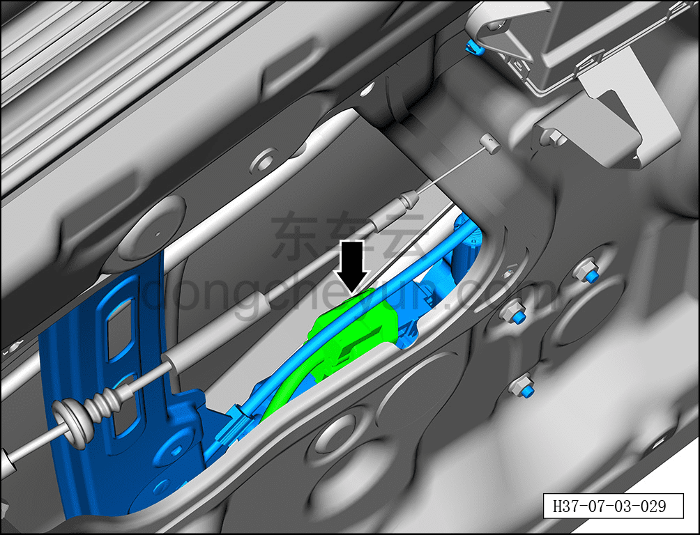
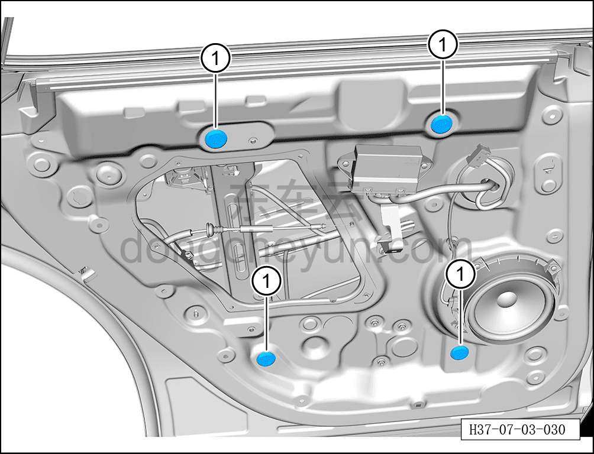
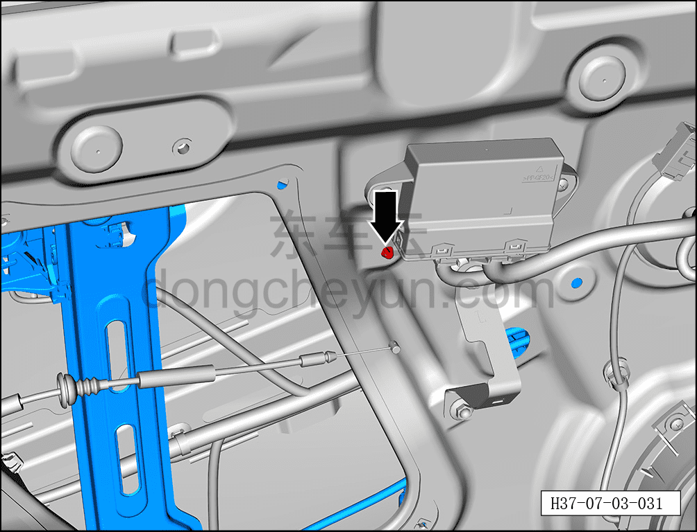
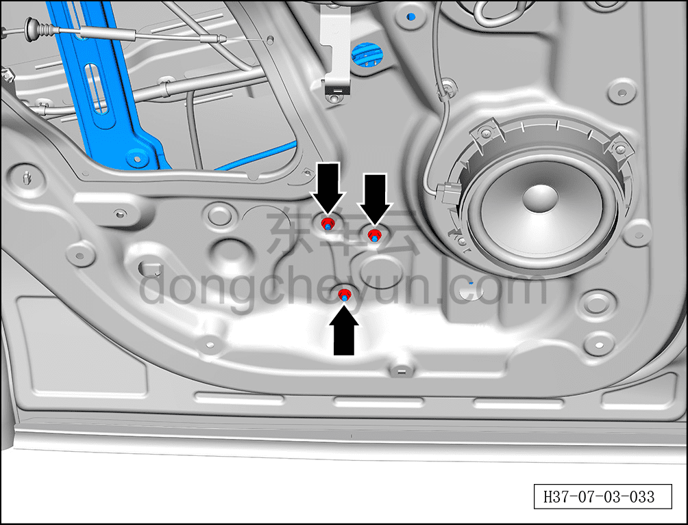
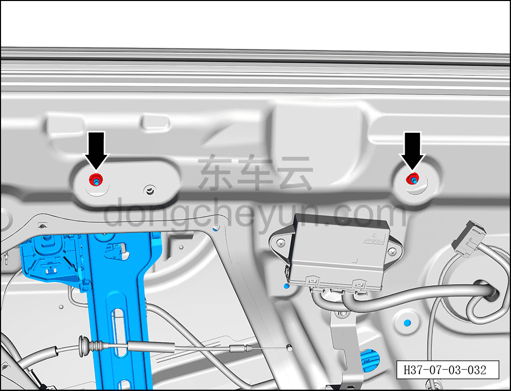
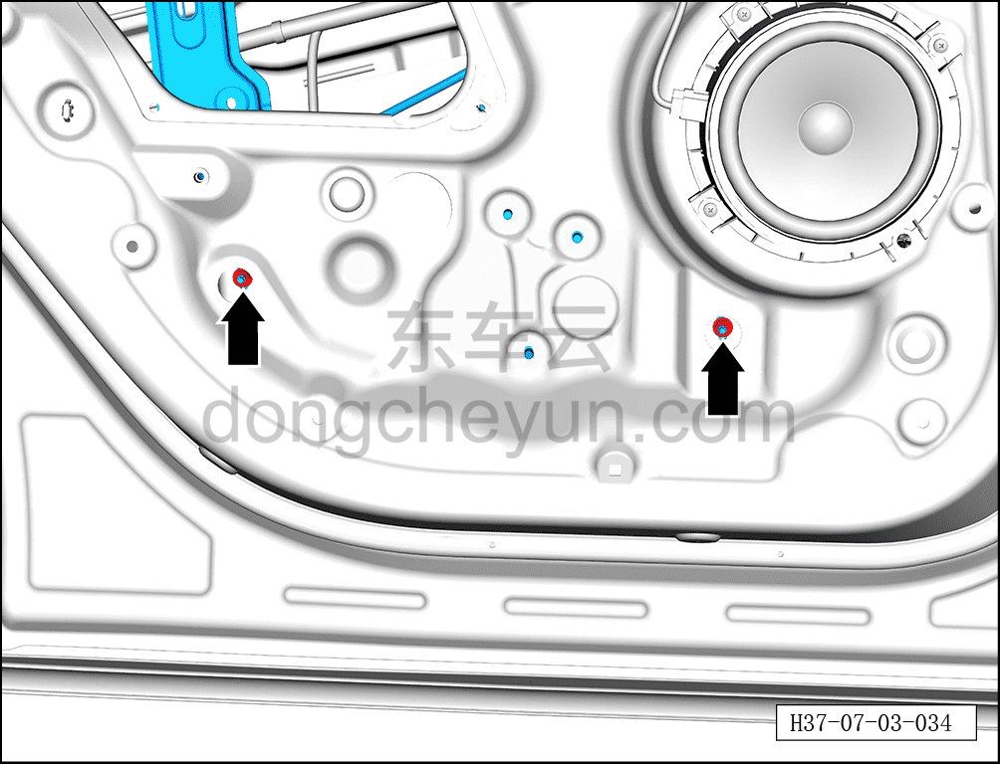
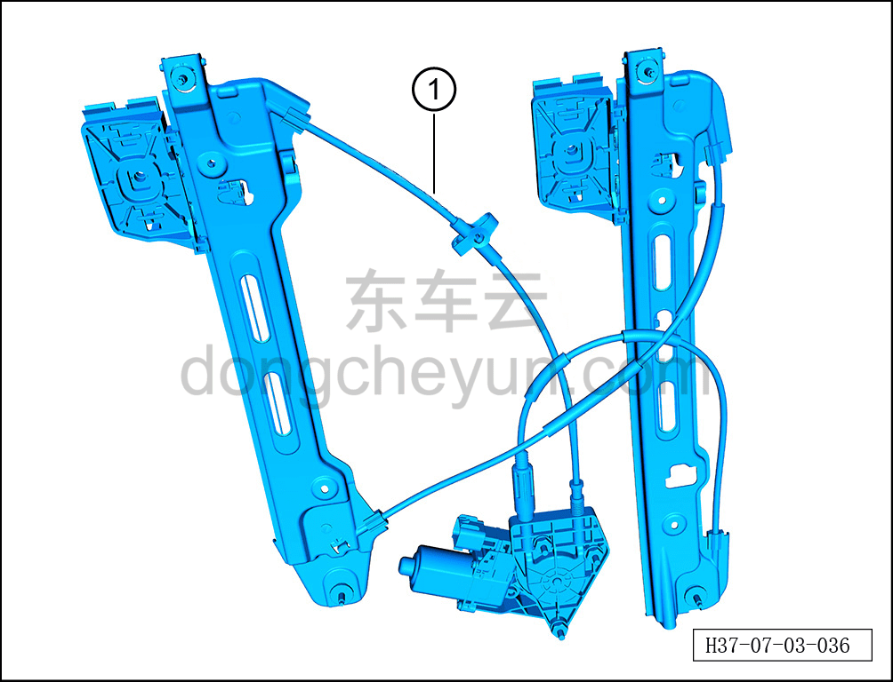

# Снятие и установка стеклоподъёмника левой задней двери

> Открывающиеся элементы кузова › Задняя дверь › Навесные элементы задней двери  
> Оригинал: `拆卸与安装左后门玻璃升降器` · [dongcheyun 56746](https://dongcheyun.com/p/56746), страница `d48b693d6f2c46d4b3d028203eefa281` · [оглавление](../README.md)

**Порядок снятия**

**Примечание:**

**- Далее описано снятие и установка стеклоподъёмника левой задней двери, правая сторона выполняется по аналогии с левой.**

1. Выключите все электроприборы, отключите питание.

2. Выполните операцию обесточивания автомобиля для ремонта. См. [3.1.4.1 Обесточивание автомобиля](../03-техническое-обслуживание/005-обесточивание-автомобиля.md)

3. Снимите стекло левой задней двери. См. [7.3.4.13 Снятие и установка стекла левой задней двери](048-снятие-и-установка-стекла-левой-задней-двери.md)

4. Снимите стеклоподъёмник левой задней двери.

a. Удерживая фиксатор разъёма, отсоедините разъём стеклоподъёмника левой задней двери.

b. С помощью плоской отвёртки снимите 4 заглушки внутренней панели задней двери ①.

c. С помощью инструмента для снятия внутренней облицовки отсоедините крепёжную клипсу стеклоподъёмника левой задней двери.

d. С помощью торцевой головки 10 мм выверните 3 крепёжные гайки стеклоподъёмника левой задней двери.

Момент затяжки гайки: 10±1 Н·м

e. С помощью торцевой головки 10 мм выверните 2 крепёжные гайки стеклоподъёмника левой задней двери.

Момент затяжки гайки: 10±1 Н·м

f. С помощью торцевой головки 10 мм выверните 2 крепёжные гайки стеклоподъёмника левой задней двери.

Момент затяжки гайки: 10±1 Н·м

g. Извлеките стеклоподъёмник левой задней двери ①.

**Порядок установки**

Установка выполняется в обратном порядке.

**Внимание:**

**- После установки стеклоподъёмника левой задней двери необходимо проверить нормальность функции подъёма и опускания стекла.**

**- После завершения установки проверьте нормальность работы всех функций двери.**
