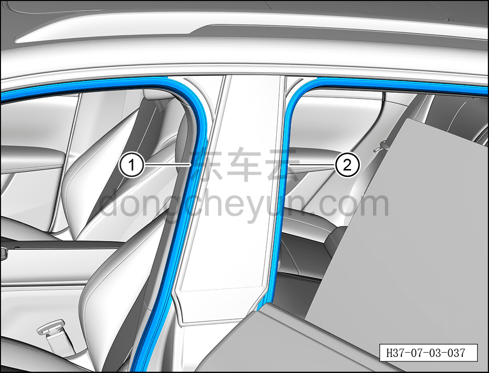
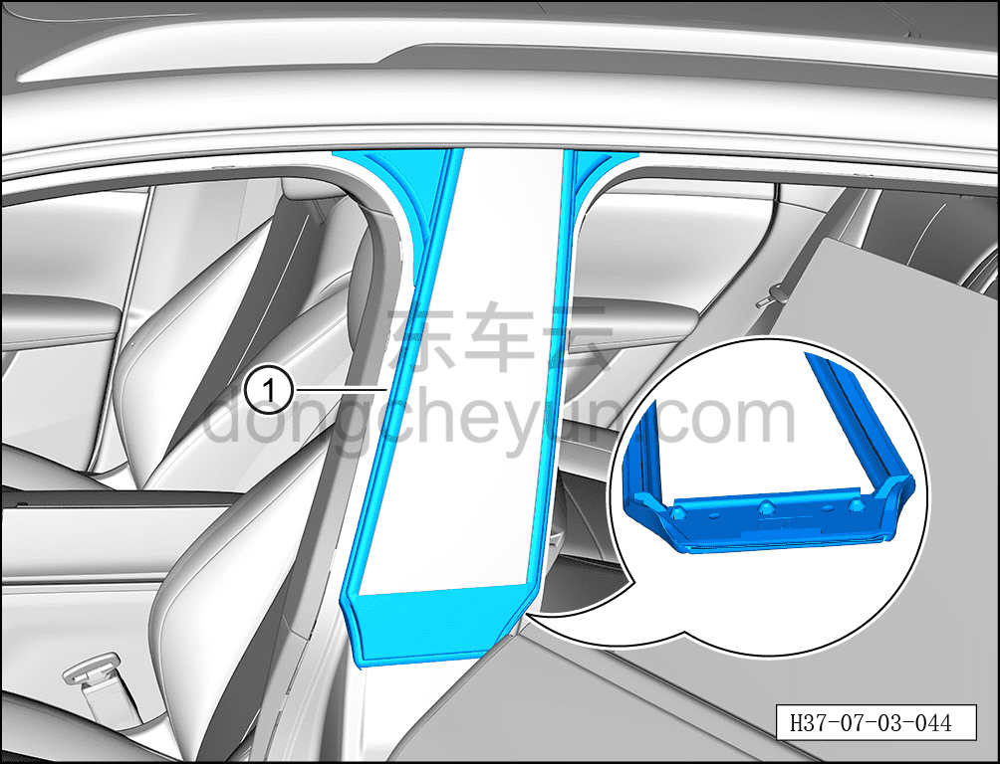

# Снятие и установка направляющей стекла левой стойки B

> Открывающиеся элементы кузова › Задняя дверь › Навесные элементы задней двери  
> Оригинал: `拆卸与安装左侧B柱玻璃导槽` · [dongcheyun 56746](https://dongcheyun.com/p/56746), страница `f8adb8aec09048f8a850b324dba071a3` · [оглавление](../README.md)

**Порядок снятия**

**Примечание:**

**- Далее описано снятие и установка направляющей стекла левой стойки B, правая сторона выполняется по аналогии с левой.**

1. Выключите все электроприборы, отключите питание.

2. Откройте левую переднюю дверь.

3. Откройте левую заднюю дверь.

4. Снимите направляющую стекла левой стойки B.

a. Отсоедините уплотнитель проёма левой передней двери ① и уплотнитель проёма левой задней двери ② от места соединения с направляющей стекла левой стойки B.

**Примечание:**

**- Не требуется полностью извлекать уплотнители проёма левой передней и задней дверей, достаточно отсоединить место соединения.**

b. С помощью инструмента для снятия внутренней облицовки отсоедините крепёжные клипсы направляющей стекла левой стойки B, снимите крепёжные клипсы направляющей стекла левой стойки B ①.

**Порядок установки**

Установка выполняется в обратном порядке.

**Внимание:**

**- После установки направляющей стекла левой стойки B необходимо проверить, чтобы установка была ровной, без выступов.**
