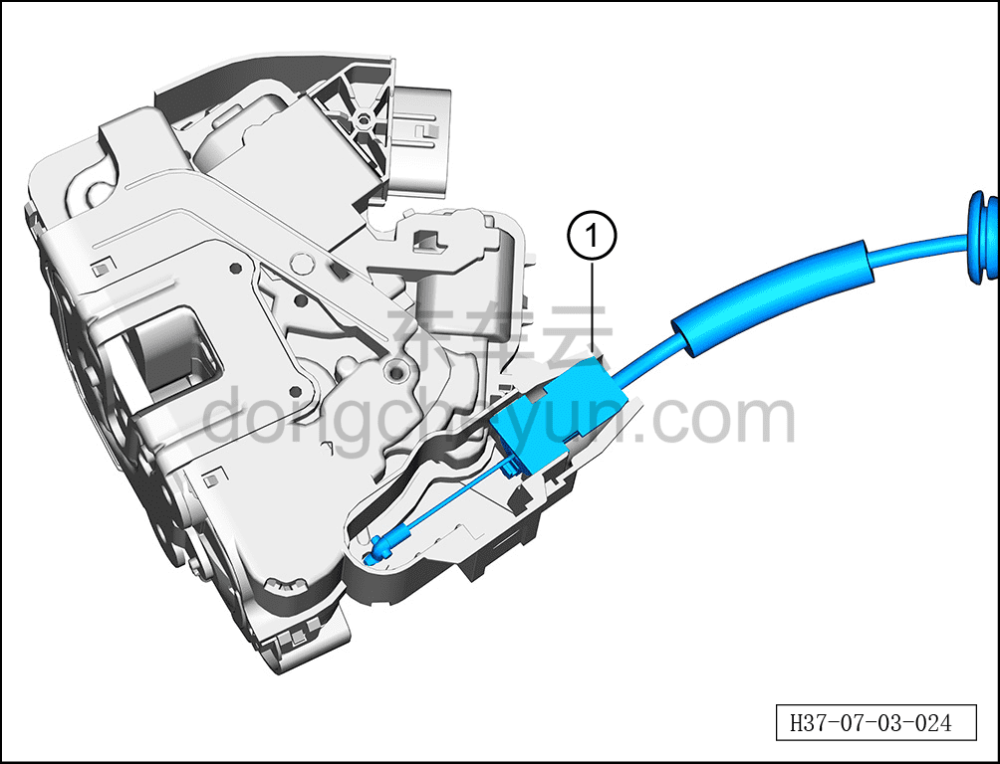

# Снятие и установка троса внутренней ручки открывания задней двери

> Открывающиеся элементы кузова › Задняя дверь › Навесные элементы задней двери  
> Оригинал: `拆卸与安装后门内开拉丝` · [dongcheyun 56746](https://dongcheyun.com/p/56746), страница `dc2938c954184567b82197e6b62ba422` · [оглавление](../README.md)

**Порядок снятия**

**Примечание:**

**- Далее описано снятие и установка троса внутренней ручки открывания левой задней двери, правая сторона выполняется по аналогии с левой.**

1. Выключите все электроприборы, отключите питание.

2. Выполните операцию обесточивания автомобиля для ремонта. См. [3.1.4.1 Обесточивание автомобиля](../03-техническое-обслуживание/005-обесточивание-автомобиля.md)

3. Снимите корпус замка левой задней двери. См. [7.3.4.11 Снятие и установка корпуса замка левой задней двери](046-снятие-и-установка-корпуса-замка-левой-задней-двери.md)

4. Снимите трос внутренней ручки открывания задней двери.

a. Отсоедините трос внутренней ручки открывания задней двери ① от места соединения с корпусом замка левой задней двери, извлеките трос внутренней ручки открывания задней двери ①.

**Порядок установки**

Установка выполняется в обратном порядке.

**Внимание:**

**- После установки троса внутренней ручки открывания задней двери необходимо проверить нормальность открывания задней двери изнутри.**

**- После завершения установки проверьте нормальность работы всех функций двери.**
