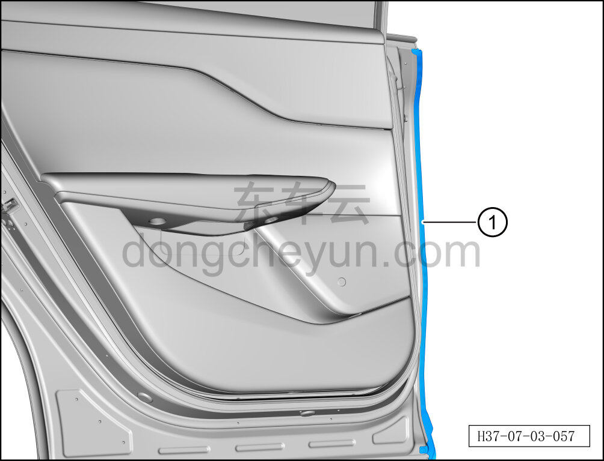

# Снятие и установка переднего уплотнителя левой задней двери

> Открывающиеся элементы кузова › Задняя дверь › Навесные элементы задней двери  
> Оригинал: `拆卸与安装左后门前部密封条` · [dongcheyun 56746](https://dongcheyun.com/p/56746), страница `cc742e1e66e8412f97a499b6de02ffb4` · [оглавление](../README.md)

**Порядок снятия**

**Примечание:**

**- Далее описано снятие и установка переднего уплотнителя левой задней двери, правая сторона выполняется по аналогии с левой.**

1. Выключите все электроприборы, отключите питание.

2. Снимите передний уплотнитель левой задней двери.

a. С помощью инструмента для снятия внутренней облицовки отсоедините передний уплотнитель левой задней двери ①.

**Примечание:**

**- Передний уплотнитель левой задней двери изготовлен из легко деформируемого материала, при снятии не сгибайте его.**

**Порядок установки**

Установка выполняется в обратном порядке.

**Внимание:**

**- После завершения установки проверьте нормальность работы всех функций двери. **
