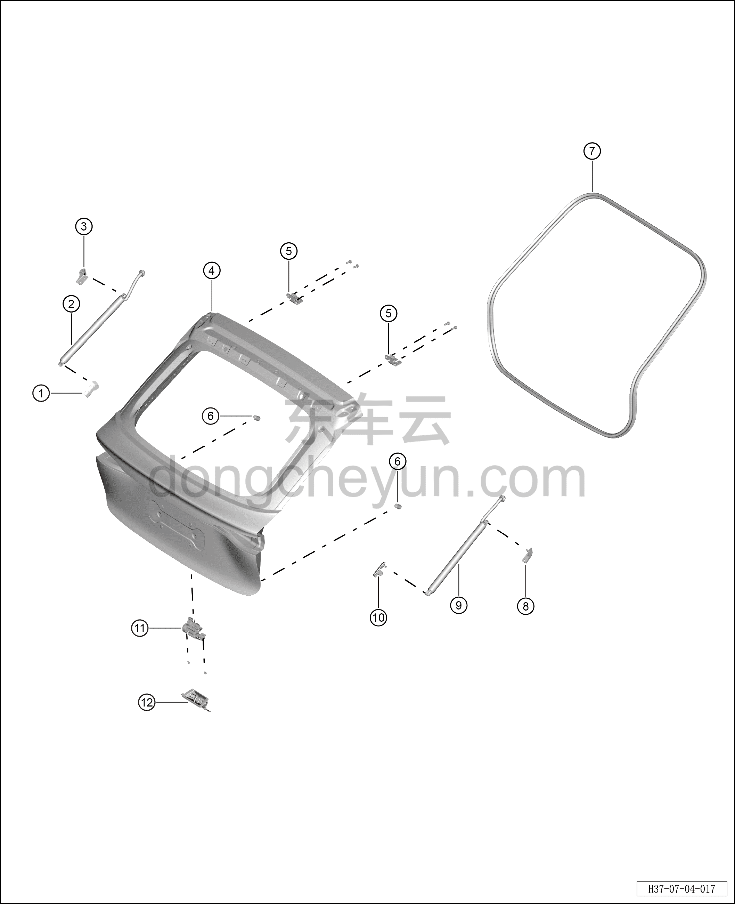

# Покомпонентный вид (деталировка)

> Открывающиеся элементы кузова › Дверь багажника › Покомпонентный вид (деталировка)  
> Оригинал: `结构分解图` · [dongcheyun 56746](https://dongcheyun.com/p/56746), страница `34393e1f019744c78d140fa0ccb1665f` · [оглавление](../README.md)

| № | Наименование детали | Кол-во на автомобиль | Примечание |
|---|---|---|---|
| 1 | Нижний кронштейн левого упора двери багажника | 1 | - |
| 2 | Левый электропривод (упор) двери багажника | 1 | - |
| 3 | Верхний кронштейн левого упора двери багажника | 1 | - |
| 4 | Дверь багажника | 1 | - |
| 5 | Петля двери багажника | 2 | - |
| 6 | Буфер двери багажника | 2 | - |
| 7 | Уплотнитель проёма двери багажника | 1 | - |
| 8 | Верхний кронштейн правого упора двери багажника | 1 | - |
| 9 | Правый электропривод (упор) двери багажника | 1 | - |
| 10 | Нижний кронштейн правого упора двери багажника | 1 | - |
| 11 | Замок двери багажника в сборе | 1 | - |
| 12 | Ответная часть замка двери багажника в сборе | 1 | - |
