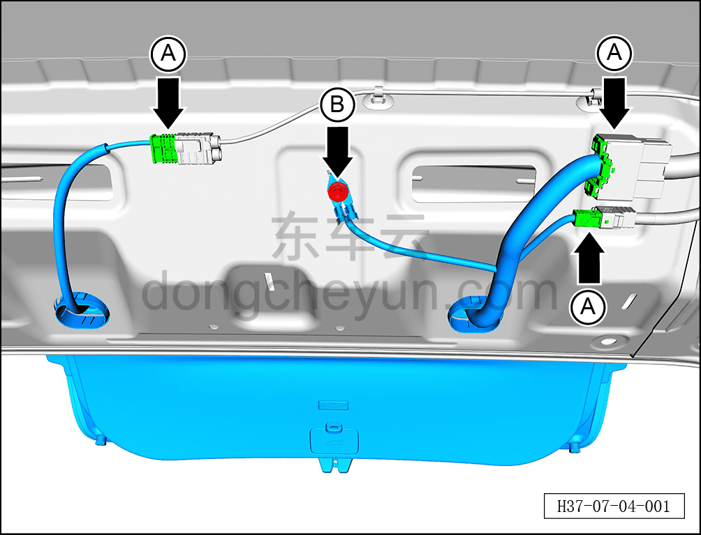
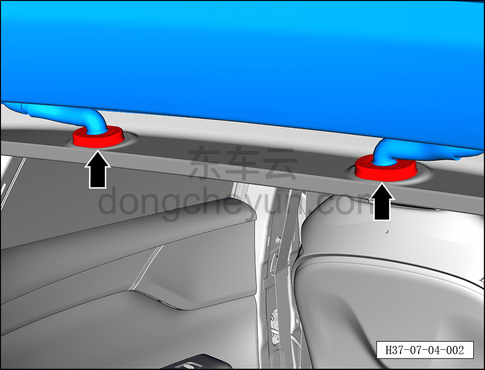
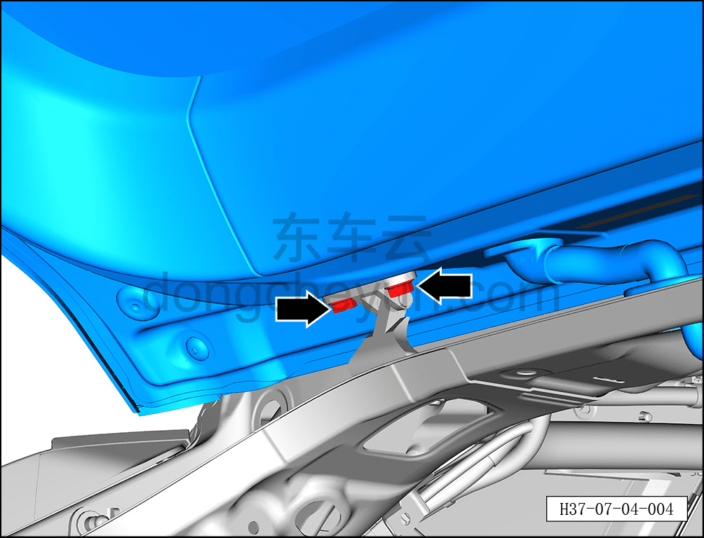
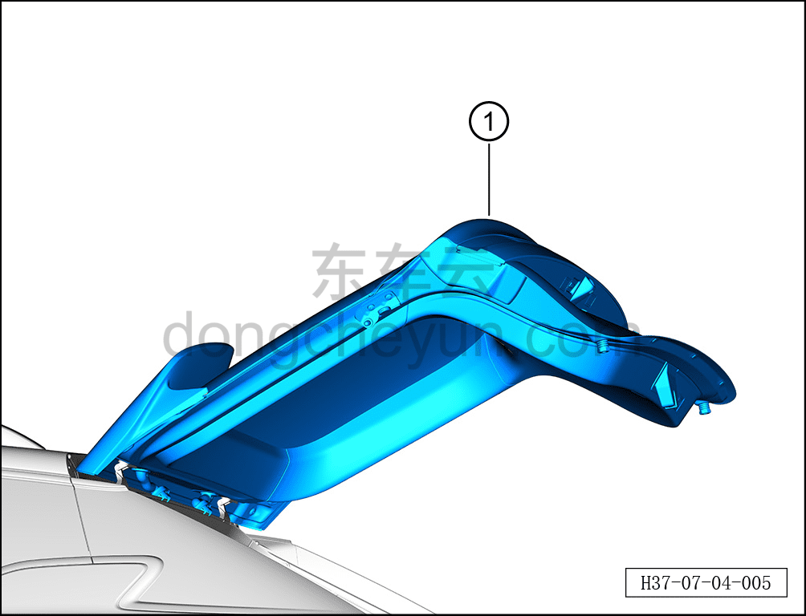
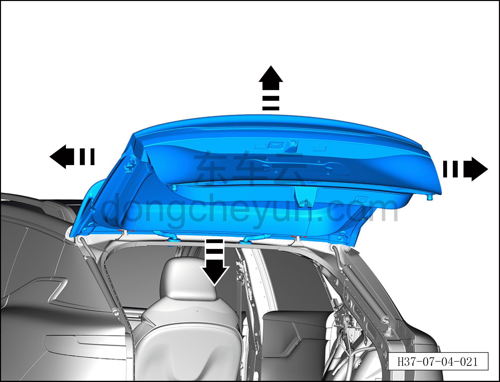

# Снятие и установка двери багажника

> Открывающиеся элементы кузова › Дверь багажника › Кузовная панель двери багажника  
> Оригинал: `拆卸与安装背门` · [dongcheyun 56746](https://dongcheyun.com/p/56746), страница `0a0d61e74c88475994425571cfdee674` · [оглавление](../README.md)

**Порядок снятия**

**Примечание:**

**- Если после обесточивания всего автомобиля или отключения АКБ 12 В требуется открывать дверь багажника вручную, время ручного открытия/закрытия должно составлять не менее 2 с (нормальное время электрического открытия/закрытия составляет около 5.5 с), в любом положении ручные операции открытия/закрытия запрещено выполнять резко/с усилием.**

**- Снятие и установку двери багажника необходимо выполнять с помощью ещё двух специалистов.**

**- После замены двери багажника в сборе необходимо повторно нанести герметик, см. [12.1.6.3 Зоны герметизации кузова](../12-кузовные-жестяные-работы-окраска/016-зона-герметизации-кузова.md). **

1. Выключите все электроприборы, отключите питание.

2. Откройте дверь багажника.

3. Выполните операцию обесточивания автомобиля перед ремонтом. См. [3.1.4.1 Обесточивание автомобиля](../03-техническое-обслуживание/005-обесточивание-автомобиля.md)

4. Снимите обивку крыши. См. [8.5.6.1 Снятие и установка обивки крыши](../08-внутренняя-и-внешняя-отделка/142-снятие-и-установка-обивки-потолка.md)

5. Снимите дверь багажника.

a. Отсоедините 3 разъёма A жгута двери багажника.

b. С помощью торцевой головки 10 мм выверните болт заземления B жгута двери багажника.

Момент затяжки болта: 8±1 Н·м

c. Отсоедините 2 водонепроницаемые заглушки жгута двери багажника.

d. Перед снятием левого электропривода (упора) двери багажника требуется помощь ещё двух специалистов для поддержки двери багажника.

e. Вставьте плоскую отвёртку в паз пружинной пластины, отсоедините пружинную пластину от левого электропривода (упора) двери багажника.

f. Отсоедините левый электропривод (упор) двери багажника ① от шарового шарнирного болта двери багажника.

g. Отсоедините правый электропривод (упор) двери багажника, по аналогии с левой стороной.

h. С помощью торцевой головки 13 мм выверните по 4 крепёжных болта с каждой стороны двери багажника.

Момент затяжки болта: 30±5 Н·м

**Внимание:**

**- Поскольку дверь багажника тяжёлая, при выворачивании болтов не допускайте её внезапного падения.**

i. С помощью ещё двух специалистов извлеките дверь багажника ①.

**Внимание:**

**- При снятии двери багажника избегайте повреждения лакокрасочного покрытия кузова, после снятия положите дверь багажника горизонтально на мягкую подкладку.**

**Порядок установки**

Установка выполняется в обратном порядке.

1. После установки двери багажника сначала проверьте, соответствуют ли зазор и высота между дверью багажника и окружающими панелями нормативным значениям. См. [12.1.4.3 Зазоры поверхности кузова](../12-кузовные-жестяные-работы-окраска/007-зазоры-поверхности-кузова.md)

2. Если результат проверки не соответствует нормативному значению, с помощью ещё двух специалистов ослабьте 4 крепёжных болта двери багажника настолько, чтобы дверь багажника получила достаточный люфт, затем отрегулируйте дверь багажника в направлении стрелки согласно рисунку, пока измеренное значение не будет соответствовать нормативному диапазону, после чего затяните 4 крепёжных болта.

**Внимание:**

**- После завершения установки проверьте нормальность работы всех функций двери багажника.**
