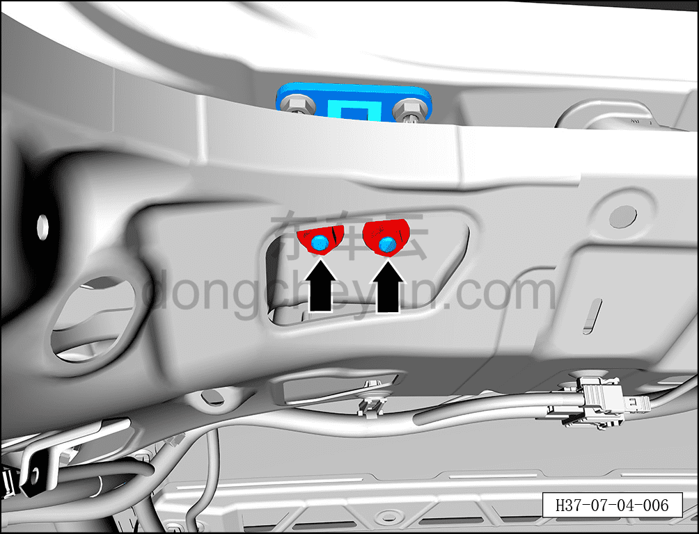
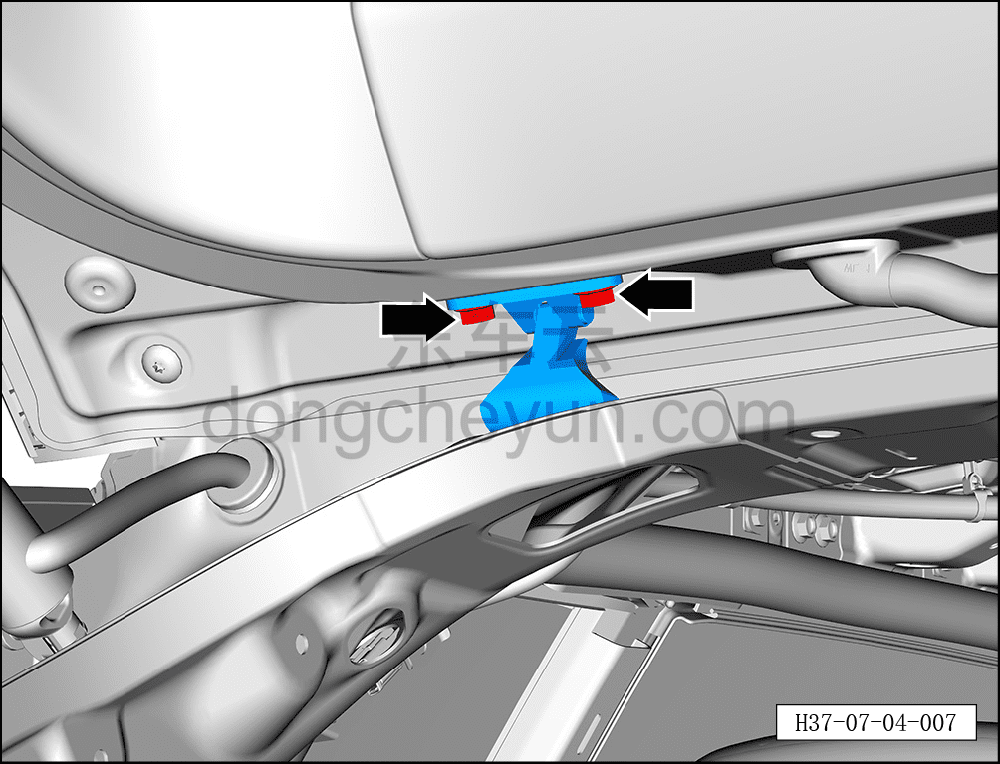
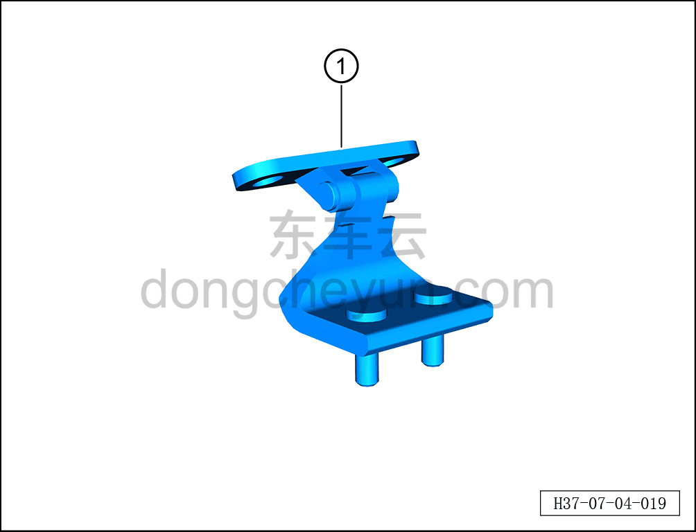
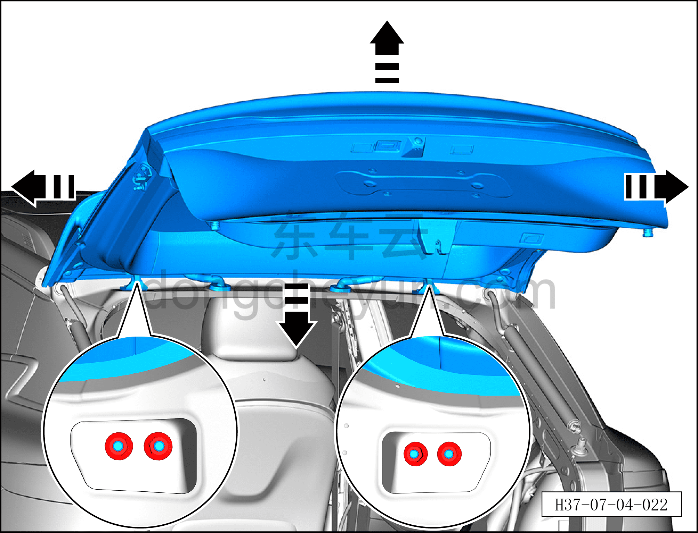

# Снятие и установка петли двери багажника

> Открывающиеся элементы кузова › Дверь багажника › Кузовная панель двери багажника  
> Оригинал: `拆卸与安装背门铰链` · [dongcheyun 56746](https://dongcheyun.com/p/56746), страница `4bf6e8c4f1af4817aa12fb1570478f49` · [оглавление](../README.md)

**Порядок снятия**

**Примечание:**

**- Далее описано снятие и установка левой петли двери багажника, правая сторона выполняется по аналогии с левой.**

**- При выворачивании крепёжных болтов петли двери багажника необходимо действовать совместно со вторым техническим специалистом, поддерживающим дверь багажника во избежание её падения.**

1. Выключите все электроприборы, отключите питание.

2. Выполните операцию обесточивания автомобиля для ремонта. См. [3.1.4.1 Обесточивание автомобиля](../03-техническое-обслуживание/005-обесточивание-автомобиля.md)

3. Снимите обивку крыши. См. [8.5.6.1 Снятие и установка обивки крыши](../08-внутренняя-и-внешняя-отделка/142-снятие-и-установка-обивки-потолка.md)

4. Снимите петлю двери багажника.

a. С помощью торцевой головки 13 мм выверните 2 крепёжные гайки петли двери багажника.

Момент затяжки гайки: 20±3 Н·м

b. С помощью торцевой головки 13 мм выверните 2 крепёжных болта петли двери багажника.

Момент затяжки болтов: 20±3 Н·м

c. Снимите петлю двери багажника ①.

**Порядок установки**

Установка выполняется в обратном порядке.

1. После установки петли двери багажника и двери багажника сначала проверьте, соответствуют ли зазор и высота между дверью багажника и окружающими панелями нормативным значениям. См. [12.1.4.3 Зазоры поверхности кузова](../12-кузовные-жестяные-работы-окраска/007-зазоры-поверхности-кузова.md)

2. Если результат проверки не соответствует нормативному значению, с помощью ещё двух специалистов ослабьте 4 крепёжные гайки петли двери багажника настолько, чтобы дверь багажника в сборе получила достаточный люфт, затем отрегулируйте дверь багажника в направлении стрелки согласно рисунку, пока измеренное значение не будет соответствовать нормативному диапазону, после чего затяните 4 крепёжные гайки.

**Внимание:**

**- После завершения установки проверьте нормальность работы всех функций двери багажника.**
