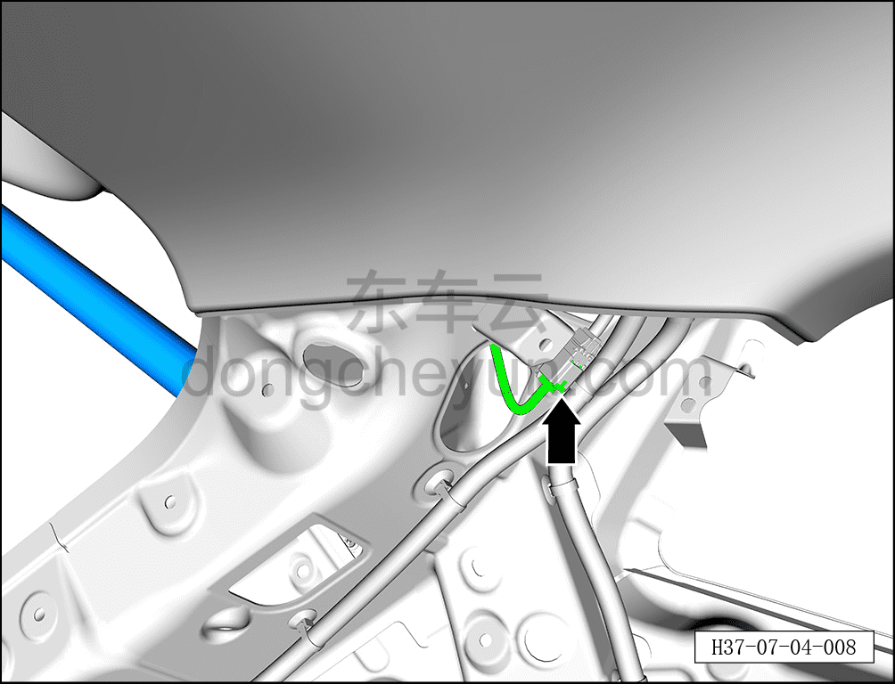
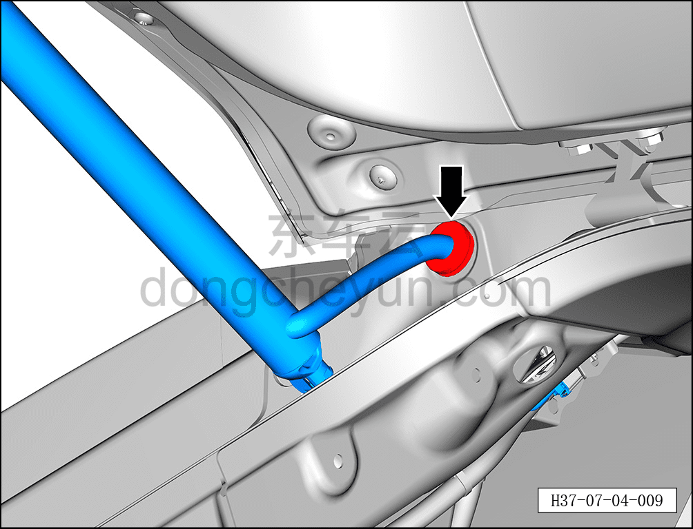
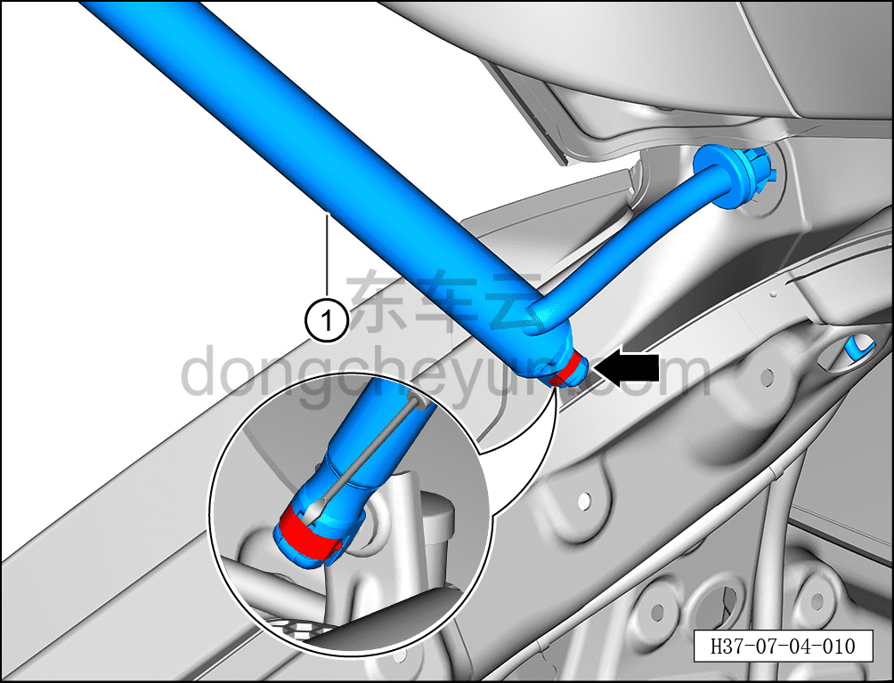
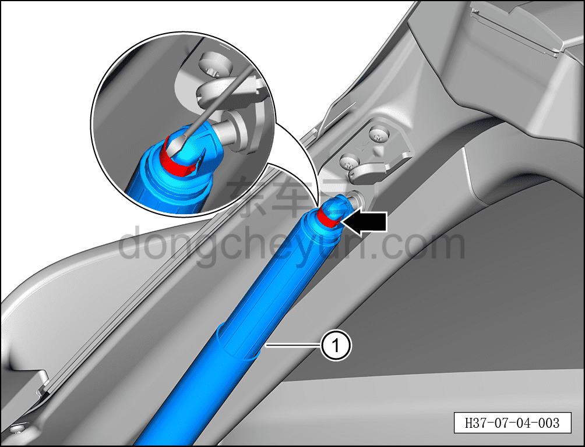

# Снятие и установка левого электропривода (упора) двери багажника

> Открывающиеся элементы кузова › Дверь багажника › Навесные элементы двери багажника  
> Оригинал: `拆卸与安装背门左电动撑杆` · [dongcheyun 56746](https://dongcheyun.com/p/56746), страница `c790eba877284a459d1fe626f5340271` · [оглавление](../README.md)

**Порядок снятия**

**Примечание:**

**- Далее описано снятие и установка левого электропривода (упора) двери багажника, правая сторона выполняется по аналогии с левой.**

**- Снятие и установку необходимо выполнять с помощью ещё одного специалиста.**

1. Выключите все электроприборы, отключите питание.

2. Выполните операцию обесточивания автомобиля для ремонта. См. [3.1.4.1 Обесточивание автомобиля](../03-техническое-обслуживание/005-обесточивание-автомобиля.md)

3. Снимите верхнюю защитную накладку левой стойки C. См. [8.5.5.5 Снятие и установка верхней защитной накладки левой стойки C](../08-внутренняя-и-внешняя-отделка/135-снятие-и-установка-левой-верхней-накладки-стойки-c.md)

4. Снимите левый электропривод (упор) двери багажника.

a. Удерживая фиксатор разъёма, отсоедините разъём левого электропривода (упора) двери багажника.

b. Отсоедините водонепроницаемую заглушку, соединяющую левый электропривод (упор) двери багажника с кузовом.

c. Вставьте плоскую отвёртку в паз пружинной пластины, отсоедините пружинную пластину от левого электропривода (упора) двери багажника.

d. Отделите левый электропривод (упор) двери багажника ① от верхнего кронштейна левого упора двери багажника.

e. С помощью плоской отвёртки отогните пружинную пластину.

f. Извлеките левый электропривод (упор) двери багажника ①.

**Порядок установки**

Установка выполняется в обратном порядке.

**Внимание:**

**- После установки левого электропривода (упора) двери багажника необходимо проверить нормальность его функционирования.**
