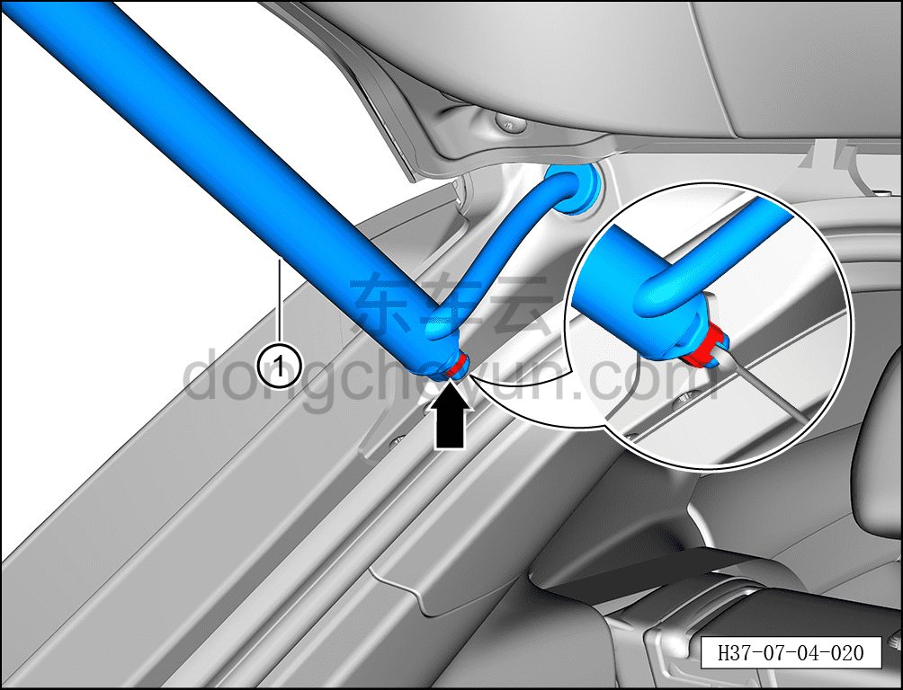
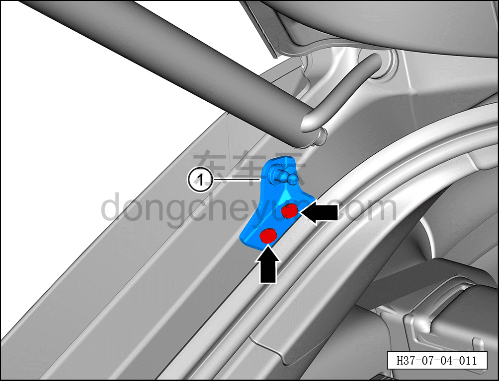

# Снятие и установка верхнего кронштейна левого упора двери багажника

> Открывающиеся элементы кузова › Дверь багажника › Навесные элементы двери багажника  
> Оригинал: `拆卸与安装背门左撑杆上支架` · [dongcheyun 56746](https://dongcheyun.com/p/56746), страница `149a12cb222f40d69f75d7d4f53b3b7a` · [оглавление](../README.md)

**Порядок снятия**

**Примечание:**

**- Далее описано снятие и установка верхнего кронштейна левого упора двери багажника, правая сторона выполняется по аналогии с левой.**

**- Снятие и установку необходимо выполнять с помощью ещё одного специалиста.**

1. Откройте дверь багажника в сборе.

2. Выключите все электрические потребители, отключите питание.

3. Снимите верхний кронштейн левого упора двери багажника.

a. Вставьте плоскую отвёртку в паз пружинной пластины, отсоедините пружинную пластину от левого электропривода (упора) двери багажника.

b. Отделите левый электропривод (упор) двери багажника ① от кронштейна левого упора двери багажника.

c. С помощью бита T40 выверните 2 крепёжных винта верхнего кронштейна левого упора двери багажника.

Момент затяжки винта: 20±3 Н·м

d. Извлеките верхний кронштейн левого упора двери багажника ①.

**Порядок установки**

Установка выполняется в обратном порядке.
