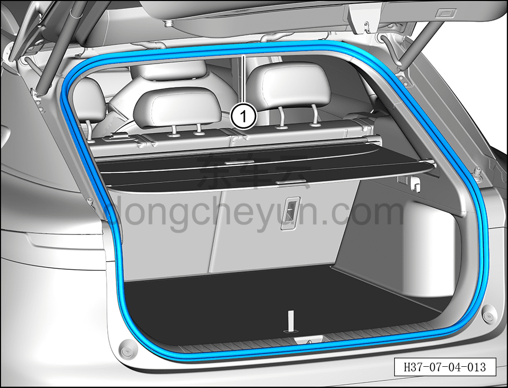

# Снятие и установка уплотнителя проёма двери багажника

> Открывающиеся элементы кузова › Дверь багажника › Навесные элементы двери багажника  
> Оригинал: `拆卸与安装后背门框密封条` · [dongcheyun 56746](https://dongcheyun.com/p/56746), страница `0002c5c86f1b45a2a421e0dd19886042` · [оглавление](../README.md)

**Порядок снятия**

1. Откройте дверь багажника.

2. Выключите все электрические потребители, отключите питание.

3. Снимите уплотнитель проёма двери багажника.

a. С помощью инструмента для снятия внутренней облицовки отсоедините уплотнитель проёма двери багажника ①.

**Порядок установки**

Установка выполняется в обратном порядке.

**Внимание:**

**- Проверьте, чтобы место установки уплотнителя на кузове было ровным, без выступов, при необходимости используйте резиновый молоток для восстановления ровности.**

**- Уплотнитель содержит клеевой состав. При снятии необходимо предотвратить загрязнение внутренней облицовки вытекшим клеевым составом. **
